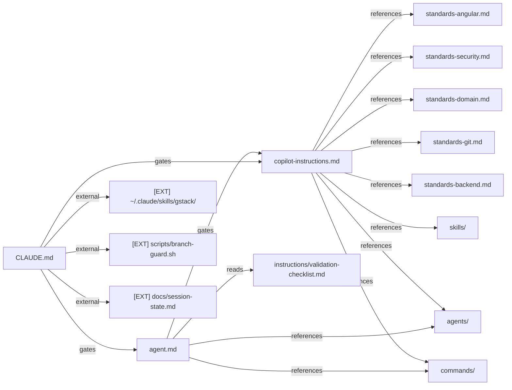
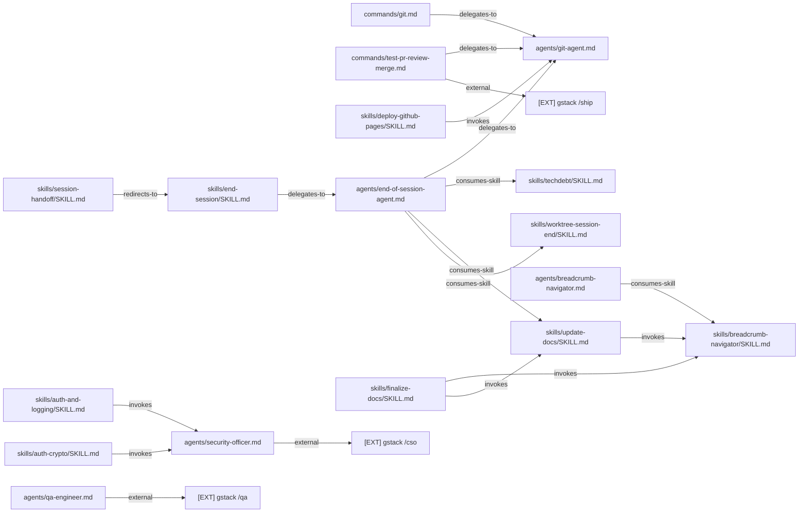
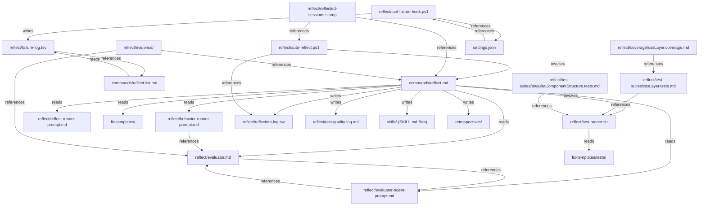
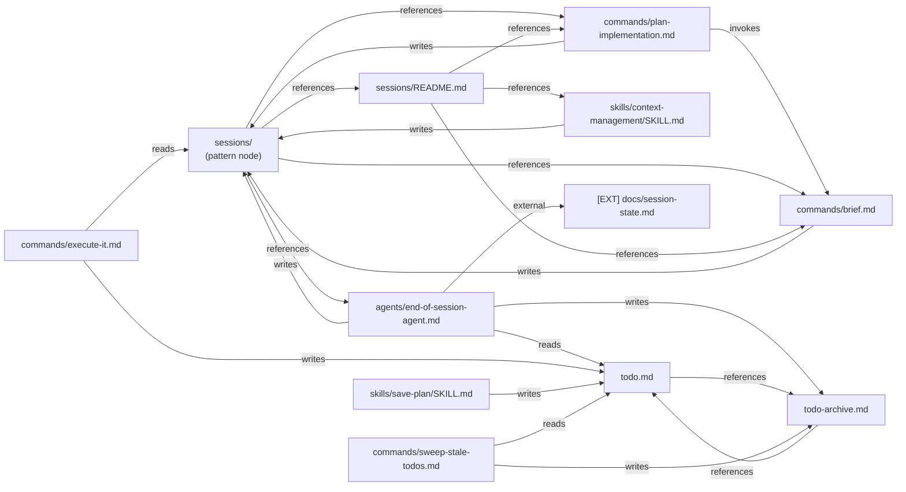
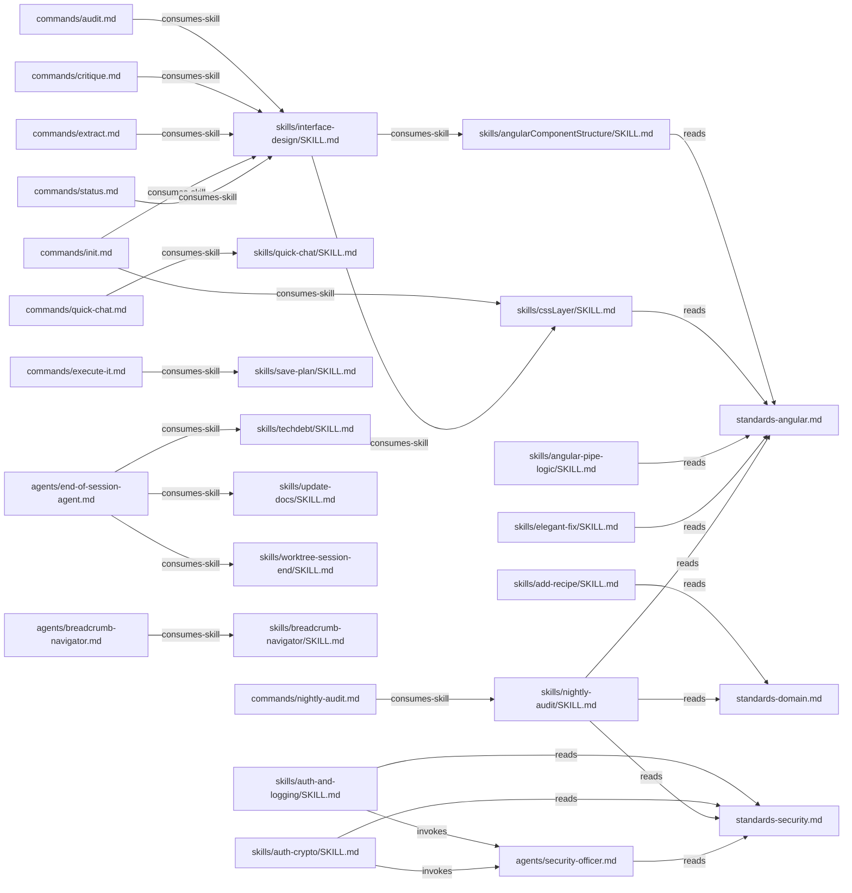

# Subsystem Diagrams

One mermaid diagram per subsystem. Edge labels match the vocabulary from relationships.md.
All nodes present in the Stage 1 inventory. No invented nodes.

---

## 1. Gate Chain

---

## 2. Command → Agent Dispatch

---

## 3. Reflect Subsystem

---

## 4. Session Lifecycle

---

## 5. Skills Consumption

