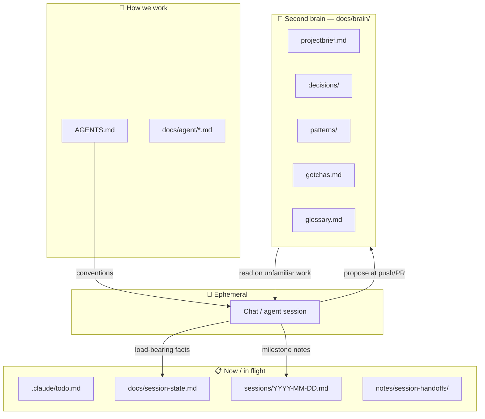
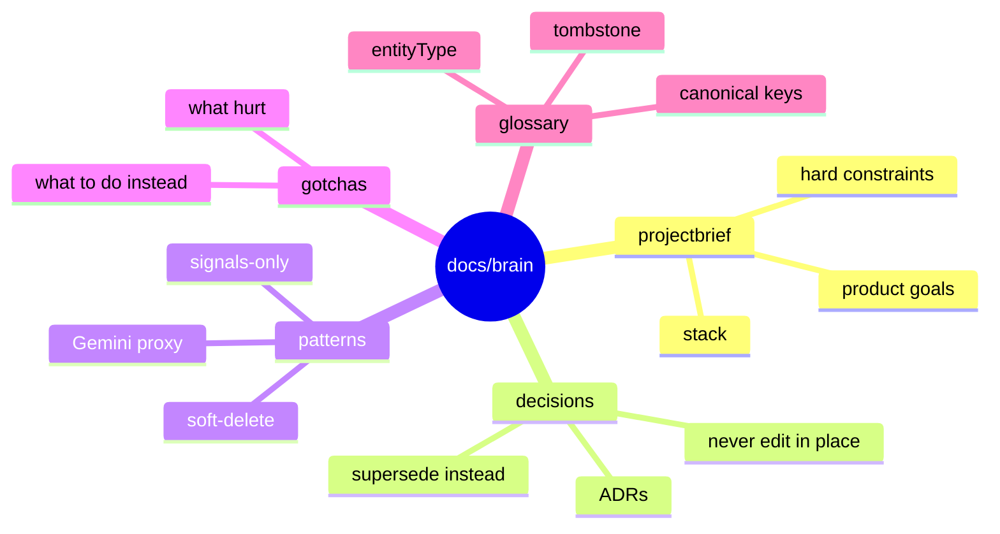
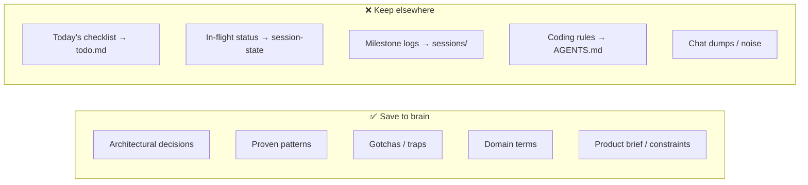
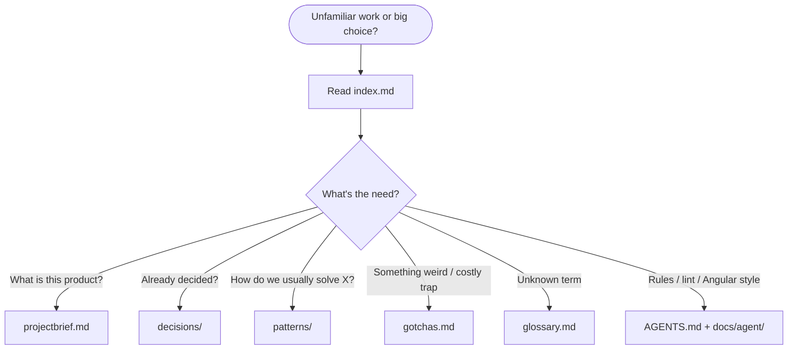

# FoodVibe Second Brain — visual tour

> Distilled project memory that survives chat compaction.  
> **Not** the rulebook (`AGENTS.md`) and **not** today's todo list.

---

## The big picture



| Layer | Lifetime | Question it answers |
| --- | --- | --- |
| Chat | Minutes–hours | What are we doing *right now*? |
| Session / todo | Days | What's open / blocked? |
| **Brain** | Months–years | Why did we choose this? What bit us? |
| AGENTS / standards | Ongoing rules | How am I *allowed* to code? |

---

## Folder map — `docs/brain/`

```text
docs/brain/
├── index.md            ← 🗺️  reading order + maintenance
├── how-it-works.md     ← 👀  this visual tour
├── projectbrief.md     ← 🎯  what FoodVibe is + hard constraints
├── gotchas.md          ← ⚠️  traps that already hurt
├── glossary.md         ← 📖  domain vocabulary
├── decisions/          ← 🏛️  ADRs (append-only)
│   ├── _TEMPLATE.md
│   ├── 0001-lean-native-workflow.md
│   ├── 0002-file-based-memory-over-tool-memory.md
│   └── 0003-auto-evoke-brain-on-pr.md
└── patterns/           ← ✅  proven solutions (one file each)
    ├── _TEMPLATE.md
    ├── signals-only-state.md
    ├── gemini-backend-proxy.md
    ├── tombstone-soft-delete.md
    └── defer-singleton-data-ensureLoaded.md
```



---

## What we save (and what we don't)



| Save here | Example | Skip / put elsewhere |
| --- | --- | --- |
| Decision | “File-based memory over MCP memory” | “Working on Plan 289 M4 today” |
| Pattern | “Signals only — no BehaviorSubject” | Full Angular style guide |
| Gotcha | “Don’t `worktree remove` from inside the worktree” | Transient build error you already fixed |
| Glossary | “Tombstone = soft-delete to TRASH_*” | Temporary branch names |

---

## Capture loop (shown-before-written, auto-write on the gate reply)

You always see the full draft before it lands. It writes automatically with whatever reply closes the gate — no separate confirmation step. Say the word and it doesn't happen.

```mermaid
sequenceDiagram
  participant Dev as You / agent session
  participant Gate as Push / PR / Merge Gate
  participant GH as GitHub sticky comment
  participant Brain as docs/brain/

  Dev->>Gate: push feature/fix/chore branch
  Gate->>Dev: propose Brain capture block (full draft shown)
  Gate->>GH: upsert reminder comment
  alt Y / merge / later / open-pr-only
    Dev->>Brain: write / append entry, then do the reply's normal action
  else no brain / skip brain (said alongside the reply)
    Dev-->>Brain: no write; reply's normal action still happens
  else brain edit …
    Dev->>Dev: revise proposal
    Dev->>Brain: write after re-showing, on next reply
  end
```

**Replies you can send**

| Reply | Effect |
| --- | --- |
| `Y` / `merge` / `later` / `open-pr-only` | Write the proposed entry, then do that reply's normal action |
| `no brain` / `skip brain` (combined with the above) | Explicit no-op on the brain write only |
| `brain edit …` | Change the draft, re-show it, then write on the next reply |

The old separate `brain approve` reply is gone — see [[0006-auto-write-brain-capture-by-default]] (supersedes the confirm-to-write clause of [[0003-auto-evoke-brain-on-pr]]). You still see every draft before it writes; opting out just takes one word instead of withholding a second approval.

### Thin vs useful — same milestone (few-shot)

Real case: the defer-eager-data session (Plan 289 M5).

❌ **Thin (reject):**

> `docs/brain/patterns/defer-singleton-data.md — "use ensureLoaded for deferred services"`

That's a label, not a lesson — it restates what the diff already shows. A cold agent learns nothing about *when* to defer, *what to audit first*, or *which trap looks like success*.

✅ **Useful (approve) — two entries, cross-linked:**

- A **pattern** carrying the judgment: the audit rule ("read from an always-on surface → leave it eager"), the 5-step recipe, and the when-not-to. → [[defer-singleton-data-ensureLoaded]]
- A paired **gotcha** naming the trap: login reload calls `reloadFromStorage()` unconditionally, so removing the constructor fetch alone *looks* done but isn't. → "Login reload bypasses deferred constructor load" in `gotchas.md`

Drafting rules, required shapes, and the usefulness gate live in `docs/agent/brain-capture.md`. Templates: `docs/brain/patterns/_TEMPLATE.md`, `docs/brain/decisions/_TEMPLATE.md`.

---

## When agents open which file



---

## Related folders (not the brain)

| Path | Job |
| --- | --- |
| `docs/session-state.md` | Current work snapshot |
| `.claude/todo.md` | Active task checklist |
| `sessions/` | Per-day execution summaries |
| `notes/session-handoffs/` | End-of-day handoffs (legacy path) |
| `plans/` | Feature plan contracts |
| `AGENTS.md` + `docs/agent/` | Hard rules & standards |

---

## One-liner

> **Chat forgets. Todos expire. The brain is what we choose to remember forever — in git, as Markdown, with your OK.**
