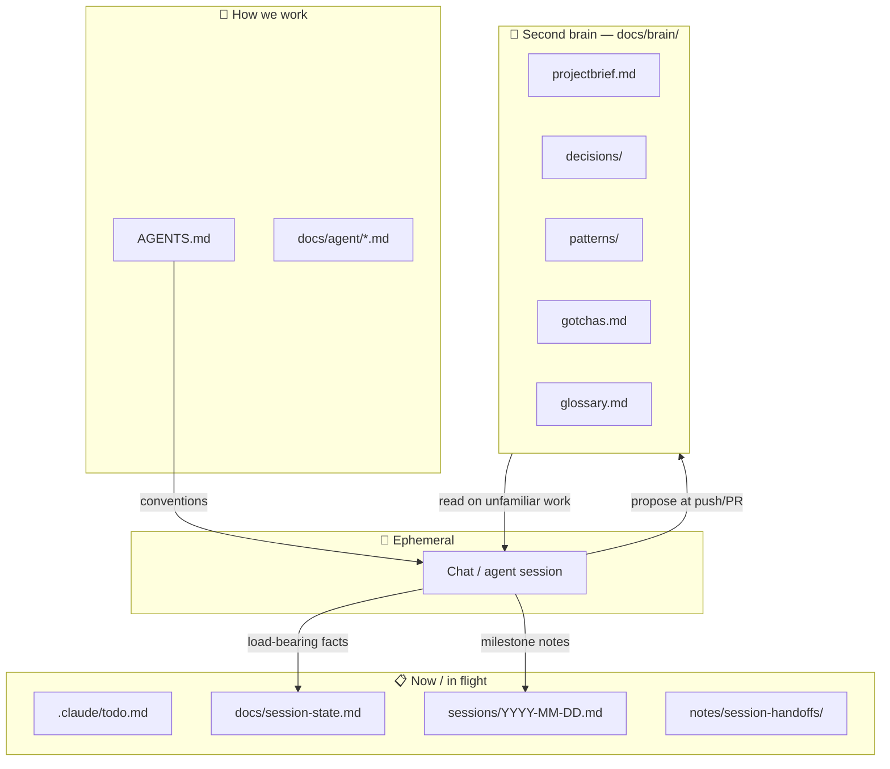
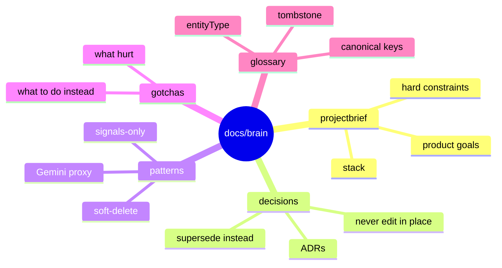
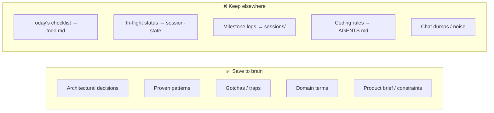
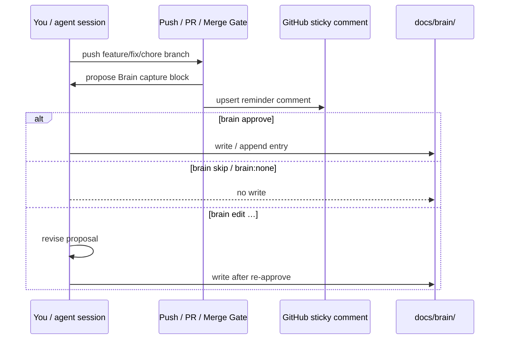

# FoodVibe Second Brain — visual tour

> Distilled project memory that survives chat compaction.  
> **Not** the rulebook (`AGENTS.md`) and **not** today's todo list.

---

## The big picture



| Layer | Lifetime | Question it answers |
| --- | --- | --- |
| Chat | Minutes–hours | What are we doing *right now*? |
| Session / todo | Days | What's open / blocked? |
| **Brain** | Months–years | Why did we choose this? What bit us? |
| AGENTS / standards | Ongoing rules | How am I *allowed* to code? |

---

## Folder map — `docs/brain/`

```text
docs/brain/
├── index.md            ← 🗺️  reading order + maintenance
├── how-it-works.md     ← 👀  this visual tour
├── projectbrief.md     ← 🎯  what FoodVibe is + hard constraints
├── gotchas.md          ← ⚠️  traps that already hurt
├── glossary.md         ← 📖  domain vocabulary
├── decisions/          ← 🏛️  ADRs (append-only)
│   ├── 0001-lean-native-workflow.md
│   ├── 0002-file-based-memory-over-tool-memory.md
│   └── 0003-auto-evoke-brain-on-pr.md
└── patterns/           ← ✅  proven solutions (one file each)
    ├── signals-only-state.md
    ├── gemini-backend-proxy.md
    └── tombstone-soft-delete.md
```



---

## What we save (and what we don't)



| Save here | Example | Skip / put elsewhere |
| --- | --- | --- |
| Decision | “File-based memory over MCP memory” | “Working on Plan 289 M4 today” |
| Pattern | “Signals only — no BehaviorSubject” | Full Angular style guide |
| Gotcha | “Don’t `worktree remove` from inside the worktree” | Transient build error you already fixed |
| Glossary | “Tombstone = soft-delete to TRASH_*” | Temporary branch names |

---

## Capture loop (confirm-to-write)

Nothing lands in the brain without you.



**Replies you can send**

| Reply | Effect |
| --- | --- |
| `brain approve` | Write the proposed entry |
| `brain skip` / `brain:none` | Explicit no-op |
| `brain edit …` | Change the draft, then approve |

Silent auto-write is **forbidden**. See [[0003-auto-evoke-brain-on-pr]].

---

## When agents open which file


---

## Related folders (not the brain)

| Path | Job |
| --- | --- |
| `docs/session-state.md` | Current work snapshot |
| `.claude/todo.md` | Active task checklist |
| `sessions/` | Per-day execution summaries |
| `notes/session-handoffs/` | End-of-day handoffs (legacy path) |
| `plans/` | Feature plan contracts |
| `AGENTS.md` + `docs/agent/` | Hard rules & standards |

---

## One-liner

> **Chat forgets. Todos expire. The brain is what we choose to remember forever — in git, as Markdown, with your OK.**
