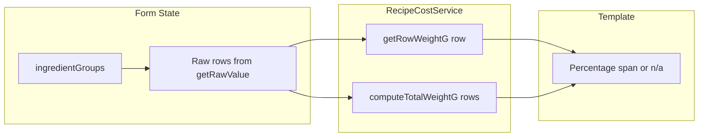

# Recipe Ingredients Table Enhancement Plan

## Current State Summary

The [recipe-ingredients-table](src/app/pages/recipe-builder/components/recipe-ingredients-table/) component already has:

- **Search input** via `app-ingredient-search` (products + recipes, dropdown selection)
- **Unit select** based on available units per ingredient
- **Quantity input** with `SelectOnFocus` directive
- **Price/cost display** (עלות)
- **Remove button** per row

## Requirements Mapping


| Requirement                       | Status  | Action                  |
| --------------------------------- | ------- | ----------------------- |
| Search products/recipes           | Done    | Keep as-is              |
| Quantity with SelectOnFocus       | Done    | Keep directive          |
| Plus/minus buttons for quantity   | Missing | Add                     |
| Minus disabled when value is 0    | Missing | Add                     |
| Unit select                       | Done    | Keep as-is              |
| Percentage span (gram-based only) | Missing | Add new column          |
| Price span                        | Done    | Keep (currently "עלות") |


---

## Implementation Plan

### 1. Add Plus/Minus Quantity Controls

**File:** [recipe-ingredients-table.component.html](src/app/pages/recipe-builder/components/recipe-ingredients-table/recipe-ingredients-table.component.html)

Replace the plain quantity input with a control group:

- Minus button: decrement `amount_net`, disabled when value is 0
- Number input: keep `SelectOnFocus`, `formControlName="amount_net"`
- Plus button: increment `amount_net`

Wire both buttons to call `updateLineCalculations($index)` after value change. Use `(click)` handlers that patch the form and trigger recalculation.

**File:** [recipe-ingredients-table.component.ts](src/app/pages/recipe-builder/components/recipe-ingredients-table/recipe-ingredients-table.component.ts)

Add helper methods:

```typescript
incrementAmount(group: FormGroup, index: number): void {
  const ctrl = group.get('amount_net');
  const val = (ctrl?.value ?? 0) + 1;
  ctrl?.setValue(val);
  this.updateLineCalculations(index);
}
decrementAmount(group: FormGroup, index: number): void {
  const ctrl = group.get('amount_net');
  const val = Math.max(0, (ctrl?.value ?? 0) - 1);
  ctrl?.setValue(val);
  this.updateLineCalculations(index);
}
```

---

### 2. Add Percentage Column

**Logic:** Show `(row_weight_g / total_weight_g) * 100` when the ingredient's unit can be converted to grams. Otherwise show `n/a`.

**File:** [recipe-cost.service.ts](src/app/core/services/recipe-cost.service.ts)

Add a new public method `getIngredientWeightG(ingredient: IngredientPriceCheck): number | null` that:

- Returns the weight in grams for a single row using the same logic as `computeTotalWeightG` (MASS_UNITS, product purchase_options, recipe yield_unit)
- Returns `null` when the unit cannot be converted to grams

Extract the per-row contribution logic into a private helper and reuse it in both `computeTotalWeightG` and `getRowWeightG` to avoid duplication.

**File:** [recipe-ingredients-table.component.ts](src/app/pages/recipe-builder/components/recipe-ingredients-table/recipe-ingredients-table.component.ts)

- Inject `RecipeCostService` (already injected)
- Add computed or method `getTotalWeightG(): number` using `recipeCostService.computeTotalWeightG(rows)` where `rows` are built from `ingredientGroups` raw values
- Add method `getPercentageDisplay(group: FormGroup): string`:
  - Build row `{ amount_net, unit, referenceId, item_type }` from group
  - Call `recipeCostService.getRowWeightG(row)`
  - If `null` → return `"n/a"`
  - Else: `total = getTotalWeightG()`, if total === 0 return `"0%"`, else return `"${(rowG / total * 100).toFixed(1)}%"`

**File:** [recipe-ingredients-table.component.html](src/app/pages/recipe-builder/components/recipe-ingredients-table/recipe-ingredients-table.component.html)

- Add header cell for percentage (e.g. `אחוז`)
- Add body cell: `<span>{{ getPercentageDisplay(group) }}</span>`

---

### 3. Update Grid Layout

**File:** [recipe-ingredients-table.component.scss](src/app/pages/recipe-builder/components/recipe-ingredients-table/recipe-ingredients-table.component.scss)

Current template: `2.5fr 1fr 1fr 1fr 48px` (name, unit, net, cost, actions)

New template: `2.5fr 1.5fr 1fr 1fr 1fr 48px` (name, quantity+controls, unit, percentage, cost, actions)

Adjust column classes if needed. The quantity column will be wider to accommodate +/- buttons.

---

### 4. Minor Fixes

**File:** [recipe-ingredients-table.component.ts](src/app/pages/recipe-builder/components/recipe-ingredients-table/recipe-ingredients-table.component.ts)

- Remove duplicate `SelectOnFocusDirective` import (lines 18–19)
- Remove unused `totalMass_` computed if it is no longer used (it uses raw `amount_net * portions`, not grams; percentage will use `RecipeCostService`)

---

## Data Flow for Percentage




---

## Files to Modify

1. **[recipe-ingredients-table.component.html](src/app/pages/recipe-builder/components/recipe-ingredients-table/recipe-ingredients-table.component.html)** – Add percentage column, refactor quantity cell with +/- buttons
2. **[recipe-ingredients-table.component.ts](src/app/pages/recipe-builder/components/recipe-ingredients-table/recipe-ingredients-table.component.ts)** – Add `incrementAmount`, `decrementAmount`, `getTotalWeightG`, `getPercentageDisplay`; remove duplicate import and unused `totalMass_`
3. **[recipe-ingredients-table.component.scss](src/app/pages/recipe-builder/components/recipe-ingredients-table/recipe-ingredients-table.component.scss)** – Update grid template, style quantity controls
4. **[recipe-cost.service.ts](src/app/core/services/recipe-cost.service.ts)** – Add `getRowWeightG(row)` and refactor to share per-row logic

---

## Edge Cases

### Edge Case: Empty Rows

When a row in the ingredients table is empty (i.e., no product/ingredient has been selected), some of the calculated or display values should show a fallback. Specifically:

- The "Percentage" column should show `n/a` if the ingredient is not set.
- This logic should be applied anywhere a row is missing required data for correct calculation or display.

**Implementation Guidance:**

- In your Angular template (HTML), use an `@if` or ternary to check if the group or ingredient is empty (e.g. missing `.get('product')?.value`).
- In TypeScript (component), the new `getPercentageDisplay` method should return `'n/a'` for these cases.
- This edge case is especially important for blank/newly-added rows before the user has made a selection.

Example HTML usage:

```html
<span>
  {{ getPercentageDisplay(group) }}
</span>
```

Where `getPercentageDisplay` will internally handle if the ingredient or conversion is missing.

---

- Empty row (no ingredient selected): percentage shows `n/a`
- Unit not gram-convertible (e.g. `unit`, `dish`): percentage shows `n/a`
- Total weight is 0: percentage shows `0%` for gram rows
- Minus button: disabled when `amount_net === 0` (use `[disabled]="(group.get('amount_net')?.value ?? 0) <= 0"`)

