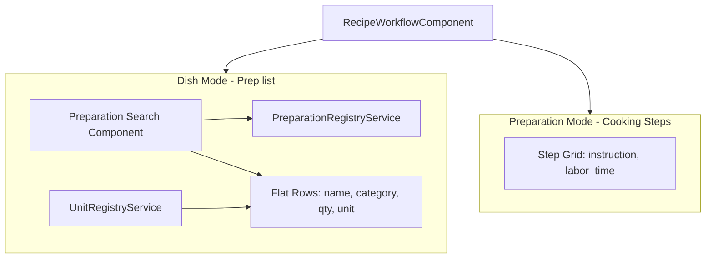

# Recipe Workflow Component Enhancement Plan

## Summary of Requirements

**Dish mode (recipe_type === 'dish')**: Preparation list — items that must be ready to serve the dish ("prep en place"). Each row: preparation name, category, quantity (default 1), and unit (with unit-creator modal). The list starts with an empty row. Search shows preparations by category; if not found, user can add a new preparation with category selection, and a category dropdown allows adding new categories via unit-creator modal if needed. All component/function names previously using "mise" should now use "prep" (e.g. `getPrepItems`, `addPrepItemToCategory`). 

**Preparation mode (recipe_type === 'preparation')**: Cooking steps — already implemented. Each row: step number, instruction text, labor time. Minor refinements only.

---

## Current State

- [recipe-workflow.component.ts](src/app/pages/recipe-builder/components/recipe-workflow/recipe-workflow.component.ts): Receives `workflowFormArray` and `type`; has `getMiseItems`, `addMiseItemToCategory`.
- [recipe-workflow.component.html](src/app/pages/recipe-builder/components/recipe-workflow/recipe-workflow.component.html): Preparation mode shows step grid (#, instruction, labor_time); Dish mode shows nested categories with items (item_name, unit only).
- [recipe.model.ts](src/app/core/models/recipe.model.ts): `MiseItem` has `item_name`, `unit`; `MiseCategory` has `category_name`, `items: MiseItem[]`.
- [recipe-builder.page.ts](src/app/pages/recipe-builder/recipe-builder.page.ts): Creates `createMiseCategoryGroup` / `createMiseItemGroup`; `buildRecipeFromForm` maps to `mise_categories_`.

---

## Architecture Overview

---

## Implementation Plan

### 1. Preparation Registry Service

**New file:** `src/app/core/services/preparation-registry.service.ts`

- **Storage key:** `KITCHEN_PREPARATIONS` (single document, like `UnitRegistryService`).
- **Structure:** `{ categories: string[], preparations: { name: string, category: string }[] }`.
- **Signals:** `preparationCategories_`, `preparations_` (readonly).
- **Methods:**
  - `registerPreparation(name, category)` — add preparation; if category missing, add it.
  - `registerCategory(name)` — add category.
  - `getPreparationsByCategory()` — return preparations grouped by category for search dropdown.
- **Initialization:** On first load, seed with empty arrays or migrate from existing recipes' `prep_categories_` to populate initial preparations (optional bootstrap).

### 2. Preparation Search Component

**New component:** `src/app/pages/recipe-builder/components/preparation-search/`

Pattern: Similar to [ingredient-search](src/app/pages/recipe-builder/components/ingredient-search/).

- **Input:** User types in text field.
- **Behavior:**
  - On input (min 2 chars): filter preparations from `PreparationRegistryService` by name, grouped by category in dropdown.
  - If no match: show "Add preparation" option with Plus icon.
  - On "Add preparation": emit event or open inline flow to add preparation — user selects/creates category, enters name, then emits `{ name, category }`.
  - Category select: use `PreparationRegistryService.preparationCategories_()`; include "Add category" option that calls `registerCategory` (or opens simple prompt/modal).
- **Outputs:** `preparationSelected`, `preparationAdded` (when user adds new one).
- **Styling:** Reuse patterns from [ingredient-search.component.scss](src/app/pages/recipe-builder/components/ingredient-search/ingredient-search.component.scss).

### 3. Recipe Model Update

**File:** [recipe.model.ts](src/app/core/models/recipe.model.ts)

- Extend `MiseItem` to include `quantity?: number` (default 1) and `category_name?: string`.
- Add optional flat structure for new dishes: `prep_items_?: FlatPrepItem[]` where `FlatPrepItem = { preparation_name: string, category_name: string, quantity: number, unit: string }`.
- Add `prep_categories_` for backward compatibility; when loading old recipes, convert `mise_categories_` to `prep_items_` for the form.

### 4. Recipe Builder Page — Form Structure for Dish Mode

**File:** [recipe-builder.page.ts](src/app/pages/recipe-builder/recipe-builder.page.ts)

- **Change:** For dish mode, use flat `workflow_items` array of groups: `{ preparation_name, category_name, quantity, unit }`.
- **Create:** `createPrepItemRow(preparation?, category?, quantity?, unit?)` returning `FormGroup` with `preparation_name`, `category_name`, `quantity` (default 1), `unit` (default from `UnitRegistryService.allUnitKeys_()[0]` or `'unit'`).
- **Replace:** `createMiseCategoryGroup` / `createMiseItemGroup` usage for dish mode with `createPrepItemRow`.
- **addNewStep (dish):** Push `createPrepItemRow()`.
- **deleteStep (dish):** Remove row at index.
- **patchFormFromRecipe:** When `mise_categories_` exists, flatten to rows: each item gets `preparation_name`, `category_name` (from parent), `quantity` (1 if missing), `unit`.
- **buildRecipeFromForm:** When dish, build `prep_items_` from flat form rows; also keep `prep_categories_` (grouped) for backward compatibility.

### 5. Recipe Workflow Component — Dish Mode UI

**File:** [recipe-workflow.component.html](src/app/pages/recipe-builder/components/recipe-workflow/recipe-workflow.component.html)

Replace the nested category blocks with a flat grid (similar to preparation mode):

- **Columns:** Preparation name (search) | Category (display/read-only from selection) | Quantity | Unit | Actions.
- **Preparation name cell:** Use `app-preparation-search` when empty; when selected, show name + clear button (like ingredient-search).
- **Category cell:** Display `category_name` from form (set when preparation is selected or added).
- **Quantity cell:** Input with +/- buttons (default 1), mirroring [recipe-ingredients-table](src/app/pages/recipe-builder/components/recipe-ingredients-table/recipe-ingredients-table.component.html).
- **Unit cell:** Select from `UnitRegistryService.allUnitKeys_()`.
- **Actions:** Remove row button.
- **Add row button:** Emit `addItem` (parent pushes new `createPrepItemRow()`).

**File:** [recipe-workflow.component.ts](src/app/pages/recipe-builder/components/recipe-workflow/recipe-workflow.component.ts)

- Remove `getMiseItems`, `addMiseItemToCategory` (no longer nested).
- Add input for `UnitRegistryService` units (or inject and expose `allUnitKeys_`).
- Add `incrementQuantity`, `decrementQuantity` for prep rows.
- Wire `preparationSelected` / `preparationAdded` from `app-preparation-search` to patch the row's `preparation_name`, `category_name`.

### 6. Recipe Workflow Component — Preparation Mode

**File:** [recipe-workflow.component.html](src/app/pages/recipe-builder/components/recipe-workflow/recipe-workflow.component.html)

- Keep current structure: step #, instruction textarea, labor_time input, remove button.
- Optional: Change `textarea` to `input` if "plain text" is preferred (user said "text input"); current textarea is acceptable for multi-line instructions.

### 7. Styling

**File:** [recipe-workflow.component.scss](src/app/pages/recipe-builder/components/recipe-workflow/recipe-workflow.component.scss)

- Add styles for dish-mode flat grid: `.prep-flat-grid` with columns for preparation, category, quantity, unit, actions.
- Reuse `.quantity-controls`, `.add-row-btn` patterns from recipe-ingredients-table.
- Add `.prep-en-place-view` styles for the new flat layout (replace or extend existing).

### 8. Dictionary and Icons

**File:** [dictionary.json](public/assets/data/dictionary.json)

- Add keys: `preparation`, `preparation_category`, `add_preparation`, `add_preparation_category`, `actions` (if missing).

**File:** [app.config.ts](src/app/app.config.ts)

- Ensure `plus` icon is registered (already in common list).

### 9. Migration and Backward Compatibility

- When loading a recipe with `mise_categories_` and no `prep_items_`: flatten to `prep_items_` for the form (each item: `preparation_name` = item_name, `category_name` = parent category, `quantity` = 1, `unit` = item.unit).
- When saving: always persist `prep_items_` for dish recipes; also keep writing `prep_categories_` for legacy consumers by grouping `prep_items_` by `category_name`.

---

## Files to Create

| File | Purpose |
|------|---------|
| `src/app/core/services/preparation-registry.service.ts` | Preparation + category registry |
| `src/app/core/services/preparation-registry.service.spec.ts` | Unit tests |
| `src/app/pages/recipe-builder/components/preparation-search/preparation-search.component.ts` | Search + add preparation UI |
| `src/app/pages/recipe-builder/components/preparation-search/preparation-search.component.html` | Template |
| `src/app/pages/recipe-builder/components/preparation-search/preparation-search.component.scss` | Styles |
| `src/app/pages/recipe-builder/components/preparation-search/preparation-search.component.spec.ts` | Unit tests |

---

## Files to Modify

| File | Changes |
|------|---------|
| [recipe.model.ts](src/app/core/models/recipe.model.ts) | Add `FlatPrepItem`, extend `MiseItem`, add `prep_items_` and `prep_categories_` to Recipe |
| [recipe-builder.page.ts](src/app/pages/recipe-builder/recipe-builder.page.ts) | Flat prep form structure, `createPrepItemRow`, patch/build logic |
| [recipe-workflow.component.ts](src/app/pages/recipe-builder/components/recipe-workflow/recipe-workflow.component.ts) | Flat rows, preparation-search wiring, quantity controls |
| [recipe-workflow.component.html](src/app/pages/recipe-builder/components/recipe-workflow/recipe-workflow.component.html) | Flat grid for dish mode |
| [recipe-workflow.component.scss](src/app/pages/recipe-builder/components/recipe-workflow/recipe-workflow.component.scss) | Dish-mode flat grid styles |
| [dictionary.json](public/assets/data/dictionary.json) | New translation keys |
| [app.config.ts](src/app/app.config.ts) | Register icons if needed |

---

## Atomic Sub-tasks

1. Create `PreparationRegistryService` + spec.
2. Create `PreparationSearchComponent` (ts, html, scss, spec).
3. Update `Recipe` model (`FlatPrepItem`, `prep_items_`, `prep_categories_`).
4. Update `recipe-builder.page.ts` (flat form, createPrepItemRow, patch, build).
5. Update `recipe-workflow` component (ts, html, scss) for dish flat grid.
6. Add dictionary entries and verify icons.
7. Migration: load old `mise_categories_` into flat form; save as `prep_items_` and `prep_categories_`.

---

## Critical Questions

1. **Persistence format:** Should we persist dish workflow as flat `prep_items_` only, or also keep `prep_categories_` (grouped) for backward compatibility with any external consumers?
   - **Answer:** Also keep `prep_categories_`

2. **Preparation bootstrap:** Should we auto-populate the preparation registry from existing recipes' prep items on first run, or start with an empty registry?
   - **Answer:** Start with an empty registry

3. **Add preparation flow:** Prefer inline (expand row to add) or a small modal/dialog for adding preparation + category?
   - **Answer:** Whatever fits best (inline recommended)
