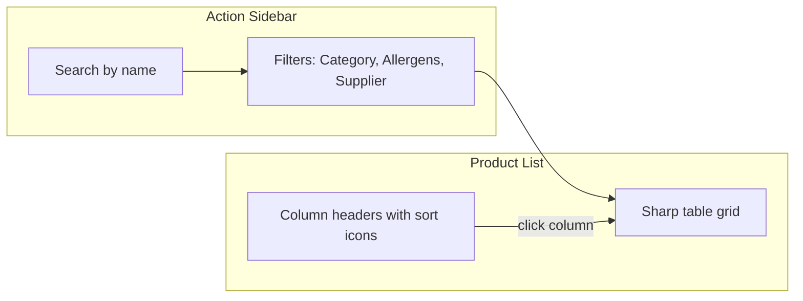

# Inventory List Refactor Plan

## Status: Done

All items (a–d) implemented. Plan and todo documents updated.

---

## Context

The inventory page enhancement ([plans/005-inventory-page-enhancement.plan.md](plans/005-inventory-page-enhancement.plan.md)) has been implemented. This plan adds four refinements and updates the plan/todo tracking.

---

## Summary of New Changes


| ID  | Change                                   | Scope                                                                                 |
| --- | ---------------------------------------- | ------------------------------------------------------------------------------------- |
| a   | Move sort from sidebar to column headers | Remove sidebar sort section; add sort icon + click handler to each data column header |
| b   | Hamburger visibility                     | Fade out when sidebar open, show when closed                                          |
| c   | Remove Add product button                | Delete the button (lines 62–66)                                                       |
| d   | Center-align grid text                   | All cells in rows centered                                                            |


---

## A. Column-Header Sort (Replace Sidebar Sort)

**Current:** Sort controls live in the sidebar (sort-section with buttons for name, category, supplier, date).

**Target:** Remove sidebar sort section. Add a small sort icon beside each column title in the grid header. The entire header cell (title + icon) is clickable and sorts by that column. First click: A→Z (asc), second click: Z→A (desc).

**Sortable columns:** Product, Category, Allergens, Supplier, Unit, Price. **Not** Actions.

**Files to modify:**

- [inventory-product-list.component.html](src/app/pages/inventory/components/inventory-product-list/inventory-product-list.component.html)
  - Remove the entire `.sort-section` block (lines 15–35).
  - Replace static header cells with clickable sort headers. Example pattern:
    ```html
    <div class="col-name sortable-header" (click)="setSort('name')" role="button" tabindex="0">
      {{ 'product' | translatePipe }}
      <lucide-icon [name]="sortIconFor_('name')" [size]="14"></lucide-icon>
    </div>
    ```
  - Repeat for category, allergens, supplier, unit, price. Actions stays non-sortable.
- [inventory-product-list.component.ts](src/app/pages/inventory/components/inventory-product-list/inventory-product-list.component.ts)
  - Extend `SortField`: add `'allergens' | 'unit' | 'price'`.
  - Extend `compareProducts()` for allergens (e.g. first allergen or empty), unit (string), price (number).
  - Add `sortIconFor_(field: SortField): string` returning `'arrow-up'`, `'arrow-down'`, or `'arrow-up-down'` (neutral when not active).
  - Remove `sortOrderIcon_()` if no longer used.
  - Remove `toggleSortOrder()` if sort order is toggled only via `setSort()`.
- [inventory-product-list.component.scss](src/app/pages/inventory/components/inventory-product-list/inventory-product-list.component.scss)
  - Remove `.sort-section`, `.sort-options`, `.sort-btn`, `.sort-order-btn` styles.
  - Add `.sortable-header` styles: `cursor: pointer`, `display: flex`, `align-items: center`, `gap: 6px`, hover state.
  - Ensure header cells remain visually consistent.
- [app.config.ts](src/app/app.config.ts)
  - Register `ArrowUp`, `ArrowDown`, `ArrowUpDown` (or equivalent) if not already present. `ArrowUpDown` exists; verify `ArrowUp` and `ArrowDown`.

---

## B. Hamburger Fade When Sidebar Open

**Current:** Hamburger is always visible.

**Target:** When sidebar is open, hamburger fades out (or hides). When sidebar closes, hamburger shows again.

**Implementation:**

- [inventory-product-list.component.html](src/app/pages/inventory/components/inventory-product-list/inventory-product-list.component.html)
  - Add `[class.burger-hidden]="isSidebarOpen_()"` (or similar) to `.burger-btn`.
- [inventory-product-list.component.scss](src/app/pages/inventory/components/inventory-product-list/inventory-product-list.component.scss)
  - Add `.burger-btn.burger-hidden { opacity: 0; pointer-events: none; transition: opacity 0.3s; }` (or `visibility: hidden` if preferred). Use a class that applies when `isSidebarOpen_()` is true.

---

## C. Remove Add Product Button

**Change:** Delete the Add product button (lines 62–66 in the template).

- [inventory-product-list.component.html](src/app/pages/inventory/components/inventory-product-list/inventory-product-list.component.html)
  - Remove:
    ```html
    <button type="button" class="add-btn" (click)="onCreateProduct()">
      <lucide-icon name="plus-circle" [size]="18"></lucide-icon>
      {{ 'add_product' | translatePipe }}
    </button>
    ```
- [inventory-product-list.component.ts](src/app/pages/inventory/components/inventory-product-list/inventory-product-list.component.ts)
  - Remove `onCreateProduct()` if it has no other usages.
- [inventory-product-list.component.scss](src/app/pages/inventory/components/inventory-product-list/inventory-product-list.component.scss)
  - Remove `.add-btn` styles if present.

---

## D. Center-Align Grid Row Text

**Change:** Center-align text in all grid row cells.

- [inventory-product-list.component.scss](src/app/pages/inventory/components/inventory-product-list/inventory-product-list.component.scss)
  - Add to `.product-grid-row > *`: `text-align: center; display: flex; justify-content: center; align-items: center;` (or equivalent). Some cells (e.g. `.col-unit`, `.col-price`) already use flex; ensure they center their content. `.col-name` and `.col-category` may need explicit centering. `.col-allergens` is already centered. Ensure `.col-actions` stays centered. Adjust `.col-unit` and `.col-price` so the select/input + suffix are centered as a group.

---

## Plan and Todo Updates

**1. Update [plans/005-inventory-page-enhancement.plan.md](plans/005-inventory-page-enhancement.plan.md):**

- Add a "Refinements (Phase 2)" section documenting changes a–d.
- Update the architecture diagram to show column-header sort instead of sidebar sort.
- Update "Files to Modify" and "Atomic Sub-tasks" to reflect the new work.
- Mark completed items and add the new sub-tasks.

**2. Update [.assistant/todo.md](.assistant/todo.md):**

- Under "Done": Keep existing inventory enhancement item; add a bullet for "Inventory refinements: column-header sort, hamburger visibility, remove add button, center-align rows" (to be marked done after implementation).
- Under "Ahead": Add "Inventory refinements (a–d)" as a single task or split into sub-tasks, and mark as pending until complete.

---

## Implementation Order

1. **C** — Remove Add product button (quick, isolated).
2. **D** — Center-align grid text (CSS only).
3. **B** — Hamburger fade (template + CSS).
4. **A** — Column-header sort (largest change: template, TS, SCSS, icons).
5. Update plan and todo documents.

---

## Data Flow (Updated)




**Sort flow:** User clicks column header → `setSort(field)` → `sortBy_` and `sortOrder_` update → `filteredProducts_` recomputes with new sort → table re-renders.

---

## To-Do Summary

| ID | Task | Status |
|----|------|--------|
| a | Column-header sort (replace sidebar sort) | Done |
| b | Hamburger fade when sidebar open | Done |
| c | Remove Add product button | Done |
| d | Center-align grid row text | Done |
| e | Update plan and todo documents | Done |
