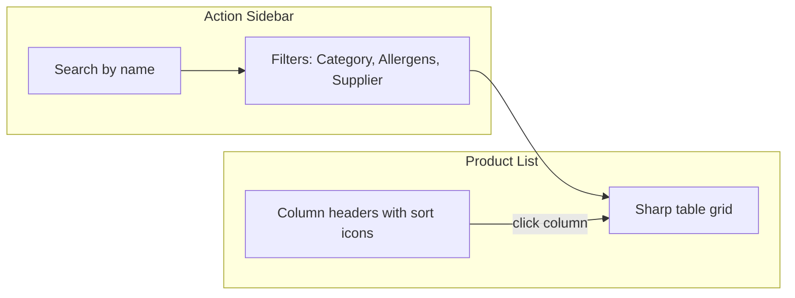

# Inventory Page Enhancement Plan

## Summary of Requirements

- **Action sidebar**: Filtering (category, allergens, supplier), sorting, and search by name
- **Search behavior**: Search applies to the already-filtered list — user filters first, then searches within filtered results
- **Product list**: Table-style layout with edit and delete buttons per product
- **Styling**: New edge, sharp and precise — aligned with [recipe-ingredients-table](src/app/pages/recipe-builder/components/recipe-ingredients-table/recipe-ingredients-table.component.scss) and [ingredient-search](src/app/pages/recipe-builder/components/ingredient-search/ingredient-search.component.scss)

---

## Current State

- [inventory-product-list.component.ts](src/app/pages/inventory/components/inventory-product-list/inventory-product-list.component.ts): Has `filterCategories_`, `filteredProducts_`, `toggleFilter`, edit/delete handlers. Filter panel + product cards layout.
- [inventory-product-list.component.html](src/app/pages/inventory/components/inventory-product-list/inventory-product-list.component.html): Left filter panel (checkboxes), right product cards. Edit/delete buttons already present.
- [product.model.ts](src/app/core/models/product.model.ts): `name_hebrew`, `category_`, `supplierId_`, `allergens_`, `base_unit_`, etc.
- No search bar or sorting currently.

---

## Architecture Overview

**Data flow**: `products_` → apply filters → apply search → apply sort → display in table.

---

## Refinements (Phase 2) — [005-1-inventory-list-refactor.plan.md](plans/005-1-inventory-list-refactor.plan.md)

- **(a)** Sort moved from sidebar to column headers: each data column (Product, Category, Allergens, Supplier, Unit, Price) has a sort icon; click toggles asc/desc.
- **(b)** Hamburger icon fades out when sidebar is open, reappears when closed.
- **(c)** Add product button removed.
- **(d)** All grid row text center-aligned.

---

## Implementation Plan

### 1. Action Sidebar — Search Bar

**File:** [inventory-product-list.component.html](src/app/pages/inventory/components/inventory-product-list/inventory-product-list.component.html)

- Add search input at top of sidebar (above filters).
- Use `[(ngModel)]` bound to `searchQuery_` signal.
- Placeholder: "חיפוש לפי שם" (search by name) or use dictionary key `general.search`.

**File:** [inventory-product-list.component.ts](src/app/pages/inventory/components/inventory-product-list/inventory-product-list.component.ts)

- Add `searchQuery_ = signal<string>('')`.
- Extend `filteredProducts_` computed: first apply category/allergen/supplier filters, then filter by `name_hebrew` containing `searchQuery_()` (case-insensitive). Search operates on the filtered subset.

### 2. Action Sidebar — Sorting

**File:** [inventory-product-list.component.ts](src/app/pages/inventory/components/inventory-product-list/inventory-product-list.component.ts)

- Add `sortBy_ = signal<'name' | 'category' | 'supplier' | null>(null)` and `sortOrder_ = signal<'asc' | 'desc'>('asc')`.
- Extend the final computed: after filters + search, apply sort by selected field.

**File:** [inventory-product-list.component.html](src/app/pages/inventory/components/inventory-product-list/inventory-product-list.component.html)

- Add sort controls in sidebar: dropdown or buttons for sort field + asc/desc toggle.

### 3. Product List — Table Layout (Sharp and Precise)

**File:** [inventory-product-list.component.html](src/app/pages/inventory/components/inventory-product-list/inventory-product-list.component.html)

Replace product cards with a table-style grid (like recipe-ingredients-table):

- **Header row**: Name | Category | Allergens | Supplier | Actions
- **Body rows**: One row per product. Each row: `name_hebrew`, `category_`, allergens (comma-separated or pills), `supplierId_`, edit + delete buttons.
- Use `@for` over `filteredProducts_()` (which now includes search + sort).

### 4. Styling — Sharp and Precise

**File:** [inventory-product-list.component.scss](src/app/pages/inventory/components/inventory-product-list/inventory-product-list.component.scss)

Align with recipe-ingredients-table and ingredient-search:

- **Layout**: `.inventory-container` — grid with sidebar (~240px) and main content (1fr). Sidebar: search, filters, sort stacked vertically.
- **Table**: `.products-grid-header` and `.product-grid-row` — CSS Grid with explicit columns (e.g. `2fr 1fr 1.5fr 1fr 80px`). Sharp borders: `border-bottom: 1px solid #e2e8f0`, header `border-bottom: 2px solid #e2e8f0`. No heavy shadows; flat, clean.
- **Colors**: Slate palette — `#f8fafc`, `#64748b`, `#e2e8f0`, `#cbd5e1`, `#1e293b`. Focus states: `border-color: #0ea5e9`, `box-shadow: 0 0 0 2px rgba(14, 165, 233, 0.1)`.
- **Search input**: Reuse `.input-wrapper` pattern from ingredient-search — `border: 1px solid #cbd5e1`, `border-radius: 6px`, focus-within styles.
- **Action buttons**: Icon-only edit (pencil) and delete (trash-2) — minimal, sharp, consistent with recipe-ingredients-table `.remove-btn`.
- **Filter checkboxes**: Clean alignment, subtle hover. Sharp corners on filter panel.

### 5. Filter Panel Refinements

- Ensure `filterCategories_` remains derived from `products_()` (or `kitchenStateService.products_()`).
- Filter options: Category, Allergens, Supplier — keep current checkbox logic.
- Sidebar structure: Search → Sort → Filters (or Search → Filters → Sort). Logical order: narrow by search first, then filters, then sort.

### 6. Dictionary and Icons

**File:** [dictionary.json](public/assets/data/dictionary.json)

- Add keys if missing: `search`, `sort`, `sort_by_name`, `sort_by_category`, `sort_by_supplier`, `filter`, `product`, `category`, `allergens`, `supplier`, `actions`, `edit`, `delete`.

**File:** [app.config.ts](src/app/app.config.ts)

- Ensure `search`, `trash-2`, `pencil` (or `edit`) icons are registered.

---

## Files to Create

| File | Purpose                                         |
| ---- | ----------------------------------------------- |
| None | All changes are modifications to existing files |

---

## Files to Modify

| File                                                                                                                                     | Changes                                                                                                        |
| ---------------------------------------------------------------------------------------------------------------------------------------- | -------------------------------------------------------------------------------------------------------------- |
| [inventory-product-list.component.ts](src/app/pages/inventory/components/inventory-product-list/inventory-product-list.component.ts)     | Add `searchQuery_`, `sortBy_`, `sortOrder_`; extend `filteredProducts_` with search and sort; add sort methods |
| [inventory-product-list.component.html](src/app/pages/inventory/components/inventory-product-list/inventory-product-list.component.html) | Replace layout: sidebar (search, sort, filters) + table grid (header + rows with edit/delete)                  |
| [inventory-product-list.component.scss](src/app/pages/inventory/components/inventory-product-list/inventory-product-list.component.scss) | Sharp table grid, sidebar, search input, action buttons — slate palette, minimal shadows                       |
| [dictionary.json](public/assets/data/dictionary.json)                                                                                    | Add translation keys for search, sort, filter, product, etc.                                                   |

---

## Atomic Sub-tasks

1. Add `searchQuery_` and integrate search into `filteredProducts_` (filter → search pipeline).
2. Add `sortBy_` / `sortOrder_` and integrate sort into final computed.
3. Add search input and sort controls to sidebar in template.
4. Replace product cards with table grid (header + rows).
5. Apply sharp, precise styling (grid, borders, colors, buttons).
6. Add dictionary entries and verify icons.
7. add Animation when hovered.On the products.On the delete and edit icon.
---

## Critical Questions (Resolved)

1. **Sort options** — Which sort fields should the sidebar offer?
   - (A) Name, Category, Supplier
   - (B) Name only
   - **(C) Name, Category, Supplier, Date added** ✓
   - (D) Custom (specify)

2. **Sidebar position** — Where should the action sidebar appear?
   - (A) Left (current)
   - (B) Right
   - (C) Collapsible from left
   - **(D) Collapsible from right** ✓

3. **Allergens display** — How should allergens appear in the product table?
   - (A) Comma-separated text
   - **(B) Small pills/badges** ✓
   - (C) Truncated text with tooltip on hover
   - (D) Icon + count only
