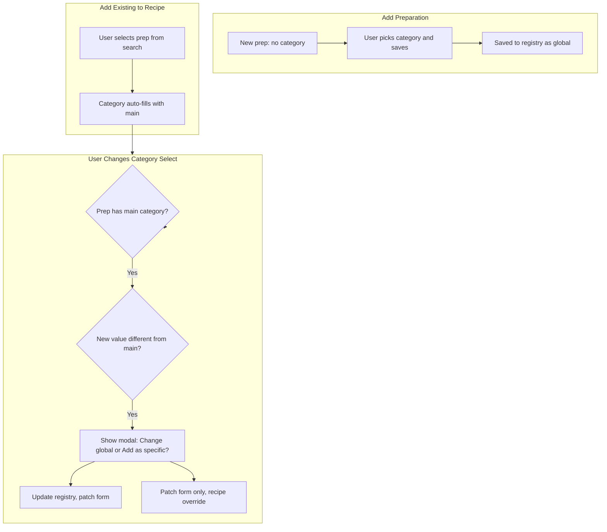

# Preparation Global vs Specific Plan (006-1)

## Status: Done

All items implemented. Build passes.

---

## Context

This plan extends [006-recipe-workflow-refactor.plan.md](plans/006-recipe-workflow-refactor.plan.md). The recipe workflow (dish mode) shows preparation rows with a category select. When a user changes the category for a preparation that already has a main/global category, we must ask: update the global preparation or keep the change recipe-specific only.

---

## Summary of Requirements

| Requirement             | Description                                                                                                                                                            |
| ----------------------- | ---------------------------------------------------------------------------------------------------------------------------------------------------------------------- |
| Default = Add as global | When creating a new preparation, it is saved to the global registry (already the case)                                                                                 |
| First-time prep         | New prep has no category until user picks one and saves; that becomes its main category                                                                                |
| Existing prep in recipe | Auto-fills with its main category (already done via `onPreparationSelected`)                                                                                           |
| Modal trigger           | Only when: (1) preparation already has a main category, AND (2) user changes the select to a different value                                                           |
| Modal options           | **Change global** — update the master preparation's category for all future uses; **Add as specific** — use this category only for this recipe, leave global unchanged |

---

## Data Flow

---

## Implementation Plan

### 1. Store Main Category Per Row

**File:** [recipe-builder.page.ts](src/app/pages/recipe-builder/recipe-builder.page.ts)

- Add `main_category_name` to each prep row form group (alongside `preparation_name`, `category_name`, `quantity`, `unit`).
- When creating a row: `main_category_name: ''`.
- When loading from recipe: set `main_category_name` from `prep_items_` — use `category_name` as the main when loading existing recipe data (or leave empty for legacy).

**File:** [recipe-workflow.component.ts](src/app/pages/recipe-builder/components/recipe-workflow/recipe-workflow.component.ts)

- In `onPreparationSelected`: when patching the form, also set `main_category_name: entry.category` (the preparation's global category from the registry).
- In `clearPreparation`: reset `main_category_name: ''`.

---

### 2. PreparationRegistryService — Lookup and Update

**File:** [preparation-registry.service.ts](src/app/core/services/preparation-registry.service.ts)

- Add `getPreparationByName(name: string): PreparationEntry | undefined` — returns the first matching entry (or undefined). Used to verify a prep exists in the registry.
- Add `updatePreparationCategory(name: string, oldCategory: string, newCategory: string): Promise<void>` — finds the entry with `name` and `oldCategory`, updates it to `newCategory`, persists to storage, updates the signal.

---

### 3. Category Change Handler — Modal Logic

**File:** [recipe-workflow.component.ts](src/app/pages/recipe-builder/components/recipe-workflow/recipe-workflow.component.ts)

Extend `onCategoryChange(group: FormGroup, value: string)`:

1. If `value === '__add_new__'` → existing flow (add new category).
2. Else, get `preparationName = group.get('preparation_name')?.value`, `mainCategory = group.get('main_category_name')?.value`, `currentCategory = group.get('category_name')?.value`.
3. If `!preparationName` or `!mainCategory` → patch `category_name` with `value` and return (no modal).
4. If `value === mainCategory` → patch and return (user reverted to main).
5. If `value !== mainCategory` and `mainCategory` exists:
  - Open modal: "Apply this change globally or only for this recipe?"
  - **Change global**: call `prepRegistry_.updatePreparationCategory(preparationName, mainCategory, value)`, patch `category_name` and `main_category_name` with `value`.
  - **Add as specific**: patch only `category_name` with `value` (leave `main_category_name` unchanged).
6. Else: patch `category_name` with `value`.

---

### 4. Global vs Specific Modal

**New files:**

- `src/app/shared/global-specific-modal/global-specific-modal.component.ts`
- `src/app/shared/global-specific-modal/global-specific-modal.component.html`
- `src/app/shared/global-specific-modal/global-specific-modal.component.scss`
- `src/app/core/services/global-specific-modal.service.ts`

**Behavior:**

- Modal shows two buttons: "Change global" (or "Apply globally") and "Add as specific" (or "Only for this recipe").
- Service: `open(config: { preparationName: string; mainCategory: string; newCategory: string }): Promise<'global' | 'specific'>`.
- On "Change global" → resolve with `'global'`.
- On "Add as specific" → resolve with `'specific'`.
- Optional: Cancel button → revert the select to previous value, resolve with `null` or reject.

**Dictionary keys:** `change_global`, `add_as_specific`, `category_change_prompt` (or similar).

---

### 5. Wire Modal into Recipe Workflow

**File:** [recipe-workflow.component.ts](src/app/pages/recipe-builder/components/recipe-workflow/recipe-workflow.component.ts)

- Inject `GlobalSpecificModalService`.
- In `onCategoryChange`, when modal is needed: call `modalService.open({ preparationName, mainCategory, newCategory })`. Await result. On `'global'` → update registry and patch both fields. On `'specific'` → patch `category_name` only.
- If user cancels: revert `category_name` to previous value (store it before opening modal).

---

### 6. Recipe Builder — Form Structure and Persistence

**File:** [recipe-builder.page.ts](src/app/pages/recipe-builder/recipe-builder.page.ts)

- Add `main_category_name` to `createPrepItemRow` and `getPrepRowsFromRecipe`.
- When building `prep_items_` for save: `category_name` is the effective category for the recipe (either main or override). We do not need to persist `main_category_name` separately — it is derived when loading: if we load a recipe, each prep item's `category_name` is used, and we set `main_category_name` from the registry when the user selects a prep. For loaded recipes, we can set `main_category_name = category_name` initially (treating loaded data as the "main" until user changes it).
- Ensure `prep_items_` in the recipe model stores `category_name` (already does). The `main_category_name` is UI/UX state for the modal logic; it can be persisted in the recipe if we want to remember "this was a global" vs "this was an override" — but for checklist behavior, we only need the effective `category_name` per item. So `main_category_name` can be form-only, derived when adding from search.

---

## Files to Create

| File                                                     | Purpose                          |
| -------------------------------------------------------- | -------------------------------- |
| `src/app/shared/global-specific-modal/*`                 | Modal component with two options |
| `src/app/core/services/global-specific-modal.service.ts` | Open modal, return promise       |

---

## Files to Modify

| File                                                                                                                 | Changes                                                                                    |
| -------------------------------------------------------------------------------------------------------------------- | ------------------------------------------------------------------------------------------ |
| [preparation-registry.service.ts](src/app/core/services/preparation-registry.service.ts)                             | Add `getPreparationByName`, `updatePreparationCategory`                                    |
| [recipe-workflow.component.ts](src/app/pages/recipe-builder/components/recipe-workflow/recipe-workflow.component.ts) | Extend `onCategoryChange`, wire modal, set `main_category_name` in `onPreparationSelected` |
| [recipe-builder.page.ts](src/app/pages/recipe-builder/recipe-builder.page.ts)                                        | Add `main_category_name` to prep row form and row creation/loading                         |
| [app.component.html](src/app/appRoot/app.component.html)                                                             | Add global-specific-modal outlet or component                                              |
| [dictionary.json](public/assets/data/dictionary.json)                                                                | Add `change_global`, `add_as_specific`, `category_change_prompt`                           |

---

## Dictionary Keys

| Key                      | Hebrew (example)                                                                  |
| ------------------------ | --------------------------------------------------------------------------------- |
| `change_global`          | עדכן גלובלי                                                                       |
| `add_as_specific`        | רק למתכון זה                                                                      |
| `category_change_prompt` | ההכנה שייכת לקטגוריה X. שינית ל-Y. לעדכן את ההכנה הגלובלית או לשמור רק במתכון זה? |

---

## Execution Order

1. Add dictionary keys.
2. Add `getPreparationByName` and `updatePreparationCategory` to PreparationRegistryService.
3. Create GlobalSpecificModal component and service.
4. Add `main_category_name` to recipe-builder form and recipe-workflow handlers.
5. Extend `onCategoryChange` with modal logic.
6. Register modal in app root and test flow.
