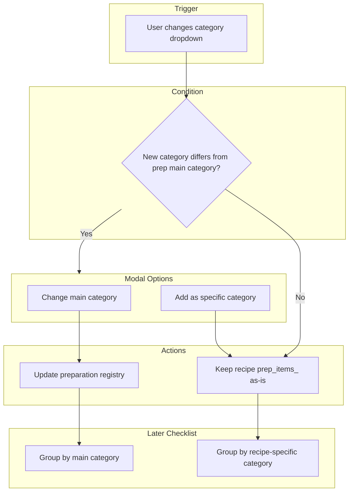

# Preparation Category Change Modal — Concept Assessment (006-2)

## Summary

The concept is **sound and worth implementing**. It aligns with the existing plan ([006-recipe-workflow-refactor.plan.md](006-recipe-workflow-refactor.plan.md)) which already describes "per-recipe override for checklist" and recipe-specific categories. The current data model supports most of this; the main addition is the modal and the logic to update the preparation registry when the user chooses "change main."

---

## Current State

| Layer | What Exists |
|-------|-------------|
| **Preparation registry** | `PreparationEntry { name, category }` — one category per (name, category) pair; same name can exist in multiple categories as separate entries |
| **Recipe** | `prep_items_: FlatPrepItem[]` with `preparation_name`, `category_name`, `quantity`, `unit` — recipe already stores category per prep item |
| **Recipe workflow** | Category dropdown per row; `onCategoryChange` only handles `__add_new__` for adding new categories |
| **Checklist** | Not implemented yet; plan 006 envisions using recipe-specific category when building checklists from recipes |

---

## Concept Flow

---

## Assessment

### Strengths

1. **Clear user intent** — Distinguishes "this prep is always in category X" vs "for this recipe only, it's in category Y."
2. **Matches plan 006** — A3 already says: "Per-recipe: user can override the default category" and "checklist shows that preparation under that (recipe-specific) category."
3. **Data model fits** — Recipe `prep_items_` already stores `category_name` per item. "Add as specific" is just keeping the current form value; no new storage needed.
4. **Checklist flexibility** — When the checklist feature is built, it can group by `category_name` from each recipe's `prep_items_`, so recipe-specific grouping is already supported.

### Considerations (Not Blockers)

1. **When to show the modal** — Only when the new category differs from the preparation's main/default category. We need to know the "original" category when the prep was selected (from registry or from the row's initial value).
2. **Modal frequency** — Show only when the user changes the category, not on initial selection. If the user adds a new prep and picks a category, no modal (no "main" to compare).
3. **"Change main" semantics** — The registry uses `(name, category)` as the uniqueness key. "Change main" would update the preparation entry: e.g. `("diced tomatoes", "vegetables")` → `("diced tomatoes", "sauce")`. If the same name exists in multiple categories, we must decide which entry to update (e.g. the one that matched when the prep was selected).
4. **Recipe ID requirement** — For "add as specific," the recipe ID is already implied: the prep item lives in the recipe's `prep_items_`. No extra `(prep, recipe_id, category)` store is needed; the recipe document itself is the source of truth.

### Potential Trouble Areas

| Area | Risk | Mitigation |
|------|------|------------|
| Duplicate prep names in registry | Same name in multiple categories (e.g. "diced tomatoes" in vegetables and sauce) | When changing main, update only the entry that was used when the prep was selected |
| New recipe (no ID yet) | User changes category before first save | Show modal; "add as specific" still works (saved with recipe on first save). "Change main" can run immediately |
| UX friction | Modal on every category change | Only show when new category differs from the preparation's main category |

---

## Recommendation

**Proceed with implementation.** The concept is coherent, matches the existing plan, and fits the current data model. Main implementation tasks:

1. **Detection** — In recipe-workflow.component.ts, when the category dropdown changes, compare new value to the preparation's main category (from registry at selection time).
2. **Modal component** — Simple dialog: "Change main category of this preparation?" vs "Use this category only for this recipe."
3. **"Change main" action** — Call `PreparationRegistryService` to update the preparation's category (update the matching `(name, category)` entry).
4. **"Add as specific" action** — No registry change; keep the form value (already stored in `prep_items_` on save).
5. **Checklist (future)** — Use `prep_items_[].category_name` when grouping; recipe-specific behavior is already supported.

---

## Open Questions — Resolved

1. **Skip modal for new preparations?** — Yes, skip the modal. Treat new preparations as **add as main category** (not specific).
2. **Default option** — Should one option be the default (e.g. "Add as specific" to avoid accidental global changes)? — *To be decided.*
3. **Undo / revert** — Yes, include a way to revert a "change main" (e.g. "Revert to previous category").
