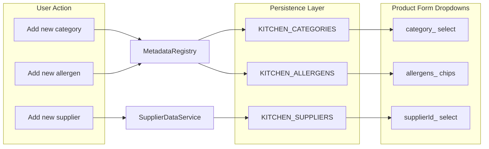

# Product Form Enhancement Plan

## Summary of Requirements

- **Add/Edit form**: Single form for both add and edit (route `/inventory/add` and `/inventory/edit/:id`)
- **Missing fields**: Add `supplierId_`, `is_dairy_`, `min_stock_level_`, `expiry_days_default_`
- **Persistence**: All new values (supplier, category, allergen) must be saved to storage so they appear in dropdowns when the user adds another product
- **Translation pipe**: Use `translatePipe` for all user-facing labels
- **Hebrew-to-English modal**: Replace `prompt()` with a smooth modal for Hebrew input that requires an English key
- **Styling**: Align with application design system
- **Icons**: Preserve all existing icons

---

## Persistence Requirements (Critical)

Every new value added during product form usage must be **saved to storage** so it appears in the relevant dropdown on the next product add.

| Value Type | Storage Location | Service | Current State |
|------------|------------------|---------|---------------|
| **Category** | `KITCHEN_CATEGORIES` (single doc, `items: string[]`) | `MetadataRegistryService.registerCategory()` | Already persisted |
| **Allergen** | `KITCHEN_ALLERGENS` (single doc, `items: string[]`) | `MetadataRegistryService.registerAllergen()` | Already persisted |
| **Unit** | `KITCHEN_UNITS` | `UnitRegistryService.registerUnit()` | Already persisted |
| **Supplier** | None | `KitchenStateService.addSupplier()` only updates in-memory signal | **Not persisted** |

**Gap**: Suppliers are not persisted. `KitchenStateService.suppliers_` is a signal that starts empty and is never loaded from storage. New suppliers added via `addSupplier()` are lost on page reload.

---

## Data Flow: New Value → Storage → Dropdown

---

## Implementation Plan

### 1. Supplier Persistence (New)

**Create** `src/app/core/services/supplier-data.service.ts`:

- Entity: `KITCHEN_SUPPLIERS` (or `SUPPLIER_LIST`)
- Pattern: Mirror [ProductDataService](src/app/core/services/product-data.service.ts)
- `loadInitialData()`: `storage.query<Supplier>(ENTITY)` → set signal
- `allSuppliers_`: readonly signal
- `addSupplier(supplier: Omit<Supplier, '_id'>)`: `storage.post()` → update signal
- `updateSupplier(supplier: Supplier)`: `storage.put()` → update signal

**Modify** [kitchen-state.service.ts](src/app/core/services/kitchen-state.service.ts):

- Inject `SupplierDataService`
- Replace `suppliers_ = signal<Supplier[]>([])` with `suppliers_ = computed(() => supplierDataService.allSuppliers_())`
- Replace `addSupplier()` to call `supplierDataService.addSupplier()` (which persists)
- Ensure `SupplierDataService` loads on app init (constructor)

### 2. Product Form: Supplier Field with "Add Supplier"

**File**: [product-form.component.html](src/app/pages/inventory/components/product-form/product-form.component.html)

- Supplier `<select>` with options from `kitchenStateService.suppliers_()`, value = `_id`, label = `name_hebrew`
- Add option: "הוסף ספק" / `add_supplier` → opens Add Supplier modal
- Empty option: "בחר ספק" / `choose_supplier`

**Add Supplier flow**: When user selects "Add supplier", open modal with:
- Hebrew name input only (minimal)
- Other Supplier fields get defaults: `min_order_mov_: 0`, `lead_time_days_: 0`, `delivery_days_: []`
- Save → `supplierDataService.addSupplier()` → form gets new supplier in dropdown, set `supplierId_` to new `_id`

**New component**: `AddSupplierModal` — Hebrew name only. On save, persist via SupplierDataService, emit saved supplier, close. Product form sets `supplierId_` to `saved._id`.

### 3. Category and Allergen: Ensure Persistence in Add Flows

**Category (NEW_CATEGORY)**:
- Open TranslationKeyModal with Hebrew + English inputs
- On save: `metadataRegistry.registerCategory(englishKey, hebrewLabel)` — persists to KITCHEN_CATEGORIES
- `translationService.updateDictionary(englishKey, hebrewLabel)` — persists to DICTIONARY_CACHE
- Set form `category_` to `englishKey`
- Dropdown options come from `metadataRegistry.allCategories_()` — already includes new value

**Allergen (NEW_ALLERGEN)** — add to allergen search box:
- When user types an allergen not in `metadataRegistry.allAllergens_()`, show "Add X" option
- On click: open TranslationKeyModal (Hebrew = typed value, English key input)
- On save: `metadataRegistry.registerAllergen(englishKey)` + `translationService.updateDictionary(englishKey, hebrewLabel)`
- Add allergen to form selection
- Dropdown options come from `metadataRegistry.allAllergens_()` — already includes new value

**Note**: `MetadataRegistryService.registerAllergen(name: string)` expects a single string. Categories/allergens are stored as keys (e.g. `shellfish`). Ensure `registerAllergen` stores the English key and dictionary has key→Hebrew. Current `registerAllergen` stores the string as-is — if we pass English key, we need to also call `translationService.updateDictionary(key, hebrewLabel)`.

### 4. Translation Key Modal

**New files**:
- `src/app/shared/translation-key-modal/translation-key-modal.component.ts`
- `src/app/shared/translation-key-modal/translation-key-modal.component.html`
- `src/app/shared/translation-key-modal/translation-key-modal.component.scss`
- `src/app/core/services/translation-key-modal.service.ts`

**Behavior**: Two fields — Hebrew label, English key. Validate English key via `TranslationService.validateEnglishKey()`. On save, emit `{ englishKey, hebrewLabel }`. Caller decides what to persist (category, allergen, etc.).

### 5. Add Missing Form Fields

- `supplierId_`, `is_dairy_`, `min_stock_level_`, `expiry_days_default_`
- Hydrate and submit these in product form

### 6. Translation Pipe and Dictionary

Apply `translatePipe` to all labels. Add dictionary keys for new strings.

### 7. Styling

Align new fields and modals with unit-creator / product-form design system.

### 8. Inventory List: Supplier Name Display

**File**: [inventory-product-list.component.ts](src/app/pages/inventory/components/inventory-product-list/inventory-product-list.component.ts)

- Inject `SupplierDataService` (or `KitchenStateService` which exposes `suppliers_`)
- Add `getSupplierName(id: string): string` — lookup supplier by `_id`, return `name_hebrew` or fallback to raw id/empty
- Use in template for supplier column display

**File**: [inventory-product-list.component.html](src/app/pages/inventory/components/inventory-product-list/inventory-product-list.component.html)

- Replace `{{ product.supplierId_ || '—' }}` with `{{ getSupplierName(product.supplierId_) || '—' }}`

---

## Files to Create

| File | Purpose |
|------|---------|
| `src/app/core/services/supplier-data.service.ts` | Persist suppliers to KITCHEN_SUPPLIERS |
| `src/app/shared/translation-key-modal/*` | Modal for Hebrew + English key input |
| `src/app/core/services/translation-key-modal.service.ts` | Open modal, return promise |
| `src/app/shared/add-supplier-modal/*` | Modal for adding supplier (minimal: name_hebrew only) |

---

## Files to Modify

| File | Changes |
|------|---------|
| [kitchen-state.service.ts](src/app/core/services/kitchen-state.service.ts) | Use SupplierDataService for suppliers_; persist on add |
| [product-form.component.ts](src/app/pages/inventory/components/product-form/product-form.component.ts) | Add fields, replace prompt with modal, wire supplier/allergen add flows |
| [product-form.component.html](src/app/pages/inventory/components/product-form/product-form.component.html) | Supplier select + add option, new fields, translatePipe |
| [metadata-registry.service.ts](src/app/core/services/metadata-registry.service.ts) | Ensure registerAllergen + dictionary update for new allergens |
| [app.component.html](src/app/appRoot/app.component.html) | Add translation-key-modal and add-supplier-modal |
| [inventory-product-list.component.ts](src/app/pages/inventory/components/inventory-product-list/inventory-product-list.component.ts) | Resolve supplierId_ to supplier name for display |
| [inventory-product-list.component.html](src/app/pages/inventory/components/inventory-product-list/inventory-product-list.component.html) | Display resolved supplier name instead of raw supplierId_ |
| [dictionary.json](public/assets/data/dictionary.json) | Add keys |

---

## Storage Keys Summary

| Key | Structure | Used By |
|-----|-----------|---------|
| `KITCHEN_CATEGORIES` | `{ _id, items: string[] }` | MetadataRegistryService |
| `KITCHEN_ALLERGENS` | `{ _id, items: string[] }` | MetadataRegistryService |
| `KITCHEN_UNITS` | Array of unit objects | UnitRegistryService |
| `KITCHEN_SUPPLIERS` | `Supplier[]` (new) | SupplierDataService |
| `DICTIONARY_CACHE` | `Record<string, string>` | TranslationService (localStorage) |
