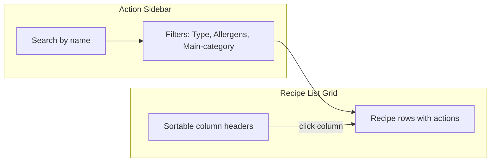

# Recipe Book Page Plan

## Summary

Build a Recipe Book page at `/recipe-book` (replacing the current `/dishes` header link) that displays all recipes and dishes in a list with a control panel for search, filtering, and sorting. The page mirrors the [inventory-product-list](src/app/pages/inventory/components/inventory-product-list/inventory-product-list.component.html) architecture.

---

## Architecture




**Data flow**: `recipes_` from [KitchenStateService](src/app/core/services/kitchen-state.service.ts) → apply filters → apply search → apply sort → display.

---

## Recipe and Dish Storage Logic (Critical)

Recipes and dishes use **separate storage** and services:


| Type            | Storage Entity | Service                                                           | Methods                                              |
| --------------- | -------------- | ----------------------------------------------------------------- | ---------------------------------------------------- |
| **Preparation** | `RECIPE_LIST`  | [RecipeDataService](src/app/core/services/recipe-data.service.ts) | addRecipe, updateRecipe, deleteRecipe, getRecipeById |
| **Dish**        | `DISH_LIST`    | [DishDataService](src/app/core/services/dish-data.service.ts)     | addDish, updateDish, deleteDish, getDishById         |


**KitchenStateService.recipes_** (lines 26–28) combines both:

```ts
recipes_ = computed(() => [
  ...this.recipeDataService.allRecipes_(),
  ...this.dishDataService.allDishes_()
]);
```

**Save flow** ([kitchen-state.service.ts](src/app/core/services/kitchen-state.service.ts) lines 85–111): `saveRecipe(recipe)` routes by `recipe_type_` (or legacy `prep_items_`/`mise_categories_`) to the correct service.

**Edit flow**: [recipe.resolver.ts](src/app/core/resolvers/recipe.resolver.ts) tries `RecipeDataService.getRecipeById` first, then `DishDataService.getDishById` if not found.

**Delete**: KitchenStateService has no `deleteRecipe`. Must add `deleteRecipe(recipe: Recipe)` that routes to `dishDataService.deleteDish` or `recipeDataService.deleteRecipe` based on type.

---

## Route and Navigation

- **Path**: `/recipe-book` (replace `/dishes` in [header.component.html](src/app/core/componets/header/header.component.html))
- **Structure**: Single page with list view; Add navigates to `/recipe-builder`, Edit navigates to `/recipe-builder/:id`
- **Routes**: Add to [app.routes.ts](src/app/app.routes.ts); update header link from `/dishes` to `/recipe-book`

---

## Recipe Type Determination

**Primary**: `recipe.recipe_type_` — stored when saving ([recipe-builder.page.ts](src/app/pages/recipe-builder/recipe-builder.page.ts) line 411, [recipe.model.ts](src/app/core/models/recipe.model.ts) line 45).

**Fallback** (legacy data): `!!(recipe.prep_items_?.length || recipe.mise_categories_?.length)`.

**Helper** (align with [kitchen-state.service.ts](src/app/core/services/kitchen-state.service.ts) line 86):

```ts
const isDish = recipe.recipe_type_ === 'dish' || !!(recipe.prep_items_?.length || recipe.mise_categories_?.length);
```

---

## Columns


| Column        | Source                                  | Sortable | Notes                                      |
| ------------- | --------------------------------------- | -------- | ------------------------------------------ |
| Name          | `name_hebrew`                           | Yes      |                                            |
| Type          | `recipe_type_` or legacy inference      | Yes      | See Recipe Type Determination              |
| Cost          | `RecipeCostService.computeRecipeCost()` | Yes      |                                            |
| Approved      | `is_approved_`                          | Yes      |                                            |
| Station       | `default_station_`                      | Yes      |                                            |
| Main-category | Placeholder `''` (no-category)          | Yes      | Future: dairy/vegetarian logic             |
| **Allergens** | Aggregated from ingredients             | Yes      | **Button → floating container with chips** |
| Actions       | Edit, Delete                            | No       |                                            |


---

## Allergens Column (New Requirement)

### Behavior

1. **Cell content**: A button (e.g. "X אלרגנים" or shield icon + count) — not inline chips.
2. **Click**: Opens a floating container (popover) positioned near the button.
3. **Floating container**: Dense grid of allergen chips (read-only), styled like [product-form allergen-tag](src/app/pages/inventory/components/product-form/product-form.component.scss) (lines 350–372): amber background, rounded, translatePipe.
4. **Close**: `clickOutside` directive (as in [product-form](src/app/pages/inventory/components/product-form/product-form.component.html) line 87) to close when clicking outside.

### Allergen Aggregation Logic

- **Products**: For each ingredient with `type === 'product'`, resolve `referenceId` via [KitchenStateService.products_()](src/app/core/services/kitchen-state.service.ts), collect `allergens_`.
- **Sub-recipes**: For each ingredient with `type === 'recipe'`, resolve recipe and recursively aggregate its allergens (same logic).
- **Result**: Union of all allergens (deduplicated).
- **Implementation**: Add `getRecipeAllergens(recipe: Recipe): string[]` — either in a new `RecipeAllergenService` or as a method in the recipe-book component using `KitchenStateService` and `RecipeCostService`-style recursion (max depth 5 to avoid cycles).

### UI Reference

- Chips: Reuse `.allergen-pill` / `.allergen-tag` styling from [inventory-product-list](src/app/pages/inventory/components/inventory-product-list/inventory-product-list.component.scss) (lines 206–221) and [product-form](src/app/pages/inventory/components/product-form/product-form.component.scss) (lines 350–372).
- Popover: `position: absolute`, `z-index` high, `box-shadow`, similar to [product-form allergen-dropdown](src/app/pages/inventory/components/product-form/product-form.component.scss) (lines 384–414).
- Use `ClickOutside` directive from [click-out-side.directive.ts](src/app/core/directives/click-out-side.directive.ts).

---

## Control Panel (Sidebar)

- **Search**: By `name_hebrew` (case-insensitive), applied after filters.
- **Filters**:
  - **Type**: Dish | Preparation | Both (checkboxes).
  - **Allergens**: Options from `MetadataRegistryService.allAllergens_()` — multi-select (recipe must contain at least one selected).
  - **Main-category**: Placeholder — "no-category" only for now.

---

## Actions

- **Add**: Button in action bar → `router.navigate(['/recipe-builder'])`.
- **Edit**: Per row → `router.navigate(['/recipe-builder', recipe._id])`. Resolver fetches from correct store (recipe or dish).
- **Delete**: Per row → confirm, then call `KitchenStateService.deleteRecipe(recipe)`. Must add this method: route to `DishDataService.deleteDish` or `RecipeDataService.deleteRecipe` based on `recipe_type_` (same logic as `saveRecipe`). Include UserMsgService for success/error feedback.

---

## Key Files to Create/Modify


| File                                                     | Action                                       |
| -------------------------------------------------------- | -------------------------------------------- |
| `src/app/pages/recipe-book/recipe-book.page.ts`          | Create — page shell                          |
| `src/app/pages/recipe-book/recipe-book.page.html`        | Create — layout                              |
| `src/app/pages/recipe-book/recipe-book.page.scss`        | Create — styles                              |
| `src/app/pages/recipe-book/components/recipe-book-list/` | Create — list component (sidebar + grid)     |
| `src/app/app.routes.ts`                                  | Add `/recipe-book` route                     |
| `src/app/core/componets/header/header.component.html`    | Change `/dishes` → `/recipe-book`            |
| `src/app/core/services/kitchen-state.service.ts`         | Add `deleteRecipe` if absent                 |
| `public/assets/data/dictionary.json`                     | Add keys: `recipe_book`, `no_category`, etc. |


---

## Implementation Order

1. Route + page shell + header link.
2. Recipe-book-list component: grid structure, data binding, sort.
3. Sidebar: search, filters (type, allergens).
4. Allergens column: aggregation logic, button, floating container with chips.
5. Actions: Add, Edit, Delete.
6. Main-category column (placeholder).
7. Unit tests for list component and allergen aggregation.
