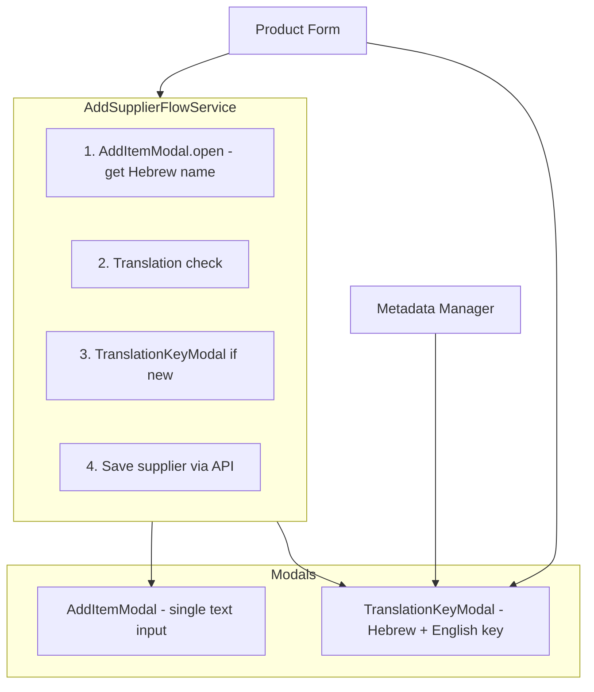

# Cohesive Add Item Modal Plan (Revised)

## Architecture: Two Modals, One Flow Service



**AddItemModal** (single-mode): One configurable text input. Returns `string | null`.

**TranslationKeyModal** (existing): Hebrew + English key. Returns `{ englishKey, hebrewLabel } | null`. Keep as-is, extend context for metadata manager.

**AddSupplierFlowService** (new): Orchestrates add-supplier flow. Same API as current AddSupplierModalService: `open(): Promise<Supplier | null>`.

---

## Implementation Plan

### 1. Refactor AddSupplierModal into AddItemModal

**Rename and generalize** the existing add-supplier-modal:

- Rename folder: `add-supplier-modal` -> `add-item-modal`
- Rename component: `AddSupplierModalComponent` -> `AddItemModalComponent`
- Rename selector: `add-supplier-modal` -> `add-item-modal`

**New service:** [src/app/core/services/add-item-modal.service.ts](src/app/core/services/add-item-modal.service.ts)

Extract from [add-supplier-modal.service.ts](src/app/core/services/add-supplier-modal.service.ts) - keep only the modal mechanics, remove supplier logic:

```typescript
export interface AddItemConfig {
  title: string;      // translation key
  label: string;      // translation key for input label
  placeholder?: string;
  saveLabel: string; // translation key for save button
}

// open(config: AddItemConfig): Promise<string | null>
// save(value: string): void - resolves promise, closes
// cancel(): void - resolves with null, closes
```

**Update** [src/app/shared/add-item-modal/add-item-modal.component.ts](src/app/shared/add-item-modal/add-item-modal.component.ts) (renamed from add-supplier):

- Inject `AddItemModalService`
- Bind `config_` from service (title, label, saveLabel)
- `value_` signal for input (local state)
- `save()` calls `modalService.save(value_())`, clear value
- Template: single input driven by config (label, placeholder), cancel + save buttons

**Update** [src/app/shared/add-item-modal/add-item-modal.component.html](src/app/shared/add-item-modal/add-item-modal.component.html):

- Replace hardcoded `add_supplier`, `supplier`, `save_supplier` with `config_().title`, `config_().label`, `config_().saveLabel` via translatePipe

### 2. Create AddSupplierFlowService

**New file:** [src/app/core/services/add-supplier-flow.service.ts](src/app/core/services/add-supplier-flow.service.ts)

Move orchestration logic from current AddSupplierModalService:

- Inject: AddItemModalService, TranslationKeyModalService, TranslationService, SupplierDataService, UserMsgService
- `open(): Promise<Supplier | null>` - same API as current AddSupplierModalService
- Flow: AddItemModal.open({ title: 'add_supplier', label: 'supplier', saveLabel: 'save_supplier' }) -> get nameHebrew
- If `!translationService.isHebrewLabelDuplicate(nameHebrew)`: TranslationKeyModal.open(nameHebrew, 'supplier') -> updateDictionary
- supplierDataService.addSupplier({ name_hebrew, ... }) -> success/error msg -> return saved or null

### 3. Update TranslationKeyModal for Metadata Manager

**Update** [src/app/core/services/translation-key-modal.service.ts](src/app/core/services/translation-key-modal.service.ts):

- Add `'unit'` to context type: `'category' | 'allergen' | 'supplier' | 'unit' | 'generic'`

**Update** [src/app/shared/translation-key-modal/translation-key-modal.component.ts](src/app/shared/translation-key-modal/translation-key-modal.component.ts):

- In `title_` computed: add case for `ctx === 'unit'` -> return translation key for "הוסף יחידה חדשה" (or use `add_new_unit` from dictionary)
- In `isHebrewReadonly_`: add `ctx === 'unit'` when hebrewLabel is pre-filled (metadata manager passes Hebrew from inline input)

### 4. Update Product Form

**Update** [src/app/pages/inventory/components/product-form/product-form.component.ts](src/app/pages/inventory/components/product-form/product-form.component.ts):

- Replace `AddSupplierModalService` with `AddSupplierFlowService`
- In `onSupplierChange`: `const supplier = await this.addSupplierFlowService.open();` (same call pattern)
- Remove `AddSupplierModalService` import, add `AddSupplierFlowService`

### 5. Update Metadata Manager

**Update** [src/app/pages/metadata-manager/metadata-manager.page.component.ts](src/app/pages/metadata-manager/metadata-manager.page.component.ts):

- Inject `TranslationKeyModalService`
- In `onAddMetadata`: Replace `prompt()` block with:
  ```typescript
  const contextMap = { category: 'category', allergen: 'allergen', unit: 'unit' } as const;
  const result = await this.translationKeyModal.open(sanitizedHebrew, contextMap[type]);
  if (!result?.englishKey || !result?.hebrewLabel) return;
  const sanitizedKey = result.englishKey;
  ```
- Keep existing registerInService + updateDictionary logic (use result.englishKey, result.hebrewLabel)

### 6. Update App Root

**Update** [src/app/appRoot/app.component.ts](src/app/appRoot/app.component.ts):

- Replace `AddSupplierModalComponent` with `AddItemModalComponent`
- Keep `TranslationKeyModalComponent`
- Update imports

**Update** [src/app/appRoot/app.component.html](src/app/appRoot/app.component.html):

- Replace `<add-supplier-modal/>` with `<add-item-modal/>`

### 7. Delete Deprecated Service

**Delete** [src/app/core/services/add-supplier-modal.service.ts](src/app/core/services/add-supplier-modal.service.ts) (replaced by AddItemModalService + AddSupplierFlowService)

### 8. Dictionary Keys

Ensure in [public/assets/data/dictionary.json](public/assets/data/dictionary.json):

- `add_supplier`, `add_new_category`, `add_new_allergen`, `add_new_unit`, `add_supplier_translation_key`
- `save_supplier`, `save_category`
- `add_new_unit` if missing (for TranslationKeyModal unit context title)

---

## File Summary

| Action | Path |
|--------|------|
| Rename/Refactor | `add-supplier-modal/` -> `add-item-modal/` (component + template + scss) |
| Create | `src/app/core/services/add-item-modal.service.ts` |
| Create | `src/app/core/services/add-supplier-flow.service.ts` |
| Update | `src/app/core/services/translation-key-modal.service.ts` (add 'unit' context) |
| Update | `src/app/shared/translation-key-modal/translation-key-modal.component.ts` (unit title, readonly) |
| Update | `src/app/pages/inventory/components/product-form/product-form.component.ts` |
| Update | `src/app/pages/metadata-manager/metadata-manager.page.component.ts` |
| Update | `src/app/appRoot/app.component.{ts,html}` |
| Delete | `src/app/core/services/add-supplier-modal.service.ts` |

---

## Result

- **AddItemModal** (refactored from AddSupplierModal): generic single-field modal, configurable
- **TranslationKeyModal**: kept separate, extended for metadata manager (unit context)
- **AddSupplierFlowService**: encapsulates add-supplier orchestration; product-form stays thin
- **Metadata manager**: uses TranslationKeyModal instead of native `prompt()`
- **No new modal components** - only refactor + one new flow service
