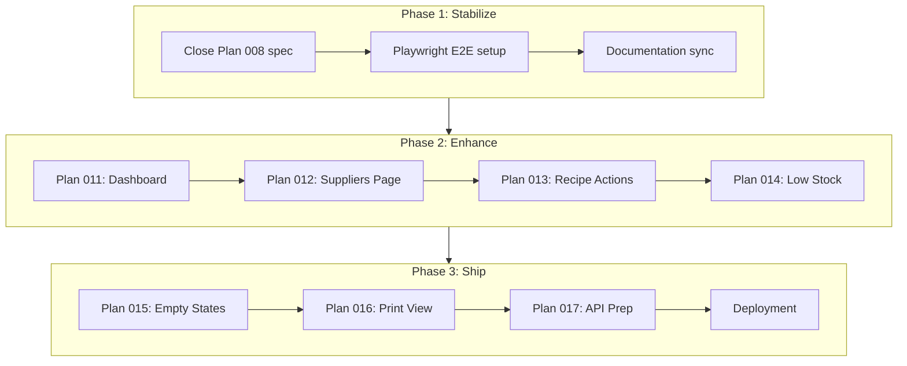

# Plan 010 — Product Roadmap: V1 Completion & Beyond

## Problem Statement

FoodVibe's core features (Inventory, Recipe Builder, Recipe Book, Command Center) are functional and tested (89+ specs passing, Plans 002–009 complete). However, the product has gaps that prevent it from being a complete, shippable V1 for professional kitchen teams. There is no dashboard, no supplier management page, no recipe duplication, unused data fields (low stock, approval workflow), and no production deployment pipeline.

## Goals & Success Criteria

- **Primary:** Deliver a complete V1 product that a professional kitchen team can use end-to-end.
- **Success:** All three phases executed, E2E tests green, deployment live on GitHub Pages.

## Product Assessment — Current State

### What's Complete
| Area | Status | Plans |
|------|--------|-------|
| Inventory (CRUD, filters, sort, inline edit) | Done | 005, 005-1, 007 |
| Recipe Builder (ingredients, cost, workflow, dual type) | Done | 002, 003, 004, 006, 006-1, 006-2 |
| Recipe Book (list, filter, sort, allergens, actions) | Done | 008 |
| Command Center (units, categories, allergens) | Done | — |
| Cohesive Modals (AddItemModal, TranslationKeyModal) | Done | 009 |
| Translation System (Hebrew UI) | Done | — |
| Unit Tests (89+ specs) | Done | — |

### Product Gaps Identified

1. **No Dashboard / Home Page** — Users land on `/inventory` by default. No overview of kitchen state, KPIs, or quick actions.
2. **Supplier Management Incomplete** — Suppliers can be added via modal flow, but no dedicated page to list, edit, or delete them.
3. **Recipe Approval Workflow** — `is_approved_` exists on Recipe model but has no meaningful UI workflow.
4. **No Recipe Duplication** — Cloning a recipe to create variations is a core kitchen workflow that's missing.
5. **Low Stock Alerts Unused** — `min_stock_level_` exists on Product but no visual indicators or filtering.
6. **No Empty States** — No onboarding guidance or empty-state UX when lists have no data.
7. **No Print / Export** — No print-friendly recipe view for kitchen use.
8. **No E2E Tests** — Playwright planned but not set up.
9. **Backend Still localStorage** — `AsyncStorageService` simulates a backend but no API contract is documented.

---

## Phase 1: Stabilize & Complete Pending Work

*Goal: Clear all backlog, achieve full test confidence.*

### 1.1 — Close Plan 008 Spec Gap

Write `recipe-book-list.spec.ts` covering:
- Component creation
- Renders recipe list from signal data
- Sort column click changes order
- Search input filters list
- Delete action triggers confirmation and removal

**Files:**
| Action | Path |
|--------|------|
| Create | `src/app/pages/recipe-book/components/recipe-book-list/recipe-book-list.component.spec.ts` |

### 1.2 — E2E Test Foundation (Playwright)

Set up Playwright and write tests for three critical user flows:

1. **Product CRUD:** Navigate to inventory → Add product → Verify in list → Edit → Verify changes → Delete → Verify removal.
2. **Recipe Creation:** Navigate to recipe builder → Set name and type → Add ingredients → Verify cost calculation → Save → Verify in recipe book.
3. **Recipe Edit:** Open existing recipe → Modify ingredient → Save → Reopen → Verify persistence.

**Files:**
| Action | Path |
|--------|------|
| Create | `playwright.config.ts` |
| Create | `e2e/product-crud.spec.ts` |
| Create | `e2e/recipe-creation.spec.ts` |
| Create | `e2e/recipe-edit.spec.ts` |

### 1.3 — Documentation Sync

- Update `project-plan.md` feature checkboxes to reflect actual completion.
- Update `.assistant/todo.md` with Phase 2–3 roadmap items.

---

## Phase 2: Product Enhancement — Core V1 Features

*Goal: Fill the product gaps that matter most to professional chefs.*

### Plan 011 — Dashboard Page

**Problem:** No at-a-glance overview of kitchen state. Chefs need quick context when they open the app.

**User Stories:**
- As a chef, I want to see my kitchen stats at a glance so I can prioritize my day.
- As a chef, I want quick-action buttons so I can jump to common tasks immediately.

**Requirements (P0):**
- [ ] New route `/dashboard` becomes the default landing page (redirect from `/`)
- [ ] KPI cards: total products, total recipes (prep + dish), low stock count, unapproved recipe count
- [ ] Recent activity section: last 5 added/edited recipes and products (by date if available)
- [ ] Quick-action buttons: Add Product, New Recipe, New Dish

**Requirements (P1):**
- [ ] Low stock card links to filtered inventory view
- [ ] Responsive grid layout (2-col on desktop, 1-col on mobile)

**Technical Notes:**
- Consumes `KitchenStateService` signals (products_, recipes_, dishes_)
- Low stock computed: `products_().filter(p => p.min_stock_level_ > 0)` (actual stock tracking is future)
- Unapproved: `[...recipes_(), ...dishes_()].filter(r => !r.is_approved_)`
- New page at `src/app/pages/dashboard/`
- Update `app.routes.ts` default redirect
- Add header navigation link
- Dictionary keys: `dashboard`, `total_products`, `total_recipes`, `low_stock`, `unapproved_recipes`, `recent_activity`, `quick_actions`

**Agents:** Product Manager (PRD) → Software Architect (HLD) → Implementation → QA Engineer

---

### Plan 012 — Supplier Management Page

**Problem:** Suppliers can only be added via the product form modal. No way to view, edit, or delete suppliers.

**User Stories:**
- As a chef, I want to manage my suppliers in one place so I can track contact info and delivery schedules.
- As a chef, I want to see which products come from each supplier.

**Requirements (P0):**
- [ ] New route `/suppliers` with list view
- [ ] Supplier list grid: name, contact person, delivery days, min order, lead time, actions
- [ ] Add supplier (reuse AddItemModal + AddSupplierFlowService)
- [ ] Edit supplier (inline or form)
- [ ] Delete supplier with usage validation (prevent if products reference it)

**Requirements (P1):**
- [ ] Expand row to show linked products
- [ ] Search/filter sidebar
- [ ] Header navigation link

**Technical Notes:**
- `SupplierDataService` already exists with CRUD methods
- Supplier model at `src/app/core/models/supplier.model.ts`
- New page at `src/app/pages/suppliers/`
- Dictionary keys: `suppliers`, `contact_person`, `delivery_days`, `min_order`, `lead_time`, `linked_products`

**Agents:** Product Manager → Software Architect → Implementation → QA Engineer

---

### Plan 013 — Recipe Quick Actions

**Problem:** Working with recipes in the recipe book is limited to view/edit/delete. Chefs need to duplicate recipes and manage approval status efficiently.

**User Stories:**
- As a chef, I want to duplicate a recipe so I can create variations without starting from scratch.
- As a chef, I want to approve recipes from the list view without opening each one.

**Requirements (P0):**
- [ ] Duplicate recipe: clone with "העתק של [name]" prefix, navigate to builder with cloned data
- [ ] Approval toggle: click to approve/unapprove directly in recipe book list row
- [ ] Visual indicator for approval status (approved badge vs pending badge)

**Requirements (P1):**
- [ ] Batch select with checkbox column
- [ ] Batch approve/delete selected recipes

**Technical Notes:**
- Duplicate: deep-clone recipe, generate new `_id`, prefix name, call `KitchenStateService.addRecipe/addDish`
- Approval toggle: `KitchenStateService.updateRecipe` with `is_approved_` flip
- Update `recipe-book-list` component (add duplicate action, approval toggle)
- Dictionary keys: `duplicate`, `copy_of`, `approve`, `unapprove`, `approved`, `pending_approval`, `batch_actions`

**Agents:** Product Manager → Implementation → QA Engineer

---

### Plan 014 — Low Stock Alerts

**Problem:** `min_stock_level_` exists on Product but provides no value to the user without visual indicators.

**User Stories:**
- As a chef, I want to see which products are below minimum stock so I can reorder.

**Requirements (P0):**
- [ ] Visual indicator (colored badge/row highlight) in inventory list for low stock
- [ ] "Low stock" filter toggle in inventory sidebar
- [ ] Dashboard KPI card for low stock count (depends on Plan 011)

**Requirements (P1):**
- [ ] Sort by stock status in inventory list

**Technical Notes:**
- Currently no `current_stock_` field exists on Product — need to add it or use `min_stock_level_ > 0` as a placeholder flag
- If adding `current_stock_`: update Product model, product form, inventory list
- Dictionary keys: `low_stock`, `in_stock`, `current_stock`, `min_stock`

**Critical Questions:**
**Q1: How should stock levels work without a current stock field?**
(A) Add `current_stock_` field to Product model and form — full stock tracking
(B) Use `min_stock_level_ > 0` as a visual flag only — no actual tracking yet
(C) Skip this plan until backend API with real stock tracking is ready

**Agents:** Product Manager → Software Architect → Implementation

---

## Phase 3: Polish & Production Readiness

*Goal: Ship-ready quality — UX polish, deployment, export capabilities.*

### Plan 015 — Empty States & Onboarding UX

**Problem:** Empty lists show nothing — no guidance for new users.

**Requirements:**
- [ ] Empty state for: inventory list, recipe book, supplier list (Plan 012), dashboard (Plan 011)
- [ ] Each empty state: illustration/icon + message + primary action button
- [ ] Hebrew copy via dictionary.json
- [ ] First-use hint: "Add your first product" when inventory is empty

**Files affected:** All list components + dashboard

---

### Plan 016 — Print-Friendly Recipe View

**Problem:** Chefs need printed recipe cards in the kitchen.

**Requirements:**
- [ ] Print stylesheet (`@media print`) for recipe builder page
- [ ] Clean layout: recipe name, ingredients table, steps, yield info
- [ ] Hide navigation, sidebar, action buttons in print
- [ ] RTL-aware print layout for Hebrew
- [ ] Print button in recipe builder header

---

### Plan 017 — Backend API Preparation

**Problem:** App runs on localStorage — not suitable for multi-user or production.

**Requirements:**
- [ ] Formalize `IStorageAdapter` interface
- [ ] Audit all data services for adapter pattern compliance
- [ ] Document REST API contract (endpoints, methods, payloads)
- [ ] Ensure all storage calls go through `AsyncStorageService`
- [ ] Plan migration path: localStorage adapter → HTTP adapter (same interface)

---

### Deployment Pipeline

- Validate existing `.assistant/workflows/deploy.yml` for GitHub Actions
- Configure Angular build for production (`ng build --configuration production`)
- Set base href for GitHub Pages
- Test deployment end-to-end

---

## Execution Sequence

## Agent Engagement Per Plan

| Plan | Product Manager | Software Architect | QA Engineer | Breadcrumb Nav |
|------|----------------|--------------------|-------------|----------------|
| Phase 1 (specs/E2E) | — | — | Lead | Update |
| 011 Dashboard | PRD | HLD | Specs | Update |
| 012 Suppliers | PRD | HLD | Specs | Update |
| 013 Recipe Actions | PRD | — | Specs | Update |
| 014 Low Stock | PRD | HLD (if model change) | Specs | Update |
| 015 Empty States | PRD | — | Specs | Update |
| 016 Print View | — | HLD (print layout) | — | Update |
| 017 API Prep | — | Lead | — | Update |

## Out of Scope (Future)

- Multi-user authentication and authorization
- Real-time collaboration
- Mobile native app
- Advanced reporting and analytics
- Menu planning and meal scheduling
- Inventory ordering integration with suppliers
- Image uploads for recipes/products
