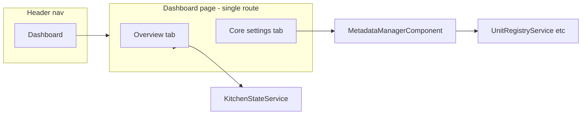

# Unify Dashboard and Command Center

## Current state

| Route                  | Component                                                                                               | Purpose                                                                                                            |
| ---------------------- | ------------------------------------------------------------------------------------------------------- | ------------------------------------------------------------------------------------------------------------------ |
| `/dashboard` (default) | [dashboard.page.ts](src/app/pages/dashboard/dashboard.page.ts)                                          | KPIs (products, recipes, low-stock, unapproved), recent activity, quick actions. Uses `KitchenStateService`.       |
| `/command-center`      | [metadata-manager.page.component.ts](src/app/pages/metadata-manager/metadata-manager.page.component.ts) | CRUD for units (with conversion rates), allergens, product categories. Uses registry/product/translation services. |

Header nav shows both links: "Dashboard" and "Command center". There is no shared shell or shared route.

## Recommended approach: single route with tabs

Use **one route** and **one page shell** with two tabs so the user stays in one place and can switch between:

1. **Overview** – current dashboard content (KPIs, recent activity, quick actions).
2. **Core settings** – current metadata-manager content (units, allergens, categories).

Reasons for tabs instead of one long page: keeps the page scannable, avoids mixing "read-only overview" with "admin CRUD" in one scroll, and preserves lazy-loading of the heavier metadata logic if desired.

---

## Implementation plan

### 1. Choose the single route and nav label

- **Option A (recommended):** Keep **`/dashboard`** as the single control-panel URL. Merge command-center into it. In the header, remove the "Command center" link; "Dashboard" goes to `/dashboard` and the dashboard page has two tabs: **Overview** and **Core settings** (or **Metadata**).
- **Option B:** Use **`/command-center`** as the single URL and move dashboard content into it as the first tab; redirect `/dashboard` to `/command-center`. Header then shows one link (e.g. "Command center" or "Control panel").

Recommendation: **Option A** – keep `/dashboard` as default and as the main nav entry; add a second tab for metadata so "Dashboard" in the nav is the one place for both overview and core settings.

- apply option A!

### 2. Create a shell page with tab navigation

- Add a **dashboard shell** that owns the URL and the tab UI:
  - Tab 1: **Overview** (current dashboard content).
  - Tab 2: **Core settings** (current metadata-manager content).
- Two ways to implement tabs:
  - **Component-based:** Refactor current dashboard into a presentational component (e.g. `dashboard-overview.component`), keep metadata-manager as-is (or rename to `metadata-settings.component`), and have the shell render one or the other based on active tab (no child routes).
  - **Route-based:** Make dashboard a parent with child routes, e.g. `dashboard/overview` and `dashboard/metadata`; tab clicks change the child route; use `<router-outlet>` in the shell. Keeps components and bundles separate.

Recommendation: **Component-based tabs** in a single dashboard shell for simplicity (one route, one load). If the metadata-manager bundle is heavy, it can be lazy-loaded via dynamic `import()` when the user switches to the "Core settings" tab later.

### 3. File and route changes

- **New/updated files:**
  - **Shell:** Either extend [dashboard.page.ts](src/app/pages/dashboard/dashboard.page.ts) to include tab state and the metadata-manager block, or introduce a thin `dashboard-shell` that wraps two sub-components. Prefer extending the existing dashboard page to avoid an extra layer: add a tab strip and `@if (activeTab === 'overview')` / `@if (activeTab === 'metadata')` that render the existing dashboard content and the metadata-manager content (the latter can be included via a wrapper component that re-exports or hosts `MetadataManagerComponent`).
  - **Optional:** Extract current dashboard template + logic into `dashboard-overview.component` (same folder or `dashboard/components/`) and keep metadata-manager as a sibling; shell then only holds tab state and the two selectors.
- **Routes ([app.routes.ts](src/app/app.routes.ts)):**
  - Remove the standalone `command-center` route (or leave it as a redirect to `/dashboard?tab=metadata` or `dashboard` with a fragment so deep links still work).
  - Default route stays `redirectTo: 'dashboard'`.
- **Header ([header.component.html](src/app/core/components/header/header.component.html)):**
  - Remove the "Command center" nav item.
  - Single "Dashboard" (or "Control panel") link to `/dashboard`. Tab selection is internal to the dashboard page.

### 4. UX and i18n

- **Tab labels:** Use translation keys (e.g. `overview`, `core_settings` or `metadata`) and add entries in [dictionary.json](public/assets/data/dictionary.json) for Hebrew/English so both tabs are translated.
- **RTL:** Both current pages use `dir="rtl"`; keep the same in the shell and in each tab content.
- **Deep link (optional):** If you keep a redirect from `/command-center` to `/dashboard`, you can support `?tab=metadata` or `#metadata` and set the initial active tab from the URL so "command center" links open directly on the Core settings tab.

### 5. What stays the same

- **Dashboard logic:** `KitchenStateService`, computed signals, navigation methods – move as-is into the overview component or keep inline in the shell.
- **Metadata-manager logic:** All registry/product/translation/modal logic stays in [metadata-manager.page.component.ts](src/app/pages/metadata-manager/metadata-manager.page.component.ts); only the route and where it's rendered change. No need to duplicate services or validations.
- **Styles:** Reuse [dashboard.page.scss](src/app/pages/dashboard/dashboard.page.scss) and [metadata-manager.page.component.scss](src/app/pages/metadata-manager/metadata-manager.page.component.scss); the shell only adds minimal tab styling.

### 6. Optional cleanup

- Align **metadata-manager** with translation keys for its section title and empty states (it currently uses hardcoded Hebrew in the template); can be done in the same pass or later.
- Consider **OnPush** for the metadata-manager component if it's embedded in the dashboard shell, to match the dashboard's change-detection strategy.

---

## High-level structure (after consolidation)

---

## Summary

| Step | Action                                                                                                               |
| ---- | -------------------------------------------------------------------------------------------------------------------- |
| 1    | Add tab state to dashboard (e.g. `overview` \| `metadata`).                                                           |
| 2    | In dashboard template: tab strip + conditional render of overview content and `<app-metadata-manager>` (or wrapper). |
| 3    | Optionally extract current dashboard body to `dashboard-overview.component` for clarity.                               |
| 4    | Remove `command-center` from header; keep single "Dashboard" link.                                                  |
| 5    | Remove or redirect `command-center` route to `/dashboard` (optional query/fragment for tab).                        |
| 6    | Add translation keys for tab labels; keep RTL and existing styles.                                                   |

Result: one control panel at `/dashboard` with all overview info and core metadata management in one place, switchable by tabs.

---

## Implementation status (completed)

- Dashboard overview extracted to `src/app/pages/dashboard/components/dashboard-overview/`.
- Dashboard page is shell with tabs; `activeTab` derived from `?tab=metadata`; Overview and Core settings (MetadataManager) rendered by tab.
- `/command-center` redirects to `/dashboard?tab=metadata`.
- Header nav: Command center link removed; 4 links (Dashboard, Inventory, Recipes, Dishes).
- Dictionary: `overview`, `core_settings` added.
- Unit tests updated for dashboard shell and header.
