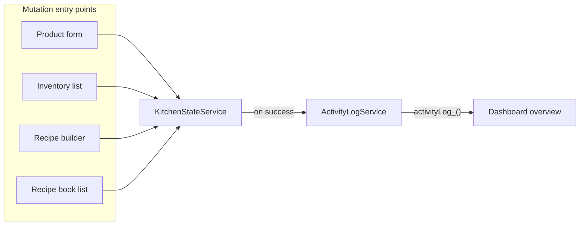

# Dashboard Recent Activity Refactor

## Current behavior

- The widget does **not** show real activity. `[recentActivity_](src/app/pages/dashboard/components/dashboard-overview/dashboard-overview.component.ts)` is a computed that takes the first 5 products and recipes from `[KitchenStateService](src/app/core/services/kitchen-state.service.ts)` and displays them with a single label ("product" or "preparation"). There is no notion of *what* happened (add/edit/delete) or when.
- All mutations flow through `[KitchenStateService](src/app/core/services/kitchen-state.service.ts)`: `saveProduct` (add/update), `deleteProduct`, `saveRecipe` (add/update recipe or dish), `deleteRecipe`. There is no "move" operation in the codebase today; the plan keeps the model extensible so a future "move" can be added.

## Target behavior

- **Single source of activity**: A dedicated log that records every relevant action (product/recipe/dish created, updated, deleted) with a timestamp and entity name.
- **Widget**: Show the last N entries (e.g. 10), most recent first, with explicit text such as:
  - "Product [name] added" / "Product [name] updated" / "Product [name] deleted"
  - "Recipe [name] created" / "Recipe [name] updated" / "Recipe [name] deleted"
  - "Dish [name] created" / "Dish [name] updated" / "Dish [name] deleted"
- **Extensible**: Easy to add more entity types (e.g. supplier, metadata) or actions (e.g. move) later.

## Implementation plan

### 1. Activity model and ActivityLogService

- **Model** (new file or in a shared models file): Define an `ActivityEntry` interface, e.g.:
  - `action`: `'created' | 'updated' | 'deleted'`
  - `entityType`: `'product' | 'recipe' | 'dish'` (extensible to `'supplier' | 'metadata'` later)
  - `entityId`: string
  - `entityName`: string (e.g. `name_hebrew` for display)
  - `timestamp`: number (Date.now())
  - Optional `id` for Angular trackBy if needed.
- **New service** `[ActivityLogService](src/app/core/services/activity-log.service.ts)` (providedIn: 'root'):
  - Hold a **signal** `activityLog_` (array of `ActivityEntry`), capped at a max size (e.g. 50–100).
  - Expose `recordActivity(entry: Omit<ActivityEntry, 'timestamp'>)` that prepends an entry with `timestamp: Date.now()` and trims the array to the max size.
  - Optional: persist to localStorage (e.g. key `activity_log`) on each record and rehydrate in constructor so activity survives refresh; if not persisted, log is in-memory only (simpler, session-scoped).

### 2. Record activity in KitchenStateService

- Inject `ActivityLogService` in `[KitchenStateService](src/app/core/services/kitchen-state.service.ts)`.
- **saveProduct** (after successful `tap`): Call `recordActivity` with `action: isUpdate ? 'updated' : 'created'`, `entityType: 'product'`, `entityId`, `entityName: product.name_hebrew`.
- **deleteProduct**: Before the async chain, resolve the product name from `this.products_()` by `_id`. In the success `tap`, call `recordActivity` with `action: 'deleted'`, `entityType: 'product'`, `entityId: _id`, `entityName: resolvedName` (fallback to _id if not found).
- **saveRecipe** (in the success `tap`, which receives the saved recipe): Call `recordActivity` with `action: isUpdate ? 'updated' : 'created'`, `entityType: isDish ? 'dish' : 'recipe'`, `entityId: saved._id`, `entityName: saved.name_hebrew`.
- **deleteRecipe**: You already have the full `recipe`; in the success `tap` call `recordActivity` with `action: 'deleted'`, `entityType: isDish ? 'dish' : 'recipe'`, `entityId: recipe._id`, `entityName: recipe.name_hebrew`.

No other call sites need to change: product form, inventory list, recipe builder, recipe-book list all go through `KitchenStateService`.

### 3. Dashboard: consume log and display

- In `[DashboardOverviewComponent](src/app/pages/dashboard/components/dashboard-overview/dashboard-overview.component.ts)`:
  - Inject `ActivityLogService`.
  - Replace the current `recentActivity_` computed: read from `activityLogService.activityLog_()`, sort by `timestamp` descending, take first 10 (or desired N), and expose as `recentActivity_`.
  - Update the `ActivityItem` interface to match `ActivityEntry` (or use `ActivityEntry` directly) so the template has `action`, `entityType`, `entityName`, and optionally `timestamp` for display/formatting.
- In `[dashboard-overview.component.html](src/app/pages/dashboard/components/dashboard-overview/dashboard-overview.component.html)` (lines 54–74):
  - For each item, display a single line that states exactly what happened, e.g.:
    - Use translation keys for action: `activity_created`, `activity_updated`, `activity_deleted` (or reuse existing where they fit, e.g. recipe_creation / recipe_edit / recipe_delete).
    - Use existing keys for entity type: `product`, `preparation` (recipe), `dish` from [dictionary.json](public/assets/data/dictionary.json).
    - Format examples: **"[Action] — [entityName] ([EntityType])"** or **"[EntityType] [entityName] [action]"** (e.g. "Product חלב added"). Prefer one predictable pattern and translate the three parts so RTL stays correct.
  - Optionally show a relative time (e.g. "לפני 5 דקות") if you add a small date-fns or custom pipe; otherwise omit for minimal scope.
  - Keep the existing empty state (`no_recent_activity`) when the log is empty.

### 4. Translations

- In `[dictionary.json](public/assets/data/dictionary.json)` (under `general` or a new `activity` section), add keys used by the widget, e.g.:
  - `activity_created` / `activity_added` (e.g. "נוסף" / "נוצר")
  - `activity_updated` (e.g. "עודכן")
  - `activity_deleted` (e.g. "נמחק")
  - If you use a single sentence pattern, e.g. `activity_product_added`: "מוצר {{name}} נוסף" and similar for recipe/dish and updated/deleted, so the template can pass `entityName` and keep translations natural in Hebrew.

Choose either:

- **Option A**: Three translation keys (created/updated/deleted) + entity type key (product/preparation/dish) and build the phrase in the template (e.g. `{{ 'activity_updated' | translate }} — {{ item.entityName }} ({{ 'product' | translate }})`), or
- **Option B**: One key per combination (e.g. `activity_product_created`, `activity_recipe_updated`) and pass only `entityName` for simpler template and more natural Hebrew phrasing.

### 5. Tests

- **ActivityLogService**: Unit tests for `recordActivity` (order, timestamp, cap at max size).
- **KitchenStateService**: Extend existing specs to assert that on successful saveProduct (add/update), deleteProduct, saveRecipe (add/update), deleteRecipe, `ActivityLogService.recordActivity` is called with the expected `action`, `entityType`, `entityId`, `entityName`.
- **DashboardOverviewComponent**: Update specs so that `recentActivity_()` reflects the activity log (e.g. inject a mock ActivityLogService with a few entries and assert displayed list and empty state).

## Data flow (high level)

## Files to add

- `src/app/core/services/activity-log.service.ts` — log storage and `recordActivity`.
- Optional: `src/app/core/models/activity.model.ts` — `ActivityEntry` interface (or define in the service file).
- `src/app/core/services/activity-log.service.spec.ts` — unit tests for the service.

## Files to modify

- `[src/app/core/services/kitchen-state.service.ts](src/app/core/services/kitchen-state.service.ts)` — inject ActivityLogService and call `recordActivity` in saveProduct, deleteProduct, saveRecipe, deleteRecipe success paths.
- `[src/app/pages/dashboard/components/dashboard-overview/dashboard-overview.component.ts](src/app/pages/dashboard/components/dashboard-overview/dashboard-overview.component.ts)` — use ActivityLogService for `recentActivity_` and align interface with ActivityEntry.
- `[src/app/pages/dashboard/components/dashboard-overview/dashboard-overview.component.html](src/app/pages/dashboard/components/dashboard-overview/dashboard-overview.component.html)` — activity list markup to show action + entity name + entity type using the new fields and translation keys.
- `[public/assets/data/dictionary.json](public/assets/data/dictionary.json)` — add activity-related translation keys.
- `[src/app/core/services/kitchen-state.service.spec.ts](src/app/core/services/kitchen-state.service.spec.ts)` — add expectations for activity recording.
- `[src/app/pages/dashboard/components/dashboard-overview/dashboard-overview.component.spec.ts](src/app/pages/dashboard/components/dashboard-overview/dashboard-overview.component.spec.ts)` — adjust for ActivityLogService and new activity shape.

## Out of scope / future

- "Move" action: not present in the app today; the model supports adding it later (e.g. `action: 'moved'`, record from wherever move is implemented).
- Persisting the activity log to localStorage: optional; can be added in ActivityLogService without changing callers.
- Relative time display: optional UX improvement.

