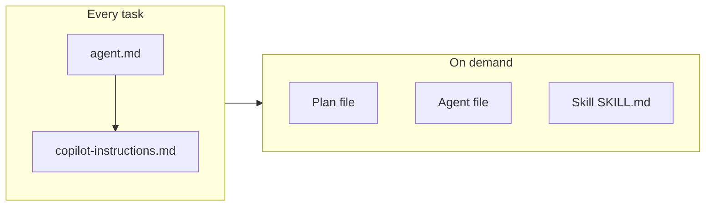

# Pre-Report: AI Agent Usage Analysis and Token Optimization

## 1. What Defines Your AI Agents Today

### 1.1 Entry point and mandatory reads

- **[agent.md](agent.md)** (~60 lines)  
  - Instructs: read this + `.assistant/copilot-instructions.md` at the start of every task.  
  - Defines: rule location (no `.cursor/rules/`), plans folder, agent list, skills list, commands, autonomous permissions, tech stack, workflow (Recon → Plan → Approval → Execute → Audit).
- **[.assistant/copilot-instructions.md](.assistant/copilot-instructions.md)** (~165 lines)  
  - Single source of truth for all project rules.  
  - Contains: Agent System Overview (when to use each agent, workflow chain, Task invocation, skills table, commands), Persona ("Yes chef!"), Gatekeeper Protocol (phases 1–5), Angular 19/Signals/Adapter rules, UI/CSS/folder structure, Security/QA, Git, Translation (Hebrew/dictionary), Lucide icons.

**Token impact:** Every task loads both files. That is your fixed "bootstrap" cost (~225 lines of markdown).

### 1.2 Agents (`.assistant/agents/`)

| Agent                   | Lines (approx) | When invoked                                  |
| ----------------------- | -------------- | --------------------------------------------- |
| team-leader.md          | ~75            | Multi-subsystem tasks, conflict resolution    |
| software-architect.md   | ~95            | PRD → HLD, architecture decisions             |
| product-manager.md      | ~107           | New feature scoping, PRDs in plans/           |
| breadcrumb-navigator.md | ~96            | Directory context, breadcrumbs.md maintenance |
| qa-engineer.md          | ~95            | Specs, E2E, test strategy, regression         |

Agents are loaded only when the Task tool (or user) invokes them; they are not all read every time.

### 1.3 Skills (`.assistant/skills/`)

| Skill                     | Purpose                                             | Trigger                              | Approx size |
| ------------------------- | --------------------------------------------------- | ------------------------------------ | ----------- |
| save-plan                 | Number and write plan to `plans/`                   | "Save the plan" after confirm        | ~65 lines   |
| github-sync               | Recent commits, PRs, issues, branch activity        | Session start, before feature        | ~95 lines   |
| techdebt                  | Duplicates, dead code, TODO audit, file size, style | Session end, before PR               | ~120 lines  |
| elegant-fix               | Refine hacky solution                               | After a fix that feels wrong         | ~105 lines  |
| update-docs               | Breadcrumbs, copilot-instructions, todo.md          | After features                       | ~115 lines  |
| commit-to-github          | Branch/commit plan as tree, then execute            | "Commit to GitHub" / push             | ~140 lines   |
| cssLayer                  | CSS architecture, vertical rhythm, theme tokens     | When doing CSS/styling               | ~65 lines   |
| angularComponentStructure | Component class order, CRDUL                        | When creating/refactoring components | ~72 lines   |
| util-standards            | Centralized utils, purity                           | When adding helpers                  | ~15 lines   |
| serviceLayer              | Service location, Signals, UserMsg                  | When adding services                 | ~40 lines   |

Skills are referenced in `agent.md` and `copilot-instructions.md` by name and "when to run." Full `SKILL.md` content is only needed when that skill is actually executed.

### 1.4 Commands

- **test-pr-review-merge** ([.assistant/commands/test-pr-review-merge.md](.assistant/commands/test-pr-review-merge.md)): Preconditions, sync trunk, run tests, push, create PR, review, merge. Used on demand.

### 1.5 Plans (`plans/`)

There are **18+ plan files** (002 through 015, plus refactors like 013, 012-kitchen-demo-data). Plans are the main variable-size context: some are short (~70 lines), others long (250+ lines for roadmap, demo data, or activity refactors).

---

## 2. When You Use the Most (Inferred from Plans and Skills)

### 2.1 By feature area (from plan titles and todo)

| Area                        | Plans                                                  | Relative weight                                                           |
| --------------------------- | ------------------------------------------------------ | ------------------------------------------------------------------------- |
| **Recipe**                  | 002, 003, 004, 006, 006-1, 006-2, 008                  | Highest — header, ingredients table, workflow, prep category, recipe book   |
| **Inventory / Product**     | 005, 005-1, 007, 012 (demo data), 014 (form alignment) | High — list, filters, form, suppliers, demo seed                          |
| **Dashboard**               | 011, 013, 015                                          | Medium — unification, recent activity refactor, change tags & popover     |
| **Modals / Metadata**       | 009                                                    | Medium — add-item modal, translation key modal                            |
| **Roadmap / Cross-cutting** | 010                                                    | Reference — phases, plan index, agent engagement                          |

So the heaviest usage tends to be: **recipe workflow and recipe book**, then **inventory and product form**, then **dashboard and modals**.

### 2.2 By session phase (when skills and big reads happen)

- **Session start:** Optional `github-sync` (if "catching up"). Not every session.
- **Planning:** Create plan → present → **"Save the plan"** → `save-plan` skill runs. Plan file is written and may be re-read in same or next turn.
- **Execution:** One plan file is the main context; often one area (e.g. `product-form`, `dashboard-overview`). Agent files (e.g. qa-engineer) only if tests are in scope.
- **After implementation:** Optional `update-docs`, optional `elegant-fix`; before PR optional `techdebt`.
- **Commit/push:** `commit-to-github` skill (visual tree, then git operations).
- **CI/merge:** `test-pr-review-merge` command.

So the **maximum token use** typically occurs when: (1) **Planning + save-plan** (agent + copilot-instructions + plan content + save-plan SKILL), (2) **Execution of a large plan** (agent + copilot-instructions + long plan + codebase files), (3) **Session start with github-sync** (agent + copilot-instructions + github-sync SKILL + command output).

### 2.3 By task type

- **New feature (multi-file):** product-manager → software-architect → implementation → qa-engineer → breadcrumb-navigator. Multiple agents and a long plan = high tokens.
- **Refactor / alignment (few files):** e.g. 014 product-form add/edit alignment. Single plan, no agent chain = lower tokens.
- **Data / seed (012):** Large plan (product list, suppliers, dictionary). One-off but plan is huge.
- **Bug fix:** Often no plan file; copilot-instructions + codebase only = moderate.

---

## 3. Overlap and Redundancy (Token Waste)

- **Agent and skill lists appear twice:** in `agent.md` (tables) and in `copilot-instructions.md` (Agent System Overview + Skills table). Same names and "when to use" in both.  
  **Waste:** Duplicate ~40–50 lines every task.
- **Workflow (Gatekeeper) described in two places:** agent.md "Operational Workflow" and copilot-instructions "Gatekeeper Protocol."  
  **Waste:** Duplicate ~15–20 lines.
- **Full skill content** is only needed when a skill runs. Today, the agent is told "read the skill" when invoking it, which is correct; the main cost is the **full copilot-instructions** on every turn, including sections (e.g. Translation, Lucide, Security) that may be irrelevant for the current task.
- **Plans:** Loading the full roadmap (010) or a large plan (012, 015) when only a small part is needed increases tokens. No current rule says "load only the section you need."

---

## 4. Recommendations for Best Implementation and Minimum Token Waste

### 4.1 Keep a single bootstrap (no extra files)

- Keep **one entry point:** agent.md saying "read copilot-instructions at start of every task."  
- Do **not** split into many small rule files that the agent "must read" — that would increase reads and redundancy.

### 4.2 Reduce duplication between agent.md and copilot-instructions

- **Option A:** agent.md stays short: entry point, "read copilot-instructions," plan folder, Gatekeeper in one short paragraph, and **one** table: "Agents: see .assistant/agents/; Skills: see .assistant/skills/; Commands: see .assistant/commands/." Remove the full agent/skill tables from agent.md so they exist only in copilot-instructions.  
- **Option B:** Keep agent.md as the only place with the full agent/skill/command tables; in copilot-instructions, replace the long "Agent System Overview" and "Available Skills" with: "Agent and skill list: see agent.md. Use Task tool with subagent_type and read the relevant .assistant/agents/<name>.md or .assistant/skills/<name>/SKILL.md when invoking."  
- **Effect:** One place for "what agents/skills exist and when" — saves ~40–50 lines per task.

### 4.3 Tier copilot-instructions (optional, larger change)

- **Tier 1 (always):** Rule location, Persona ("Yes chef!"), Gatekeeper (plan → pause → approve → execute), single reference to agents/skills (as above).  
- **Tier 2 (load when relevant):** Angular 19/Signals, UI/CSS/folder structure, Translation (dictionary), Lucide, Security/QA, Git.  
- Implementation could be: "Always apply Tier 1. For implementation in Angular/UI/translation, also apply Tier 2" (or store Tier 2 in a second file and "read Tier 2 when doing implementation").  
- **Effect:** Short planning or bug-fix turns don't pull Angular/translation/CSS rules — saves roughly 50–80 lines per such turn.

### 4.4 Skills: load only when executing

- Current pattern ("when user says X, apply skill Y — read SKILL.md") is correct.  
- Ensure **agent.md and copilot-instructions** do not paste full skill content; they should only list **name + trigger + one-line purpose**. Full SKILL.md is read only when the skill is run.  
- **Effect:** No change if already doing this; avoids future bloat if someone inlines skill content into instructions.

### 4.5 Plans: load only what's needed

- Add a short rule: "When executing a plan, prefer loading only the sections relevant to the current sub-task (e.g. 'Implementation plan', 'Files to modify'); avoid loading the full plan when a short summary suffices."  
- **Effect:** For large plans (010, 012, 015), large token savings when only a subset of sections are needed.

### 4.6 Session discipline (behavior, not file changes)

- **github-sync:** Run only at session start when "catching up," not every time.  
- **techdebt:** Run at session end or before PR, not mid-feature.  
- **update-docs:** Run after completing a feature, not after every small edit.  
- **save-plan:** Only when user said "save the plan" — don't re-read the full plan file when only the next number and slug are needed (save-plan skill already focuses on numbering and write).

---

## 5. Summary Diagram

**Highest-impact, lowest-effort changes:**  
(1) Remove duplicate agent/skill tables from one of agent.md or copilot-instructions (Section 4.2).  
(2) Add "load only relevant plan sections" (Section 4.5).  
(3) Optionally tier copilot-instructions (Section 4.3) for bigger savings on small tasks.

---

## 6. Deliverable: The Pre-Report Artifact

The pre-report itself can be a single markdown file (e.g. `docs/ai-agent-usage-pre-report.md` or `.assistant/ai-agent-usage-pre-report.md`) containing:

- **Section 1:** Inventory (entry point, mandatory reads, agents, skills, commands, plans count).
- **Section 2:** "When you use the most" (by feature area, by session phase, by task type), with the tables above.
- **Section 3:** Overlap and redundancy (what's duplicated, where).
- **Section 4:** Recommendations (single bootstrap, dedupe, tier optional, skills on-demand, plan sections).
- **Section 5:** Optional mermaid diagram.

No code or config changes are required to *write* this report; it's an analysis document. Implementing the recommendations would be a follow-up (e.g. edit agent.md and copilot-instructions, then optionally add tiering and a "plan sections" rule).
