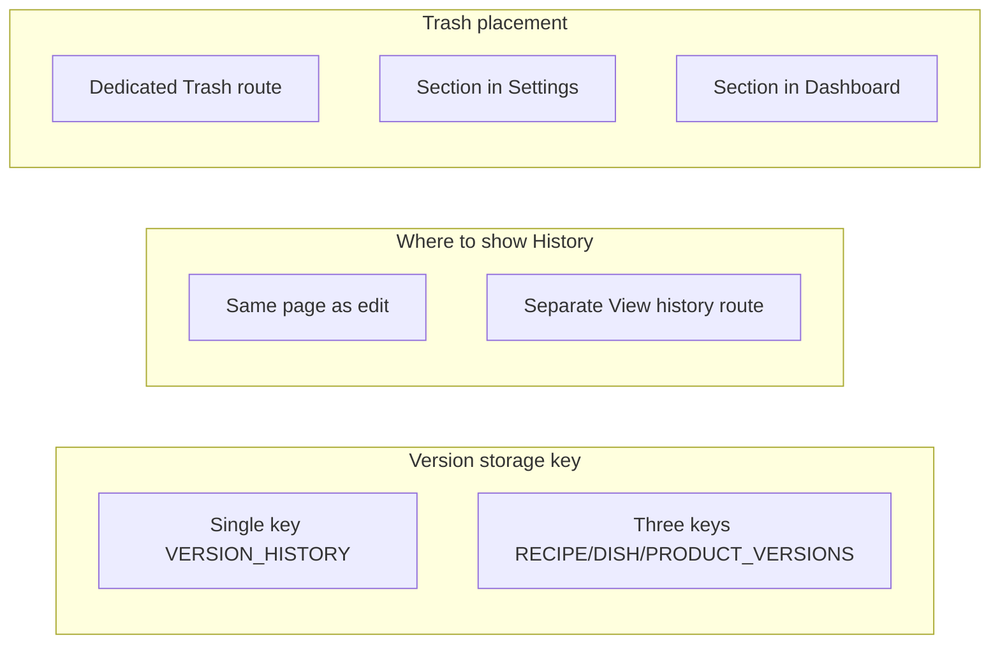

# Version history and trash can

## Current state

- **Storage**: [async-storage.service.ts](src/app/core/services/async-storage.service.ts) uses localStorage keys `RECIPE_LIST`, `DISH_LIST`, `PRODUCT_LIST`. Delete is hard: `remove()` splices the item out and saves.
- **Activity log**: [activity-log.service.ts](src/app/core/services/activity-log.service.ts) records created/updated/deleted with optional `changes` (field, from, to) for the dashboard. It is a global recent-activity feed, not per-entity history and not restorable.
- **Recipe model**: [recipe.model.ts](src/app/core/models/recipe.model.ts) has unused `version_history_?: string[]`. No version snapshots are stored today.
- **Deletes**: [kitchen-state.service.ts](src/app/core/services/kitchen-state.service.ts) calls `productDataService.deleteProduct`, `dishDataService.deleteDish`, or `recipeDataService.deleteRecipe`, which call `storage.remove()`.

---

## Part A: Version history (trace changes / revert)

**Goal**: Each recipe, dish, and product has its own history; every change is stored so the user can see what changed and optionally restore a previous version.

**Approach**: Store version snapshots per entity, not in the entity document (to avoid bloating the main list). Keep the existing activity log for the dashboard; add a separate **version store** used for "History" and "Restore".

- **Data model**
  - New storage key(s), e.g. `VERSION_HISTORY` or one key per entity type: `RECIPE_VERSIONS`, `DISH_VERSIONS`, `PRODUCT_VERSIONS`.
  - Each version entry: `{ entityType, entityId, entityName, versionAt (timestamp), snapshot (full Recipe | Product), changesSummary or changes[] }`. Include a human-readable summary or activity-style `changes[]` for display in the history list.
  - Decide a **max versions per entity** (e.g. 20) and trim oldest when exceeding.
- **When to create a version**
  - **Update only** (not create): in [kitchen-state.service.ts](src/app/core/services/kitchen-state.service.ts), before calling `updateRecipe` / `updateDish` / `updateProduct`, push the **previous** state (from state or from storage) into the version store. Same in [product-data.service.ts](src/app/core/services/product-data.service.ts) / product update path if update goes through a single place.
- **Services**
  - New **VersionHistoryService** (or similar): `getVersions(entityType, entityId): VersionEntry[]`, `addVersion(entry)`, and optionally `restoreVersion(entityType, entityId, versionAt)` that writes the snapshot back to the main entity store and then triggers normal save flow so activity log and UI stay consistent.
- **UI**
  - From recipe/dish detail or edit screen: "History" (היסטוריה) opens a list of versions (date/time, summary). User can "View" (read-only diff or side-by-side) and "Restore" (confirm then replace current with that snapshot).
  - Same for product: from product detail/edit, History list and Restore.
  - **From trash**: History and Restore must also be available from the trash can (e.g. view version history of a trashed item and optionally restore a previous version before recovering the item).

**Relationship to activity log**: Keep activity log as-is for the dashboard. Version history is the source of truth for "what did this entity look like at time T?" and for restore. Optionally, when displaying history, you can show a one-line summary per version (e.g. "Name, yield, 3 ingredients changed") using the same kind of diff as `buildRecipeChanges` / product equivalent.

---

## Part B: Trash can (soft delete, recover, dispose)

**Goal**: Deleted items (recipes, dishes, products) go to trash and stay until the user disposes of them. UI: separate containers per type (Dishes, Recipes, Products — products last); dispose entire container or single item; recover single item or entire container.

**Approach**: Soft delete by moving to a trash store instead of removing from the main list.

- **Data model**
  - New storage keys, e.g. `TRASH_DISHES`, `TRASH_RECIPES`, `TRASH_PRODUCTS` (or one `TRASH` array with `entityType` on each item). Separate keys make "dispose entire container" a single clear of that key.
  - Trash entry: at minimum `{ ...entity, deletedAt: number }`. Same shape as Recipe or Product so restore is "copy back to main list and remove from trash".
- **Delete flow**
  - Replace hard delete with: read entity from main list, add `deletedAt`, append to the appropriate trash array, remove from main list, save both. Do this in data layer (e.g. [recipe-data.service.ts](src/app/core/services/recipe-data.service.ts), [dish-data.service.ts](src/app/core/services/dish-data.service.ts), [product-data.service.ts](src/app/core/services/product-data.service.ts)) so all callers (e.g. [kitchen-state.service.ts](src/app/core/services/kitchen-state.service.ts)) keep calling `deleteRecipe` / `deleteDish` / `deleteProduct`; internally they move to trash.
- **Recover**
  - **Single item**: Remove from trash array, add back to the corresponding main list (RECIPE_LIST / DISH_LIST / PRODUCT_LIST), save both. Expose e.g. `restoreRecipe(id)`, `restoreDish(id)`, `restoreProduct(id)` and call from trash UI.
  - **Whole container**: For each item in e.g. `TRASH_DISHES`, move back to `DISH_LIST` and clear `TRASH_DISHES`.
- **Dispose**
  - **Single item**: Remove from trash array and save (permanent delete from trash).
  - **Whole container**: Clear that trash key (e.g. `TRASH_DISHES = []`) and save.
- **UI**
  - **Trash page/section**: Three containers (sections):
    1. **Dishes** (מנות)
    2. **Recipes** (מתכונים)
    3. **Products** (חומרי גלם) — last, as requested.
  - Each container shows list of trashed items (name, optional deletedAt). Actions per item: **Recover** (משחזר), **Dispose** (ממחק לצמיתות).
  - Per container: **Recover all** (משחזר הכל), **Dispose all** (ממחק את כל התוכן לצמיתות). Confirm before dispose-all.
  - Navigation: link to Trash from main nav or settings/dashboard so users can open it when they need to undo a delete.
- **Confirmation modals**
  - **Dispose (permanent remove)**: Show a confirmation modal asking if the user is sure they want to remove for good. Use more alerting styling (e.g. red accent / danger theme) so it stands out.
  - **Restore**: Show a confirmation modal when the user chooses to restore an item. Use a distinct style (e.g. yellow/amber accent) so it is clearly different from the dispose flow.

**Backward compatibility**: Existing code that calls `deleteRecipe`/`deleteDish`/`deleteProduct` does not need to change; only the implementation of those methods (and the underlying data services) changes from "remove from list" to "move to trash".

---

## Implementation order (suggested)

1. **Trash (data + services)**
  Add trash storage keys and soft-delete in recipe/dish/product data services; add restore/dispose methods and (if needed) a small TrashService that both list and kitchen-state can use.
2. **Trash UI**
  Trash page with three containers (Dishes, Recipes, Products), per-item and per-container recover/dispose, products last.
3. **Version history (data + services)**
  Version storage, VersionHistoryService, and hook into update flows to push previous snapshot before saving.
4. **Version history UI**
  History list and Restore from recipe/dish/product detail or edit screens; same for products.

---

## Open decisions (choose before or during implementation)

Decisions below are shown as options; pick one per row when implementing.

| Decision                  | Option A                                                  | Option B (or C)                                                    |
| ------------------------- | --------------------------------------------------------- | ------------------------------------------------------------------ |
| **Version storage key**   | Single key `VERSION_HISTORY` (entityType in each record). | Three keys `RECIPE_VERSIONS`, `DISH_VERSIONS`, `PRODUCT_VERSIONS`. |
| **Where to show History** | Same page as edit (tab or side panel).                    | Separate "View history" route.                                     |
| **Trash placement**       | Dedicated "Trash" route (main nav).                       | Section inside Settings or Dashboard.                              |

If you want, next step can be concrete type definitions and function signatures for VersionHistoryService and the trash methods (so implementation stays consistent with this plan).
