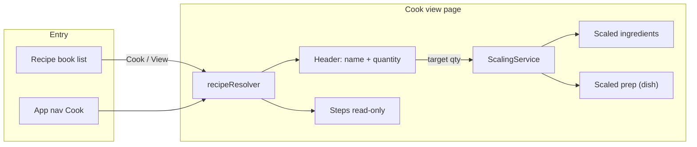

# Recipe Cook View Page (Scale & Cook)

## Goal

A **separate page** from recipe-builder for **viewing and scaling** recipes/dishes. User chooses a recipe, sets desired quantity (e.g. ½ of 1000g, or 10 portions), and sees **exact quantities per product** so they don't have to calculate. Ratios stay the same; only the end quantity changes. This page should be **easy to read, user-friendly, and fun**, and become the **go-to place** when the user wants to cook.

---

## 1. Core behavior

- **Choose recipe/dish**:
  - **From recipe-book**: User can open the cook view by **clicking the recipe/dish row** in the table. Edit, Remove, and Allergens remain as separate buttons (not row click).
  - **Cook route** remembers the **last viewed recipe**. When the user opens the cook route again (e.g. from nav), show the last viewed recipe/dish.
  - **Search bar** on the cook view: search with dropdown showing recipe/dish **name** and **type tag** (recipe vs dish). Selecting an item shows that item in the recipe-view.
  - **Edit**: Dedicated **Edit** button that navigates to recipe-builder (edit) for the current recipe.
- **Quantity in header**: Single control for "how much I want":
  - **Preparations** (yield in gram/kg/liter/etc.): e.g. "500" in "gram" → scale to 500g total.
  - **Dishes** (yield in `dish`/portion): e.g. "10" in "dish" → scale to 10 portions.
- **Scaling**: `factor = targetQuantity / recipe.yield_amount_`. Apply to:
  - Every **ingredient** `amount_` (and display with same `unit_`; optional: human-friendly formatting later).
  - For **dishes**: every **prep item** `quantity` in `prep_items_` (and `mise_categories_` if still used).
- **Display**: Read-only list of ingredients with **product/prep name** and **scaled quantity + unit**; optional scaled cost/weight. Steps / workflow shown read-only (no scaling of step text).

No changes to stored recipe data; scaling is **view-state only**.

---

## 2. Data and services (existing)

- **[recipe.model.ts](src/app/core/models/recipe.model.ts)**: `Recipe` has `yield_amount_`, `yield_unit_`, `ingredients_` (each with `amount_`, `unit_`, `referenceId`, `type`), and for dishes `prep_items_` (quantity, unit).
- **[recipe.resolver.ts](src/app/core/resolvers/recipe.resolver.ts)**: Loads recipe by id (preparation then dish); can be reused for a route like `cook/:id`.
- **RecipeCostService**: `computeRecipeCost`, `getRecipeCostPerUnit`, `computeTotalWeightG`; scaled cost = cost per unit × target quantity (when unit matches); total weight can use same helpers on scaled ingredient rows.
- **KitchenStateService**: Resolve product/recipe names for `referenceId` (same pattern as [recipe-book-list](src/app/pages/recipe-book/components/recipe-book-list/recipe-book-list.component.ts) and recipe-builder).
- **UnitRegistryService**: `yield_unit_` and ingredient `unit_` are already in the registry (e.g. `gram`, `dish`); use for labels and optional conversions.

---

## 3. Scaling logic (new, small surface)

- **ScalingService** (or pure functions in a service):
  - `getScaleFactor(recipe: Recipe, targetQuantity: number): number`
    - `targetQuantity / (recipe.yield_amount_ || 1)` (guard against 0).
  - `getScaledIngredients(recipe: Recipe, factor: number): { name, amount, unit }[]`
    - Map `recipe.ingredients_` to display names (via KitchenState) and `amount_ * factor`, keep `unit_`.
  - For dishes: `getScaledPrepItems(recipe: Recipe, factor: number)`
    - Map `prep_items_` (and any `mise_categories_`) to same structure with `quantity * factor`.
- **Scaled cost/weight**: Use existing `RecipeCostService` on a **temporary** recipe object with scaled `ingredients_` (and optionally scaled `prep_items_`) for the current target quantity, so cost and total weight update with scale.

---

## 4. New page and route

- **Route**: e.g. `cook` (recipe picker / last-viewed) and `cook/:id` (single recipe view).
  - `cook/:id` resolved with existing **recipeResolver**; `cook` shows last viewed recipe (state) or redirect/picker.
- **Page component**: **CookViewPage** at `pages/cook-view/`.
  - **Header**: Recipe name (read-only); **quantity control**: number input + unit label (recipe's `yield_unit_`), +/- buttons, SelectOnFocus directive for keyboard input; **unit-specific quick presets** (see §6).
  - **Body**:
    - **Ingredients block**: Table/cards with columns: ingredient name (product or sub-recipe), scaled amount, unit. Optional: cost per line, % of total weight.
    - **Dishes only**: **Prep list** (scaled quantities) from `prep_items_` (and categories if applicable).
    - **Steps / workflow**: Read-only steps (no scaling of text); optional labor time display.
  - **Search bar**: Search recipes/dishes with dropdown (name + type tag); selection shows that item in the view.
  - **Edit button**: Navigate to `recipe-builder/:id` for the current recipe.
  - **Product names**: Resolve via `KitchenStateService.products_()` and `recipes_()` by `referenceId` (and `type`) same as recipe-book-list.
- **Entry from recipe-book**: Row click (except Edit/Remove/Allergens buttons) navigates to `cook/:id`; also add a **Cook** (or **View**) button per row → `router.navigate(['/cook', recipe._id])`.
- **App nav**: Add link to **Cook** in [header](src/app/core/components/header/header.component.html) pointing to `cook` (or recipe-book with clear affordance).

---

## 5. UX and readability (user-friendly, fun)

- **Clear hierarchy**: Recipe name → "Make this much" control → ingredients → prep (if dish) → steps.
- **Quantity control**: Prominent, same line as recipe name or directly below; unit in user's language (translatePipe); min 0.01 or 1 depending on unit to avoid zero.
- **Numbers**: Show scaled amounts in **consistent precision** (e.g. 2 decimal places for small decimals, 0 for integers when appropriate); consider later "smart" display (e.g. 500 g vs 0.5 kg) using UnitRegistryService.
- **RTL**: Keep `dir="rtl"` and existing translation pipe for Hebrew.
- **Accessibility**: Labels, aria-labels on controls, keyboard-friendly +/- and input.
- **Fun**: Optional light touches (clear typography, one primary CTA "Start cooking").

---

## 6. Extra features for day-to-day cooking (prioritized)

1. **Quick scale presets** (in scope)
   - User can type in the quantity or use +/-. Presets depend on **unit**:
     - **Dish (portions)**: ½, 1×, 1.5×, 2× (step up/down).
     - **By count (e.g. units)**: ½, 1×, 1.5×, 2×.
     - **Gram**: e.g. 1, 2, 3 (step up/down).
     - **Liter**: e.g. 1, 2, 3 (step up/down).
     - Same idea for other units (presets/steps match unit).

2. **Copy / print / share** — **Out of scope for this plan.** Add to [Ideas.md](public/assets/data/Ideas.md).

3. **Shopping list** — **Placeholder only**: Add a styled **non-functional** "Add to shopping list" button. Real feature → add to Ideas.md.

4. **Edit from cook view** (in scope)
   - **Edit in-place**: Designated **Edit** button at top. Entering edit mode changes the page (e.g. different background) so it is clear the user is in edit mode.
   - **Confirm modal** before saving or when leaving with unsaved changes.
   - **Show changed fields in red** (measurement units, ingredients, or workflow) so the user sees what changed.

5. **Favorites / recent** (in scope)
   - "Favorites" or "Recently cooked" on the cook landing (or recipe-book) for quick access; minimal state (e.g. local storage IDs).

6. **Prep time / timer** — **Out of scope.** Add to Ideas.md.

7. **Checklist** (per-ingredient "I have this") — **Out of scope.** Add to Ideas.md.

---

## 7. Files to add or change (summary)

| Area            | Action                                                                                                                                                                                       |
| --------------- | -------------------------------------------------------------------------------------------------------------------------------------------------------------------------------------------- |
| **Route**       | In [app.routes.ts](src/app/app.routes.ts): add `cook` and `cook/:id` with `recipeResolver` for `:id`.                                                                                        |
| **Scaling**     | New `ScalingService` (or under `recipe-cost.service`) with `getScaleFactor`, `getScaledIngredients`, `getScaledPrepItems`; use existing KitchenState + RecipeCost for names and cost/weight. |
| **Page**        | New `pages/cook-view/`: page component, template (header + quantity control + search + ingredients table + prep block + steps), styles; optional subcomponents for ingredient list and scale presets. |
| **Recipe-book** | Row click (except action buttons) and "Cook" button per row → `router.navigate(['/cook', recipe._id])`.                                                                                      |
| **Header**      | Add nav link "Cook".                                                                                                                                                                         |
| **i18n**        | Add dictionary keys for "cook", "scale", "make_quantity", "portions", "edit_recipe", etc., in [dictionary.json](public/assets/data/dictionary.json).                                         |
| **Ideas**       | Ensure [Ideas.md](public/assets/data/Ideas.md) lists: copy/print/share, shopping list (full), prep time/timer, checklist.                                                                       |

---

## 8. Architecture sketch

---

## 9. Out of scope (by design)

- **No persistence** of scale or checklist in recipe data; scale and optional checklist are view/session state only.
- **No new recipe types**; same `Recipe` model and dish vs preparation distinction.
- Copy/print/share, full shopping list, prep timer, and per-ingredient checklist are documented in Ideas.md for later; not implemented in this plan.

---

## 10. Suggested implementation order

1. **ScalingService** (or functions): factor, scaled ingredients, scaled prep items; unit tests.
2. **Route** `cook` / `cook/:id` + **CookViewPage** shell: resolve recipe, header with name and quantity input, display scaled ingredients (names from KitchenState). Persist last-viewed recipe id for `cook` route.
3. **Recipe-book**: Row click (to cook view) and "Cook" button; navigation.
4. **Header**: "Cook" link; dictionary keys.
5. **Polish**: Unit-specific presets (½, 1×, 1.5×, 2× for dish/units; 1,2,3 for gram/liter etc.), scaled cost/weight, prep block for dishes, read-only steps. Search bar on cook view.
6. **Edit from cook view**: Edit button, edit mode (visual distinction), confirm modal on save/leave, show changed fields in red.
7. **Favorites / recent**: Minimal state (e.g. local storage); show on cook landing or recipe-book.
8. **Placeholder**: Styled "Add to shopping list" button (non-functional).

This keeps the page focused on **quantity scaling and exact amounts per product**, with a path to add day-to-day helpers without bloating the first release.
