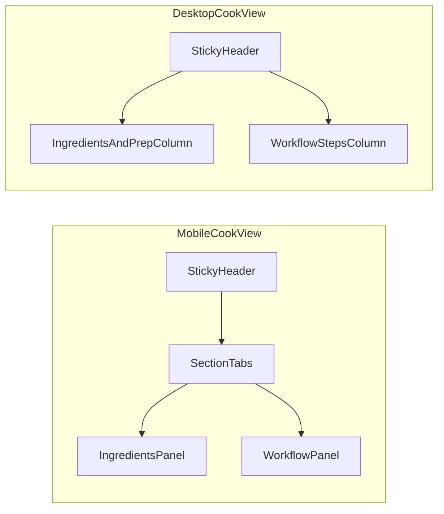

# Cook View Workflow Fix + UX Redesign Plan

## Goals

- Restore full workflow editing in `cook-view` for both `dish` and `preparation` entities (add/edit/remove even when workflow is empty).
- Redesign the cook-view page to be more engaging and easier to use, with distinct mobile and desktop layouts.
- Keep behavior consistent with existing workflow editing patterns already implemented in recipe builder.

## Confirmed Root Cause

- `cook-view` edit mode only supports ingredient editing; workflow sections remain read-only even in edit mode.
- `cook-view` does not wire the reusable workflow editor used in recipe builder.

Primary references:

- [src/app/pages/cook-view/cook-view.page.ts](src/app/pages/cook-view/cook-view.page.ts)
- [src/app/pages/cook-view/cook-view.page.html](src/app/pages/cook-view/cook-view.page.html)
- [src/app/pages/recipe-builder/components/recipe-workflow/recipe-workflow.component.ts](src/app/pages/recipe-builder/components/recipe-workflow/recipe-workflow.component.ts)
- [src/app/pages/recipe-builder/components/recipe-workflow/recipe-workflow.component.html](src/app/pages/recipe-builder/components/recipe-workflow/recipe-workflow.component.html)

## Implementation Strategy

### 1) Workflow Editing Fix in Cook View (Functional)

- Extend `cook-view` edit mode to support workflow item CRUD for both modes:
  - `preparation`: step instruction + labor time rows.
  - `dish`: prep item selection/category/qty/unit rows.
- Reuse the existing workflow editor component patterns from recipe builder to avoid duplication and maintain parity.
- Ensure empty workflow states can always create the first row in edit mode.
- Keep save/undo behavior aligned with existing `originalRecipe_` snapshot flow.

Target files:

- [src/app/pages/cook-view/cook-view.page.ts](src/app/pages/cook-view/cook-view.page.ts)
- [src/app/pages/cook-view/cook-view.page.html](src/app/pages/cook-view/cook-view.page.html)
- [src/app/pages/cook-view/cook-view.page.scss](src/app/pages/cook-view/cook-view.page.scss)

### 2) UX Redesign for a More Fun Cook Experience (Visual + Layout)

External inspiration applied from AnyList, Paprika, Samsung Food, and RecipeKit cook-mode patterns:

- Mobile-first reduced cognitive load:
  - Segment content into clear sections/tabs (Ingredients / Prep / Steps / Info).
  - Remember active section state and avoid long vertical scanning.
- Desktop zero-friction layout:
  - Two-column cockpit where ingredients + workflow are visible together.
  - Keep key controls (quantity, edit actions) sticky and always visible.
- Delight + clarity improvements:
  - Active step highlighting.
  - Checkable ingredient/prep progress visuals.
  - Cleaner spacing hierarchy and stronger visual anchors (without clutter).

Target files:

- [src/app/pages/cook-view/cook-view.page.html](src/app/pages/cook-view/cook-view.page.html)
- [src/app/pages/cook-view/cook-view.page.scss](src/app/pages/cook-view/cook-view.page.scss)

### 3) Data Mapping + Persistency Safety

- Preserve current recipe model compatibility:
  - `steps_` for preparations.
  - `prep_items_` (and backward compatibility where needed) for dishes.
- Add explicit normalization before save so editing produces stable payloads regardless of initial structure.

Reference model:

- [src/app/core/models/recipe.model.ts](src/app/core/models/recipe.model.ts)

### 4) Validation + Guardrails

- Prevent invalid saves from edit mode (empty instructions for steps, invalid qty/unit for prep rows).
- Ensure at least one row can be created from empty state and removed safely.
- Preserve undo reliability for both ingredient and workflow changes together.

### 5) Testing Plan

- Manual regression matrix:
  - Dish with zero prep rows: add first row, edit, save, reload.
  - Dish with existing prep rows: edit qty/unit/category, remove/add, save, reload.
  - Preparation with zero steps: add first step, edit labor time, save, reload.
  - Preparation with existing steps: edit text/time, reorder rules (if any), save, reload.
  - Undo after mixed edits (ingredients + workflow) restores full original state.
- Add/update focused component tests for workflow edit behavior in cook-view interaction paths.

## Responsive Layout Blueprint

## Success Criteria

- Workflow is editable in cook-view for both recipe types.
- Empty workflow states can add first item in edit mode.
- Desktop shows key cooking information without unnecessary scrolling for typical recipe sizes.
- Mobile interaction feels focused and readable with reduced scrolling friction.
- No regressions in ingredient editing, save, undo, and persisted recipe structure.
