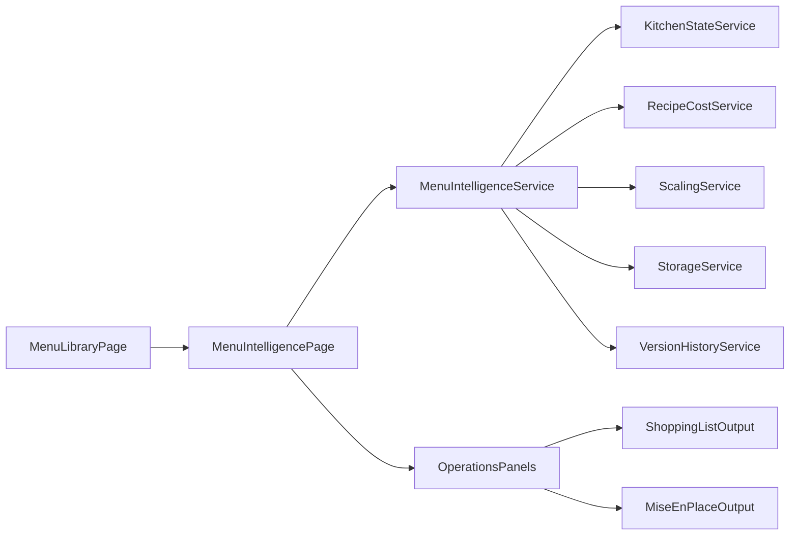

# Menu Intelligence Module Plan

## Objective

Build a new end-to-end planning workflow that moves from dish-level authoring to event-level strategy:

- Manage historical event menus and clone winning templates.
- Configure event assumptions (serving style, guest count, pieces/person).
- Compose sectioned menus with predicted take-rate and strategic balance indicators.
- Generate consolidated procurement and mise-en-place outputs.
- Track event financial health in real time.

## Project Fit (Current Code Reuse)

Use existing foundations instead of rebuilding:

- Routing/page conventions from `[C:/foodCo/foodVibe1.0/src/app/app.routes.ts](C:/foodCo/foodVibe1.0/src/app/app.routes.ts)`.
- Recipe/dish source data from `[C:/foodCo/foodVibe1.0/src/app/core/models/recipe.model.ts](C:/foodCo/foodVibe1.0/src/app/core/models/recipe.model.ts)`, `[C:/foodCo/foodVibe1.0/src/app/core/services/recipe-data.service.ts](C:/foodCo/foodVibe1.0/src/app/core/services/recipe-data.service.ts)`, and `[C:/foodCo/foodVibe1.0/src/app/core/services/dish-data.service.ts](C:/foodCo/foodVibe1.0/src/app/core/services/dish-data.service.ts)`.
- Cost/unit/scaling logic from `[C:/foodCo/foodVibe1.0/src/app/core/services/recipe-cost.service.ts](C:/foodCo/foodVibe1.0/src/app/core/services/recipe-cost.service.ts)` and `[C:/foodCo/foodVibe1.0/src/app/core/services/scaling.service.ts](C:/foodCo/foodVibe1.0/src/app/core/services/scaling.service.ts)`.
- Search/filter/table UX pattern from `[C:/foodCo/foodVibe1.0/src/app/pages/recipe-book/components/recipe-book-list/recipe-book-list.component.ts](C:/foodCo/foodVibe1.0/src/app/pages/recipe-book/components/recipe-book-list/recipe-book-list.component.ts)`.
- History/restore patterns from `[C:/foodCo/foodVibe1.0/src/app/core/services/version-history.service.ts](C:/foodCo/foodVibe1.0/src/app/core/services/version-history.service.ts)` and `[C:/foodCo/foodVibe1.0/src/app/shared/version-history-panel/version-history-panel.component.ts](C:/foodCo/foodVibe1.0/src/app/shared/version-history-panel/version-history-panel.component.ts)`.
- Local persistence strategy from `[C:/foodCo/foodVibe1.0/src/app/core/services/async-storage.service.ts](C:/foodCo/foodVibe1.0/src/app/core/services/async-storage.service.ts)`.

## Architecture Upgrade (Recommended)

Create a dedicated event-level domain (you chose new entity strategy):

- `MenuEvent` (new): event metadata + assumptions + sectioned menu structure + metrics snapshot.
- `MenuSection` (new): logical menu section (course/station/service phase).
- `MenuItemSelection` (new): selected dish/recipe with take-rate and derived portions.
- `MenuOperationalSnapshot` (new): computed shopping and prep outputs.

## Full Feature Build Plan

### 1) Data Layer and Domain Contracts

- Add models:
  - `[C:/foodCo/foodVibe1.0/src/app/core/models/menu-event.model.ts](C:/foodCo/foodVibe1.0/src/app/core/models/menu-event.model.ts)`
  - Include: `serving_type_`, `guest_count_`, optional `pieces_per_person_`, `sections_`, `financial_targets_`, `performance_tags_`, `created_from_template_id_`.
- Add persistence service:
  - `[C:/foodCo/foodVibe1.0/src/app/core/services/menu-event-data.service.ts](C:/foodCo/foodVibe1.0/src/app/core/services/menu-event-data.service.ts)`
  - Storage key: `MENU_EVENT_LIST`; soft-delete trash key for parity.
- Add orchestrator service:
  - `[C:/foodCo/foodVibe1.0/src/app/core/services/menu-intelligence.service.ts](C:/foodCo/foodVibe1.0/src/app/core/services/menu-intelligence.service.ts)`
  - Responsibilities: all calculations, consolidation, strategic tags, and floating financial metrics.

### 2) Routing and Navigation Integration

- Add routes in `[C:/foodCo/foodVibe1.0/src/app/app.routes.ts](C:/foodCo/foodVibe1.0/src/app/app.routes.ts)`:
  - `/menu-library`
  - `/menu-intelligence`
  - `/menu-intelligence/:id`
- Keep route guard parity with existing edit flows using `pendingChangesGuard`.

### 3) Menu Library (Explorer Phase)

- New page + list component:
  - `[C:/foodCo/foodVibe1.0/src/app/pages/menu-library/menu-library.page.ts](C:/foodCo/foodVibe1.0/src/app/pages/menu-library/menu-library.page.ts)`
  - `[C:/foodCo/foodVibe1.0/src/app/pages/menu-library/components/menu-library-list/menu-library-list.component.ts](C:/foodCo/foodVibe1.0/src/app/pages/menu-library/components/menu-library-list/menu-library-list.component.ts)`
- Capabilities:
  - Search by name/date/event type.
  - Filter chips using existing recipe-book interaction style.
  - Performance tag cards per event (`food_cost_pct`, serving style).
  - `Clone as New` action that deep-copies sections/items with new id and `created_from_template_id_`.
  - Optional history panel reuse pattern for menu versions.

### 4) Event Configuration (Foundation)

- Add configuration block component:
  - `[C:/foodCo/foodVibe1.0/src/app/pages/menu-intelligence/components/event-config/event-config.component.ts](C:/foodCo/foodVibe1.0/src/app/pages/menu-intelligence/components/event-config/event-config.component.ts)`
- Rules implementation:
  - Serving type required (`buffet_family`, `plated_course`, `cocktail_passed`).
  - Guest count global required and min 1.
  - Cocktail mode requires `pieces_per_person_`.
  - Encapsulate multipliers in `menu-intelligence.service` to avoid logic leakage into components.

### 5) Menu Canvas (Visual Builder)

- New editor page with modular components:
  - `[C:/foodCo/foodVibe1.0/src/app/pages/menu-intelligence/menu-intelligence.page.ts](C:/foodCo/foodVibe1.0/src/app/pages/menu-intelligence/menu-intelligence.page.ts)`
  - `[C:/foodCo/foodVibe1.0/src/app/pages/menu-intelligence/components/menu-sections/menu-sections.component.ts](C:/foodCo/foodVibe1.0/src/app/pages/menu-intelligence/components/menu-sections/menu-sections.component.ts)`
  - `[C:/foodCo/foodVibe1.0/src/app/pages/menu-intelligence/components/dish-injection/dish-injection.component.ts](C:/foodCo/foodVibe1.0/src/app/pages/menu-intelligence/components/dish-injection/dish-injection.component.ts)`
- UX/behavior:
  - Drag-drop section ordering (course flow).
  - Per-section dish injection search against existing dishes/recipes from `KitchenStateService`.
  - Per-item predicted take-rate input with instant derived portions (`guest_count_ * take_rate_`).
  - Strategy overlay toggle (Star/Plowhorse/Puzzle), computed by popularity proxy + cost margin thresholds.

### 6) Logistics Engine Outputs

- Add output components:
  - `[C:/foodCo/foodVibe1.0/src/app/pages/menu-intelligence/components/shopping-output/shopping-output.component.ts](C:/foodCo/foodVibe1.0/src/app/pages/menu-intelligence/components/shopping-output/shopping-output.component.ts)`
  - `[C:/foodCo/foodVibe1.0/src/app/pages/menu-intelligence/components/mise-output/mise-output.component.ts](C:/foodCo/foodVibe1.0/src/app/pages/menu-intelligence/components/mise-output/mise-output.component.ts)`
- Smart Shopping List:
  - Consolidate ingredients by product id/name across all selected menu dishes.
  - Supplier categorization via product category metadata and existing supplier mapping where available.
  - Buying-unit recommendation using product `purchase_options_` conversion logic.
- Consolidated Mise en Place:
  - Merge prep tasks by normalized prep name + unit.
  - Preserve sub-breakdown by dish for traceability.
  - Provide grouped views: by station and by timing bucket.

### 7) Financial Guardrails (Persistent Bottom Bar)

- Add floating financial component:
  - `[C:/foodCo/foodVibe1.0/src/app/pages/menu-intelligence/components/financial-health-bar/financial-health-bar.component.ts](C:/foodCo/foodVibe1.0/src/app/pages/menu-intelligence/components/financial-health-bar/financial-health-bar.component.ts)`
- Metrics:
  - Event total ingredient cost.
  - Cost per guest.
  - Food cost percent vs target thresholds.
  - Profit-per-guest (based on event revenue input or target sell price per guest).
- Color states and warnings:
  - Green/amber/red based on threshold bands.

### 8) Versioning, Templateing, and Recovery

- Extend versioning to `menu_event` entity type in:
  - `[C:/foodCo/foodVibe1.0/src/app/core/services/version-history.service.ts](C:/foodCo/foodVibe1.0/src/app/core/services/version-history.service.ts)`
- Add clone/template workflow:
  - explicit `cloneMenuEventAsNew()` method in data/orchestrator service.
- Optional trash parity for menus:
  - align with patterns in `[C:/foodCo/foodVibe1.0/src/app/core/services/trash.service.ts](C:/foodCo/foodVibe1.0/src/app/core/services/trash.service.ts)`.

### 9) Internationalization and UX Consistency

- Add translation keys for all new labels/states (serving styles, strategy tags, output sections).
- Reuse RTL-compatible UI conventions already used in recipe-book/cook-view templates.
- Keep components focused and below ~300 lines by splitting container vs presentational components.

### 10) Test and Validation Plan

- Unit tests:
  - Calculation correctness for each serving mode.
  - Consolidation logic (shopping + prep merge edge cases).
  - Strategy tag classification thresholds.
- UI behavior tests:
  - Clone/template flow.
  - Section reorder and dish injection.
  - Real-time financial bar updates.
- Regression checks:
  - Existing recipe-builder, recipe-book, cook-view flows remain unchanged.

## Enhancements Over Original Plan

- Adds a dedicated event data model to avoid overloading recipe entities.
- Makes all heavy business logic service-driven (testable and reusable), not template-driven.
- Aligns with your existing history/restore and local-storage architecture for lower integration risk.
- Defines explicit route, component, and service boundaries to keep files maintainable.
- Adds concrete test strategy and regression controls so feature growth does not break core flows.
