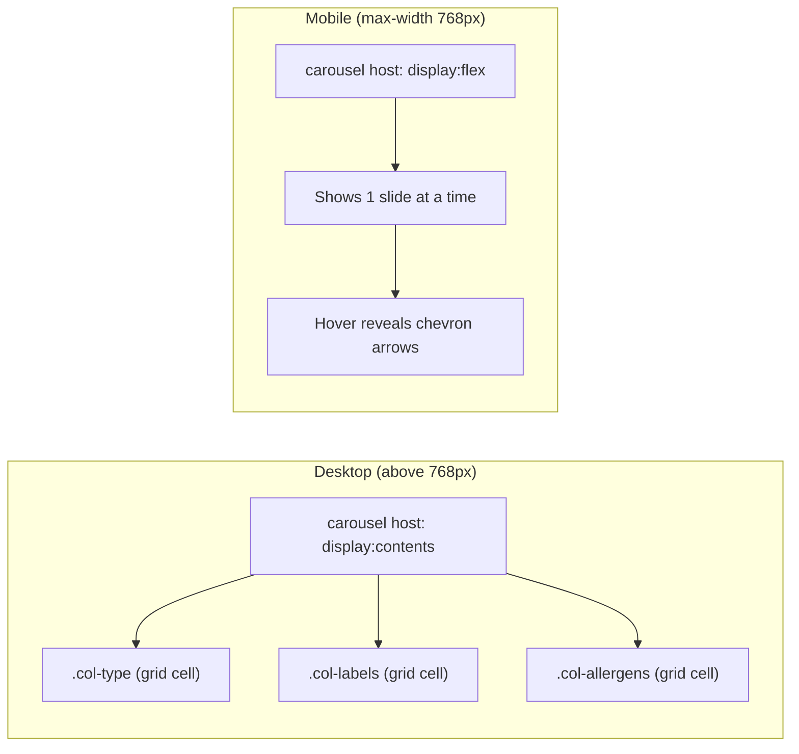

# Responsive Carousel Column for Recipe Book and Inventory Tables

## Context

Both tables use CSS Grid with `display: contents` rows. At mobile (max-width: 768px), three metadata columns in each table should merge into a single carousel cell that shows one value at a time with left/right chevron arrows on hover.

- **Recipe Book** columns to carousel: Type, Labels, Allergens
- **Inventory** columns to carousel: Category, Allergens, Supplier

## Architecture: `display: contents` toggle

The carousel component wraps the target columns. At desktop its `:host` uses `display: contents`, making it invisible -- children remain direct grid cells. At mobile its `:host` switches to a positioned flex cell, activating carousel behavior. This avoids template duplication and keeps a single source of truth for each column's content.

## Step 1 -- Create the shared `CellCarouselComponent`

**New files:**

- `src/app/shared/cell-carousel/cell-carousel.component.ts`
- `src/app/shared/cell-carousel/cell-carousel.component.html`
- `src/app/shared/cell-carousel/cell-carousel.component.scss`

**Directive** (`CellCarouselSlideDirective`): defined in the same `.ts` file. Applied to each slide element via attribute selector `[cellCarouselSlide]`. Accepts a `label` input (the column name to display in the carousel header context).

**Component behavior:**

- `@ContentChildren(CellCarouselSlideDirective)` queries slides
- Maintains a `currentIndex` signal per instance
- `prev()` / `next()` methods to navigate
- Wraps around at boundaries (last slide -> first, first -> last)

**Template:**

- Renders `<ng-content>` for all children
- Overlays left chevron (`chevron-right` for RTL) and right chevron (`chevron-left` for RTL) buttons, absolutely positioned at the edges of the cell
- Arrows appear on `:host:hover` via CSS (opacity transition)
- A small label indicator at the top of the cell showing the current slide name (e.g., "Type", "Labels")

**SCSS (`:host`):**

- Desktop: `display: contents` (no visual presence)
- `@media (max-width: 768px)`:
  - `display: flex; position: relative; overflow: hidden; align-items: center; min-width: 0;`
  - All `::ng-deep [cellCarouselSlide]` children get `display: none` except the active one (`display: flex`)
  - Arrow buttons: `position: absolute; top: 0; bottom: 0; width: 1.5rem;` with glass background, `opacity: 0` by default, `opacity: 1` on `:host:hover`
  - Slide label: small `font-size: 0.625rem` muted text above the content

## Step 2 -- Modify the Recipe Book table

**Files:**

- `src/app/pages/recipe-book/components/recipe-book-list/recipe-book-list.component.html`
- `src/app/pages/recipe-book/components/recipe-book-list/recipe-book-list.component.scss`
- `src/app/pages/recipe-book/components/recipe-book-list/recipe-book-list.component.ts`

**HTML changes (rows):** Wrap the existing `.col-type`, `.col-labels`, and `.col-allergens` divs inside `<app-cell-carousel>`, adding `cellCarouselSlide` attribute and `label` input to each.

**HTML changes (header):** Replace the three individual header cells (`.col-type`, `.col-labels`, `.col-allergens`) with a wrapper:

- Desktop: wrapper uses `display: contents` so three headers render normally
- Mobile: wrapper becomes a single header cell showing "Details" or a combined label; hide individual headers via CSS

**SCSS changes:** At `@media (max-width: 768px)`:

- Change grid template from `2fr 1fr 1fr minmax(48px, 0.8fr) 0.8fr 80px` (6 cols) to `2fr 1fr 0.8fr 80px` (4 cols: Name, Carousel, Cost, Actions)
- Hide the three individual header cells and show a single carousel header cell
- Adjust cell padding for the carousel column

**TS changes:** Import `CellCarouselComponent` and `CellCarouselSlideDirective` in the component's `imports` array.

## Step 3 -- Modify the Inventory table

**Files:**

- `src/app/pages/inventory/components/inventory-product-list/inventory-product-list.component.html`
- `src/app/pages/inventory/components/inventory-product-list/inventory-product-list.component.scss`
- `src/app/pages/inventory/components/inventory-product-list/inventory-product-list.component.ts`

**HTML changes (rows):** Wrap `.col-category`, `.col-allergens`, and `.col-supplier` inside `<app-cell-carousel>` with the `cellCarouselSlide` attribute and `label` input on each.

**HTML changes (header):** Same pattern as recipe book -- wrapper for the three header cells, single carousel header at mobile.

**SCSS changes:** At `@media (max-width: 768px)`:

- Change grid template from `2fr 1fr 1.5fr 1fr 6.25rem 1fr 5rem` (7 cols) to `2fr 1fr 6.25rem 1fr 5rem` (5 cols: Name, Carousel, Unit, Price, Actions)
- Hide three individual header cells, show single carousel header

**TS changes:** Import `CellCarouselComponent` and `CellCarouselSlideDirective`.

## UX Details

- **Arrow icons:** Use Lucide `chevron-left` and `chevron-right` at size 14. Since the layout is RTL, left arrow moves to the next slide and right arrow moves to the previous slide.
- **Hover behavior:** Arrows fade in with `opacity` transition (0.2s ease) on hover over the carousel cell. On touch devices, arrows are always visible at reduced opacity.
- **Slide label:** A small muted label (e.g., "Type", "Allergens") appears above or inline with the slide content so the user knows which column value they are viewing.
- **Wrap-around:** Navigation wraps -- going past the last slide returns to the first.
