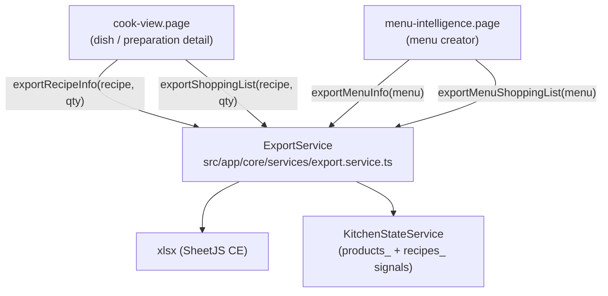

# Excel Export Feature Plan

## Architecture

## New dependency

Install `xlsx` (SheetJS Community Edition) — browser-native, no backend, same `Blob + <a>` download pattern used in `backup.service.ts`.

## New file: ExportService

**`src/app/core/services/export.service.ts`** — injectable service, injects `KitchenStateService`. Provides four public methods:

### a. `exportRecipeInfo(recipe, quantity)`
Single workbook, three sheets:
- **Info** — Name, Type, Yield (scaled), Station
- **Ingredients** — # | Ingredient | Amount | Unit | Cost
- **Steps/Prep** — Order | Instruction | Time (min)

### b. `exportShoppingList(recipe, quantity)`
Single workbook, single sheet — ingredients of the (scaled) recipe, rows grouped under category headers:
- Direct product ingredients → grouped by `product.categories_[0]` (fallback: "כללי")
- Sub-recipe (type `'recipe'`) ingredients → grouped under "הכנות"
- Columns: Category | Ingredient | Amount | Unit

### c. `exportMenuInfo(menu, recipes)`
Single workbook, one sheet per menu section (+ a cover sheet):
- Cover sheet: Menu name, event type, date, guest count, pieces/person
- Per-section sheet: Dish name | Portions | Take rate | Sell price

### d. `exportMenuShoppingList(menu, recipes, products)`
Single workbook, single sheet — aggregates all ingredients across all menu dishes (scaled by `derived_portions_`), grouped by category. Same layout as (b) but merged across all dishes with totals.

## File naming (all exports)

`[name]_x[quantity]_[YYYY-MM-DD].xlsx`
- For recipe: `שקשוקה_x4_2026-03-05.xlsx`
- For menu: `[menu-name]_x[guest-count]_[YYYY-MM-DD].xlsx`

## Modified files

- **cook-view.page.ts**: Inject ExportService; add onExportInfo(), onExportShoppingList()
- **cook-view.page.html**: Add Export Info and Shopping List buttons (hidden in edit mode)
- **cook-view.page.scss**: Style new buttons (cssLayer, existing tokens)
- **menu-intelligence.page.ts**: Inject ExportService; add onExportMenuInfo(), onExportMenuShoppingList()
- **menu-intelligence.page.html**: Add two export buttons to toolbar-actions
- **menu-intelligence.page.scss**: Reuse .toolbar-btn as needed
- **Translations**: export_recipe_info, export_shopping_list, export_menu_info, export_menu_shopping_list
