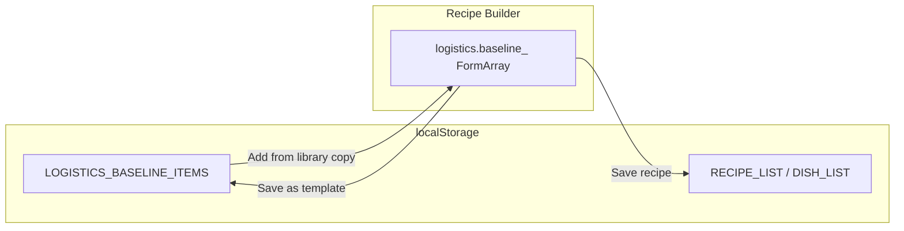

# Logistics Designated Storage Refactor

## Current state

- Logistics baseline entries live only inside each recipe/dish as `logistics_.baseline_` (array of `BaselineEntry`: equipment_id_, quantity_, phase_, is_critical_, notes_).
- No shared storage; no way to reuse the same "logistics item" across multiple recipes or dishes.
- Recipe builder: [recipe-builder.page.ts](src/app/pages/recipe-builder/recipe-builder.page.ts) builds payload including `logistics_.baseline_` from the form; [RecipeFormService.createBaselineRow](src/app/pages/recipe-builder/services/recipe-form.service.ts) creates form rows from `BaselineEntry`.

## Target design

- **Designated storage**: New entity type in localStorage for "logistics baseline items" (reusable templates). Same shape as today's baseline entry plus `_id`.
- **Usage across recipes/dishes**: When editing any recipe or dish, user can "Add from library" and pick a saved item; it is **copied** into that recipe's baseline (recipe document still stores inline `logistics_.baseline_`). No change to recipe/dish schema; no migration.
- **Optional**: "Save as template" from a baseline row in the recipe builder to create a new library item.

## Implementation steps

### 1. Model and storage wiring

- **Model**  
  In [logistics.model.ts](src/app/core/models/logistics.model.ts) (or a minimal addition): define a type for the stored item, e.g. `LogisticsBaselineItem = { _id: string } & BaselineEntry`. No change to `BaselineEntry` or `DishLogistics`; recipes keep `logistics_?: DishLogistics` with `baseline_: BaselineEntry[]`.
- **Storage**  
  - In [async-storage.service.ts](src/app/core/services/async-storage.service.ts): add a new entity type constant (e.g. `LOGISTICS_BASELINE_ITEMS`) and include it in `BACKUP_ENTITY_TYPES` so it is backed up like other entity types.

### 2. Data service for the library

- **New service**  
  Create a data service (e.g. `LogisticsBaselineDataService`) following the same pattern as [EquipmentDataService](src/app/core/services/equipment-data.service.ts):
  - Uses `StorageService` with entity type `LOGISTICS_BASELINE_ITEMS`.
  - Methods: `query()` / `getAll()`, `getById(_id)`, `add(item)`, `update(item)`, `remove(_id)`.
  - Exposes a readonly signal (e.g. `allItems_()`) for the list so the recipe builder can reactively show "Add from library" options.
  - Optional: `reloadFromStorage()` for consistency with demo loader if we ever replace this entity from demo data.
- **No trash**  
  Omit trash/restore for this entity unless you explicitly want it; keep the first version simple.

### 3. Recipe builder: "Add from library"

- **Inject** the new logistics baseline data service in [recipe-builder.page.ts](src/app/pages/recipe-builder/recipe-builder.page.ts).
- **UI** in the logistics section (same block as the existing equipment search and chips in [recipe-builder.page.html](src/app/pages/recipe-builder/recipe-builder.page.html) ~lines 75–130):
  - Add a control to open a "library" list (e.g. button "From library" that toggles a dropdown or small modal listing `LogisticsBaselineItem` from the service).
  - List entries in a clear way (e.g. equipment name from `getEquipmentNameById(item.equipment_id_)`, quantity, phase).
  - On select: create a baseline row from the selected item's `BaselineEntry` fields and push it to `logisticsBaselineArray` via existing `recipeFormService_.createBaselineRow(entry)` (same as when adding by equipment search). So we **copy** into the form; no references stored in the recipe.
- **Filtering**  
  Optionally exclude equipment IDs already in the current recipe's baseline from the library list (or allow duplicates if you prefer). Reuse the same "already in baseline" logic used for the equipment dropdown (`logisticsBaselineIds_`).

### 4. Recipe builder: "Save as template" (optional but recommended)

- **UI**  
  For each baseline chip/row, add an action (e.g. "Save as template" or icon) that takes the current row's value (equipment_id_, quantity_, phase_, is_critical_, notes_) and calls the new service's `add()` (without _id). Service assigns _id and persists to `LOGISTICS_BASELINE_ITEMS`.
- **Feedback**  
  Use existing user-message service for success/error so the user knows the item was saved to the library.

### 5. Backward compatibility and demo

- **Existing recipes/dishes**  
  No change: they already have `logistics_.baseline_` (or no logistics). Loading and saving remain the same; no migration or dual-write.
- **Demo loader**  
  Optional: add a small `demo-logistics-baseline.json` and in [demo-loader.service.ts](src/app/core/services/demo-loader.service.ts) call `storage.replaceAll('LOGISTICS_BASELINE_ITEMS', data)` and then the new service's `reloadFromStorage()` if implemented. If you skip demo data for this entity, the library simply starts empty.

### 6. Translations and accessibility

- Add any new UI strings (e.g. "From library", "Save as template") to the project's translation assets and use the existing `translatePipe` in the template.
- Keep existing a11y patterns (e.g. listbox/option for lists, aria-labels where applicable).

## Files to add

- New data service file, e.g. `src/app/core/services/logistics-baseline-data.service.ts`.
- Optionally `public/assets/data/demo-logistics-baseline.json` if you want demo library items.

## Files to modify

- [src/app/core/models/logistics.model.ts](src/app/core/models/logistics.model.ts) – add `LogisticsBaselineItem` type.
- [src/app/core/services/async-storage.service.ts](src/app/core/services/async-storage.service.ts) – add entity type and backup set.
- [src/app/pages/recipe-builder/recipe-builder.page.ts](src/app/pages/recipe-builder/recipe-builder.page.ts) – inject new service; add "add from library" and "save as template" handlers; expose library list (or filtered) for template.
- [src/app/pages/recipe-builder/recipe-builder.page.html](src/app/pages/recipe-builder/recipe-builder.page.html) – add "From library" control and "Save as template" per row (or per selection).
- Translation files (wherever recipe-builder strings live) – new keys for "From library" and "Save as template".
- Optionally [src/app/core/services/demo-loader.service.ts](src/app/core/services/demo-loader.service.ts) and new demo JSON if you include demo logistics items.

## Out of scope (reference-based design)

- This plan does **not** change recipes to store only references (IDs) to shared logistics items. Recipes still store a **copy** of the baseline entries. A future "reference-based" design (one logistics item, many recipes, edit in one place) would require a different recipe schema and resolution logic.
