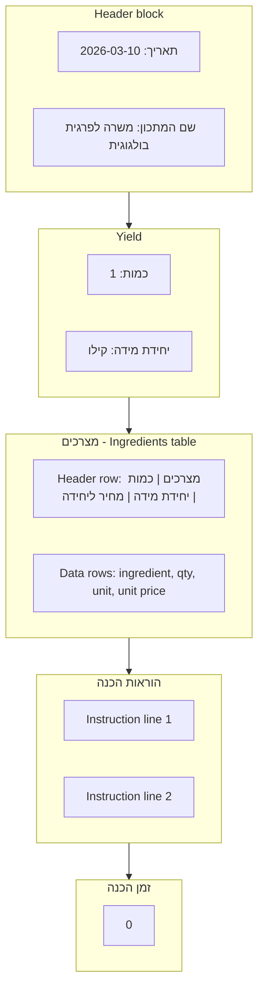

# Recipe export and view: spreadsheet-style layout

## Visual: target layout (Excel and preview)

The sheet and the in-app view should look like this (RTL: content flows right-to-left; labels in Hebrew).

**Block structure (top to bottom):**



**Spreadsheet-style wireframe (single sheet / preview, RTL-aligned):**

```
+------------------------------------------+------------------------------------------+
|          משרה לפרגית בולגוגית :שם המתכון  |                         2026/10/3 :תאריך  |
+------------------------------------------+------------------------------------------+

          קילו :יחידת מידה          1 :כמות

  ┌───────────────────────────────────────────────────────── מצרכים (Ingredients) ─┐
  │  מחיר ליחידה  │   יחידת מידה   │   כמות   │              מצרכים  │
  ├───────────────┼───────────────┼─────────┼──────────────────────┤
  │  4.67         │          ק"ג  │  0.34   │                 אגס  │
  │  0.50         │          ק"ג  │  0.13   │            בצל צהוב  │
  │  0.81         │          ק"ג  │  0.02   │             ג'ינג'ר  │
  │  ...          │          ...  │  ...    │                 ...  │
  └───────────────┴───────────────┴─────────┴──────────────────────┘

  ─────────────────────────────────────
  (Preparation instructions) הוראות הכנה

  .עם הפרגיות, לערבב לטחון הכל
  .שעות 3-2 להשרות
  .שימוש עד בקירור לשמור

  0 :(Preparation time) זמן הכנה
```

- **Excel**: One worksheet, RTL view; same rows/sections with borders and styled headers (teal/gray as in current export helpers).
- **Preview**: Same blocks inside the existing paper-style overlay; header and yield as a small grid, ingredients as a bordered table, instructions as a text block (no table), prep time as a single line.

---

## Goal

- **Excel**: Recipe/dish export (recipe-info and sheet 1 of "export all together") should use a **single-sheet** layout matching the reference: date + recipe name at top, yield (quantity + unit), ingredients table (מצרכים | כמות | יחידת מידה | מחיר ליחידה or similar), preparation instructions (הוראות הכנה) as a text block, preparation time (זמן הכנה).
- **View**: The export preview (and optionally a dedicated "recipe sheet" view) should show the **same structure** in a refined, spreadsheet-like UI — same blocks, clear grid, RTL-friendly.

---

## Current state

- **Excel**: [export.service.ts](src/app/core/services/export.service.ts) — `exportRecipeInfo` uses **3 worksheets** (Info, Ingredients, Steps); `exportAllTogetherRecipe` uses one long sheet with name/type/yield/station/exported, then ingredients, then steps. No single-sheet "recipe card" layout.
- **Preview**: [export-preview.component](src/app/shared/export-preview/export-preview.component.html) renders a generic list of sections (title + optional headerRow + table rows). No dedicated header block (date + recipe name), yield block, or instructions paragraph.
- **Data**: Recipe has `steps_` (order_, instruction_, labor_time_minutes_); no separate "preparation instructions" field — instructions = steps' text; preparation time = sum of `labor_time_minutes_`. For dishes, workflow is prep/mise; instructions can be derived from prep or left empty if not applicable.

---

## 1. Single payload shape for "recipe sheet"

Introduce a **recipe-sheet** view model used by both Excel and the preview:

- **Header**: export date (תאריך), recipe name (שם המתכון).
- **Yield**: quantity (כמות), unit (יחידת מידה).
- **Ingredients**: rows with [ingredient name, quantity, unit, unit price] — columns match image (מצרכים, כמות, יחידת מידה, מחיר ליחידה or combined "unit cost" column if preferred).
- **Preparation instructions**: array of lines (from `steps_[].instruction_` for preparations; for dishes, optional from prep or a single "See checklist" line).
- **Preparation time**: number (sum of `steps_[].labor_time_minutes_` for preparations; 0 or optional for dishes).

**Where**: Extend [export.util.ts](src/app/core/utils/export.util.ts) with an optional `RecipeSheetPayload` (or add fields to `ExportPayload`) so the same structure drives:

- Excel single-sheet write in `ExportService`
- Export-preview rendering

**Translations**: Add/use in [export.util.ts](src/app/core/utils/export.util.ts) and dictionary: `recipe_name` (שם המתכון), `preparation_instructions` (הוראות הכנה), `preparation_time` (זמן הכנה). `EXPORT_HEADER_HE` already has `date` → תאריך, `amount` → כמות, `unit` → יח' מידה, `unit_price` → מחיר ליחידה; add `recipe_name`, `preparation_instructions`, `preparation_time` if missing.

---

## 2. Excel: single-sheet recipe layout

**Files**: [export.service.ts](src/app/core/services/export.service.ts).

- **exportRecipeInfo**: Replace the current 3-sheet workbook with **one worksheet** (e.g. "Recipe" or "מתכון") with RTL, structured as:
  - **Rows 1–2**: Header block — e.g. row 1: תאריך, value; שם המתכון, value (or two columns: label | value).
  - **Yield**: כמות, unit (e.g. 1, קילו).
  - **Ingredients section**: section title "מצרכים"; header row (מצרכים | כמות | יחידת מידה | מחיר ליחידה); data rows from scaled ingredients + unit price.
  - **Preparation instructions**: section title "הוראות הכנה"; one or more rows with instruction text (from steps).
  - **Preparation time**: section "זמן הכנה" with one value (sum of labor_time_minutes_).
- Reuse existing styling helpers: `styleExcelTitle`, `styleExcelSubtitle`, `styleExcelColumnHeader`, `styleExcelDataRowBorders`, `styleExcelSeparator` so the sheet looks coherent and RTL.
- **exportAllTogetherRecipe**: Make **sheet 1** use this same single-sheet recipe layout (info + ingredients + instructions + prep time). Sheet 2 remains the shopping list.

Optional: Keep a separate "export detailed (3 sheets)" if product owner wants both; otherwise remove the old 3-sheet variant for recipe-info.

---

## 3. Refined view: export preview "recipe sheet" layout

**Files**: [export-preview.component.html](src/app/shared/export-preview/export-preview.component.html), [export-preview.component.scss](src/app/shared/export-preview/export-preview.component.scss), and payload building in [export.service.ts](src/app/core/services/export.service.ts).

- **Payload**: `getRecipeInfoPreviewPayload` (and any "export all" preview for recipe) should return the same structure as the new Excel sheet: header (date, recipe name), yield (quantity, unit), ingredients table, preparation instructions (array of lines), preparation time. This can be represented as:
  - Optional `recipeSheet?: { date, recipeName, yieldQty, yieldUnit, preparationInstructions: string[], preparationTime: number }` on `ExportPayload`, **or**
  - Same data as sections: first section = key-value (date, recipe name); second = yield (key-value); third = ingredients (headerRow + rows); fourth = "instructions" (title + single block of text or list); fifth = "prep time" (one value). The preview then needs to **detect** "recipe info" type and render a **refined recipe-sheet layout** (header block, yield, table, instructions block, prep time) instead of a generic list of tables.
- **UI**: Refined layout in the paper-style preview:
  - **Header block**: Grid or two-column layout for date and recipe name (labels + values), aligned with the image (e.g. top-right in RTL).
  - **Yield**: Quantity and unit clearly shown (e.g. כמות 1, יחידת מידה קילו).
  - **Ingredients**: Same table as now but with columns matching Excel (מצרכים | כמות | יחידת מידה | מחיר ליחידה); subtle borders/grid so it looks like a spreadsheet.
  - **Preparation instructions**: Section title "הוראות הכנה" + a block of text (or numbered lines) from steps — no table, just readable paragraph/list.
  - **Preparation time**: Section "זמן הכנה" with one number.
- Styling: Follow [.claude/skills/cssLayer/SKILL.md](.claude/skills/cssLayer/SKILL.md); reuse paper/outer/inner and tokens from `src/styles.scss`; keep RTL (`dir="rtl"` already on the paper wrap).

---

## 4. Optional: dedicated "recipe sheet" view in app

If desired beyond the export preview, the same payload/layout could be reused in:

- **Cook-view**: A "View as sheet" or "Print view" that opens the same recipe-sheet layout (modal or full-page) for reading/printing without exporting.
- **Recipe-builder**: Same when viewing "Recipe info" before export.

This can be a follow-up; the minimal scope is **Excel single-sheet + export preview refined layout** using the shared payload.

---

## 5. Data mapping details

| Image element      | Source                                                                                   |
| ------------------ | ---------------------------------------------------------------------------------------- |
| תאריך              | Export date (exportDateStr() or formatted).                                              |
| שם המתכון          | recipe.name_hebrew                                                                       |
| כמות (yield)       | Scaled quantity (target yield).                                                          |
| יחידת מידה (yield) | recipe.yield_unit_ (translated via heUnit).                                              |
| מצרכים table       | Scaled ingredients: name, amount, unit, unit price (cost/amount).                        |
| הוראות הכנה        | steps_[].instruction_ concatenated or as lines; for dishes, optional or "See checklist". |
| זמן הכנה           | Sum of steps_[].labor_time_minutes_; 0 for dishes if not applicable.                     |

Unit price for ingredients: `getCostForIngredient(ing) / (ing.amount_ * factor)` for scaled unit price. Recommendation: **include unit price column in the recipe sheet** to match the reference image.

---

## 6. Files to touch (summary)

- [export.util.ts](src/app/core/utils/export.util.ts): Optional `RecipeSheetPayload` or extended `ExportPayload`; translation keys (recipe_name, preparation_instructions, preparation_time).
- [export.service.ts](src/app/core/services/export.service.ts): `exportRecipeInfo` → single-sheet layout; `getRecipeInfoPreviewPayload` → build recipe-sheet payload; `exportAllTogetherRecipe` sheet 1 → same layout.
- [export-preview.component.html](src/app/shared/export-preview/export-preview.component.html): Conditional "recipe sheet" layout when payload contains recipe-sheet data (header block, yield, ingredients table, instructions block, prep time).
- [export-preview.component.scss](src/app/shared/export-preview/export-preview.component.scss): Styles for header block, yield, instructions block, prep time (cssLayer-compliant).
- [dictionary.json](public/assets/data/dictionary.json) (or translation source): Add keys for recipe_name, preparation_instructions, preparation_time if not present.

---

## 7. Order of implementation

1. **Payload and translations**: Extend export.util (and dictionary) with recipe-sheet structure and Hebrew labels.
2. **Excel**: Implement single-sheet recipe layout in `exportRecipeInfo` and in sheet 1 of `exportAllTogetherRecipe`.
3. **Preview**: Extend `getRecipeInfoPreviewPayload` to return the new shape; update export-preview template and styles to render the refined recipe-sheet layout when this payload is used.
4. **Tests**: Update export.service.spec.ts for the new recipe-info structure (single sheet, correct rows/sections).

No change to cook-view or recipe-builder beyond the fact that they already call `getRecipeInfoPreviewPayload` and `exportRecipeInfo` — the new layout is transparent to them once the service and preview component are updated.
