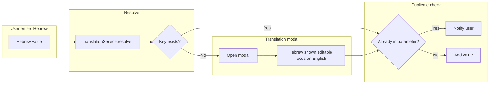

# Translation and Confirmation Modals — Unified Plan

## Current state

- **Save-confirmation** ([pending-changes.guard.ts](src/app/core/guards/pending-changes.guard.ts)): runs first when there are real changes; uses [ConfirmModalService](src/app/core/services/confirm-modal.service.ts) for "save or leave without saving". No translation UI.
- **Translation modal** ([translation-key-modal](src/app/shared/translation-key-modal/)): used for add-time (category, allergen, unit, supplier) and on-leave (`generic` with Cancel, Continue without saving, Save). Same component; title/buttons vary by context.
- **Resolution**: Some call sites already "resolve first, modal only if missing" ([metadata-registry.service.ts](src/app/core/services/metadata-registry.service.ts), [unit-registry.service.ts](src/app/core/services/unit-registry.service.ts)). Product form `onAddNewAllergen` does **not** resolve first.

---

## Goals

1. **Two modals, clearly separate**
   - **Confirmation modal**: Only "Do you want to save or leave without saving?" — no translation.
   - **Translation modal**: Only "This Hebrew value has no translation; enter English key (and optionally correct Hebrew)." Same theme, simpler layout, clear translation header.

2. **Translation modal: single purpose and UX**
   - Show the **Hebrew value** in a **text input** that is **editable in both contexts** (add-time and on-leave/generic) so the user can correct it if needed in any case.
   - **Initial focus on the English key input** as soon as the modal opens so the user can type the key immediately.
   - **No "Continue without saving"** in add-time flows. Keep it **only for on-leave (generic)** so the guard can let the user leave and strip untranslated values.
   - Dedicated header (e.g. translation key `translation` or `add_translation`) so it is visually distinct from the confirm modal.

3. **Unified "add Hebrew value" flow** (anywhere a value is stored/compared by English key)
   - **Resolve** first: `key = translationService.resolve*(hebrew)` (e.g. `resolveAllergen`, `resolveCategory`, `resolveUnit`).
   - **If no key** → open translation modal; on result use `result.englishKey` and add to dictionary.
   - **Then** run **"already in this parameter"** check; if the current list/field already contains that key, notify the user and do not add.
   - **Scope**: Categories, units, allergens, section/preparation categories, supplier key, equipment category. **Exclude** product name (stored by ID).

4. **"Already in this parameter"**: Always run the check after resolving or after the user provides the English key (avoids duplicates; simple per-context check).

---

## Translation modal implementation

- **Template** ([translation-key-modal.component.html](src/app/shared/translation-key-modal/translation-key-modal.component.html)): Hebrew field is always a **text input (editable)** in both add-time and generic — remove readonly for generic. Add a template reference (e.g. `#englishKeyInput`) on the English key input for focus. Optional: translation-specific class or subtitle when not `generic`.
- **Component** ([translation-key-modal.component.ts](src/app/shared/translation-key-modal/translation-key-modal.component.ts)):
  - Title: use a single translation-focused key for add contexts (e.g. `add_translation`) or keep context-specific titles plus "Translation" subtitle; apply consistently.
  - When modal opens (`isOpen_()` becomes true), focus the English key input (e.g. `ViewChild` + `afterNextRender` or `effect` calling `input.focus()`). Apply for add-time (or all contexts) consistently.
- **Buttons**: Show "Continue without saving" only when `context_() === 'generic'` (already in place).

---

## Unified flow at every entry point

```text
1. Resolve: key = translationService.resolve*(hebrew)
2. If !key → open translation modal; on result use result.englishKey, add to dictionary
3. "Already in this parameter": if current list/field already contains key → show message, do not add
4. Otherwise add/use the key
```

| Location | Current behavior | Change |
|----------|------------------|--------|
| [product-form.component.ts](src/app/pages/inventory/components/product-form/product-form.component.ts) `onAddNewAllergen(hebrewLabel)` | Always opens modal with Hebrew | Resolve with `resolveAllergen(hebrewLabel)` first; modal only when null; then existing "allergen already on product" check. |
| [product-form.component.ts](src/app/pages/inventory/components/product-form/product-form.component.ts) `openAddNewCategory()` | Opens modal with empty Hebrew | No Hebrew from user; keep as-is; optional single "new category" translation title. |
| [metadata-registry.service.ts](src/app/core/services/metadata-registry.service.ts) `registerAllergen` / `registerCategory` | Already resolve first, then modal | Keep; ensure "already in list" message clear if needed. |
| [unit-registry.service.ts](src/app/core/services/unit-registry.service.ts) `registerUnit` | Already resolve first, then modal | Keep; "already on product" via `alreadyOnProduct`. |
| [menu-section-categories.service.ts](src/app/core/services/menu-section-categories.service.ts) | — | Resolve first; modal if needed; "already in parameter" where applicable. |
| [metadata-manager.page.component.ts](src/app/pages/metadata-manager/metadata-manager.page.component.ts) | Add-by-Hebrew | Resolve first by type; modal if needed; "already in list" if applicable. |
| [preparation-category-manager](src/app/pages/metadata-manager/components/preparation-category-manager/preparation-category-manager.component.ts) | Add category | `resolvePreparationCategory` first; modal only if missing; "already in list" if applicable. |
| [preparation-registry.service.ts](src/app/core/services/preparation-registry.service.ts) | Uses modal with `generic` | Resolve first (e.g. `resolvePreparationCategory`); open modal only when no key. |
| [add-supplier-flow.service.ts](src/app/core/services/add-supplier-flow.service.ts) | Supplier name in Hebrew | Resolve if key-based; "already in parameter" where relevant. |
| [add-equipment-modal](src/app/shared/add-equipment-modal/add-equipment-modal.component.ts) | Category in Hebrew | Resolve category first; modal only if missing; "already in parameter" for that equipment's categories if applicable. |
| [recipe-workflow.component.ts](src/app/pages/recipe-builder/components/recipe-workflow/recipe-workflow.component.ts) | Add category (empty Hebrew) | Same as product form "new category"; ensure no duplicate add. |

Optional: small helper (shared or per-component) for "resolve for type X → if null open modal with context X → check already-in-parameter" to keep call sites consistent.

---

## On-leave (guard) behavior

- **Save-confirmation**: Runs first when `hasRealChanges()`; only save vs leave without saving. No change.
- **Translation (generic)**: After save-confirmation, if there are values needing translation (e.g. keys on form not in dictionary), show translation modal with context `generic` and "Continue without saving"; on choose, call `removeValuesNeedingTranslation()`, allow leave, show notification. No change to guard logic for this plan.

---

## Agent guides (one source of truth: copilot-instructions only; no Cursor rule)

- **[.claude/copilot-instructions.md](.claude/copilot-instructions.md)** — single source of truth:
  - **Section 7.2** (canonical rule — keep short): Use the translation-key modal: Hebrew in an **editable** text input (all contexts); **focus the English key** input when the modal opens; **no** "Continue without saving" in add-time (only in generic/on-leave).
  - **Section 0** (Skill Triggers): Extend the existing Hebrew canonical values trigger to "**Section 7.1 and 7.2**" so one trigger pulls both when the agent is in that flow.
- **[agent.md](agent.md)**: One-line pointer only (no duplication): "Hebrew→English key flows: apply copilot-instructions 7.1–7.2." In Skills table. No separate Cursor rule — one source of truth only.

---

## Implementation order

1. **Translation modal**: Title/header (translation-specific); **Hebrew always editable** (both add-time and generic — remove readonly for generic); **focus English key input on open**; "Continue without saving" only for generic. Template ref on English input + ViewChild + focus in component.
2. **Product form allergen**: In `onAddNewAllergen`, call `translationService.resolveAllergen(hebrewLabel)` first; open modal only when null; then existing "allergen already on product" check.
3. **Other entry points**: Align metadata-manager, preparation-category-manager, preparation-registry, menu-section-categories, add-equipment-modal, recipe-workflow, add-supplier-flow with resolve first → modal if needed → already in parameter.
4. **Agent guides** (one source of truth): Add Section 7.2 and extend Section 0 trigger to 7.1+7.2 in copilot-instructions; add one-line pointer in agent.md. No Cursor rule.
5. **Guard/dictionary**: Confirm `getValuesNeedingTranslation` and guard behavior unchanged (keys not in dictionary; generic translation modal with strip on "Continue without saving").

---

## Flow diagram



This is the single conclusive plan merging separation of modals, translation modal UX (Hebrew editable, focus on English), unified add flow, on-leave behavior, and agent-guide updates.
