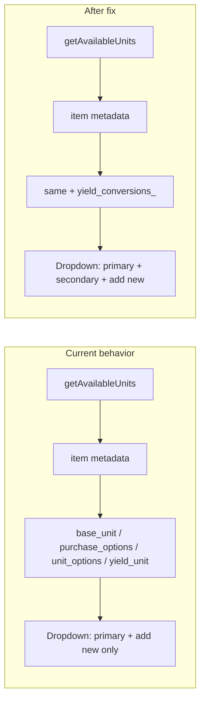

# Fix: Show recipe secondary measurement units in ingredient dropdown

## Root cause

When you add an ingredient that is a **recipe** (e.g. "משרה לפרגית בולגוגית"), the unit dropdown is built in [recipe-ingredients-table.component.ts](src/app/pages/recipe-builder/components/recipe-ingredients-table/recipe-ingredients-table.component.ts) by `getAvailableUnits(group)` (lines 299–315). That method gets the referenced item (product or recipe) and collects units from:

- `base_unit_` (products)
- `purchase_options_` (products)
- `unit_options_` (products; Recipe model does not have this)
- `yield_unit_` (recipes — primary only)

Recipes store secondary units in **`yield_conversions_`** ([recipe.model.ts](src/app/core/models/recipe.model.ts) line 39). That array is saved when you set the header chips (e.g. גרם, כפות, יחידה) and is correctly used elsewhere (e.g. [cook-view](src/app/pages/cook-view/cook-view.page.ts) `yieldUnitOptions_`). The ingredients table never reads `yield_conversions_`, so secondary units never appear in the dropdown.

## Change

**File:** [src/app/pages/recipe-builder/components/recipe-ingredients-table/recipe-ingredients-table.component.ts](src/app/pages/recipe-builder/components/recipe-ingredients-table/recipe-ingredients-table.component.ts)

1. **Extend the metadata type** used in `getAvailableUnits` (around line 304) to include recipe secondary conversions:
   - Add `yield_conversions_?: { amount: number; unit: string }[]` to the cast (Recipe already has this on the model).
2. **Add secondary units to the set** after handling `yield_unit_`:
   - If `meta.yield_conversions_?.length`, iterate and add each `c.unit` (when present) to the `units` set.

No template or API changes. No change to how units are saved (recipe-builder already persists `yield_conversions_`).

## Verification

- Open a recipe that has secondary units (e.g. גרם + כפות + יחידה) and save it.
- Create a new recipe and add that recipe as an ingredient.
- Open the unit dropdown for that ingredient row: it should list גרם, כפות, יחידה (and "+ יחידה חדשה"), and selecting a secondary unit should work and keep cost/calculations correct (existing conversion logic in recipe-cost.service already supports conversion by unit).
- Optionally run the recipe-ingredients-table spec and any related unit tests to ensure no regressions.
