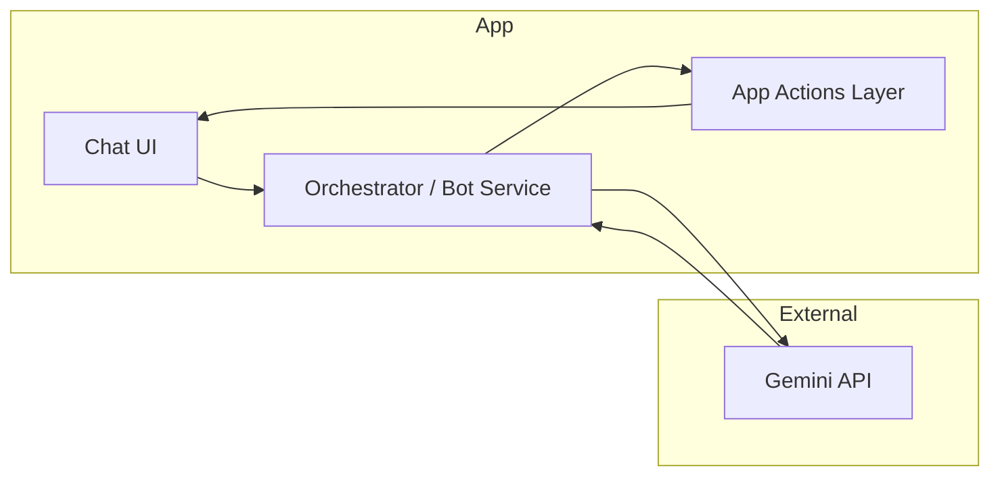

# AI Chatbot with Gemini API: Scope, Borderlines, and Options

This plan is a **thinking document**. It does not implement anything; it clarifies what is in scope when using **only the Gemini API** (no custom model training) and how that fits your app's existing data and flows.

---

## 1. What You Have Today (Relevant to the Bot)

- **Recipe/Dish model** ([recipe.model.ts](src/app/core/models/recipe.model.ts)): `ingredients_` (product/recipe refs, amount, unit), `steps_`, `yield_amount_/yield_unit_`, `prep_items_`/prep categories, `logistics_`, `labels_`. Stored in demo JSON (dishes vs preparations).
- **Menu events** ([menu-event.model.ts](src/app/core/models/menu-event.model.ts)): `guest_count_`, `sections_` with `MenuItemSelection` (recipe_id_, portions, take rate, sell price, etc.), `serving_type_`, financial targets.
- **Scaling** ([scaling.service.ts](src/app/core/services/scaling.service.ts)): scale factor from target quantity and recipe yield; scaled ingredients/prep.
- **Menu intelligence** ([menu-intelligence.service.ts](src/app/core/services/menu-intelligence.service.ts)): derive portions, event cost, food cost %.
- **Add-recipe flow** (Cursor skill): extract from image/text → validate vs products/preparations → confirm visual tree → write to demo JSON. No runtime API today; all in-editor.

The chatbot will need to **produce or modify** the same structures (recipes, menus, scaling inputs) and **present them for confirmation** before any write, similar to the add-recipe "confirm before write" rule.

---

## 2. Scope: Gemini API Only (No Custom Training)

**In scope**

- **Send user messages to Gemini** (e.g. REST or SDK): you control the request (system prompt + conversation + optional app context).
- **Structured output**: ask Gemini to return JSON that matches your DTOs (recipe, menu event, scale parameters, etc.). You validate and apply in the app.
- **Context injection**: include relevant app state in the prompt (e.g. list of product names/IDs, existing recipe names, section categories) so the model can reference real entities.
- **Multi-turn chat**: keep conversation history and send it with each request so the bot can do follow-up questions or refinements.

**Out of scope (by choice)**

- Training or fine-tuning a model. You use Gemini as a general-purpose model via API only.
- Running your own model or vector DB. All "intelligence" is in prompt design + your app logic.

**Implication**: The bot's capabilities are determined by (1) what you put in the prompt, (2) how you map Gemini's response to app actions, and (3) what actions you allow (create recipe, create menu, scale, etc.).

---

## 3. Borderlines and Limitations

| Area | Borderline / limitation |
|------|-------------------------|
| **Entity resolution** | Gemini does not have direct access to your demo JSON. You must pass **current** product list, preparation list, recipe names, etc. in the prompt (or a summary). Size limits (context window) may force you to send only names/IDs and minimal metadata. |
| **Structured output** | The model can return JSON, but it can make mistakes (wrong field names, wrong types, invented IDs). You **must** validate and normalize in the app (e.g. map product names to `referenceId`, enforce units from product/prep data). |
| **Language** | If your app and demo data are Hebrew-heavy, prompts and response schema should support Hebrew; you may need clear instructions so Gemini keeps field names (e.g. `name_hebrew`) and your expected structure. |
| **Confirmation** | Any action that creates or updates data (recipe, menu, scale-and-save) should follow the same principle as add-recipe: **show a summary or open edit mode for user confirmation** before persisting. The chatbot should not write to demo JSON without explicit user approval. |
| **Cost and latency** | Each user message = one (or more) API call. Token usage grows with context (conversation + injected app state). You'll want to limit context size and possibly cache "current kitchen state" for the session. |
| **Idempotency and identity** | Creating "a recipe" or "a menu" requires new IDs and possibly duplicate-name handling. The app (or a small backend) should own ID generation and conflict resolution; Gemini should only suggest names and structure. |

---

## 4. High-Level Options for What the Bot Can Do

These are the main **capability buckets** you can support with Gemini + your existing services:

- **Dictation → recipe/dish**  
  User describes a dish or recipe in plain text (ingredients, amounts, steps, prep). Gemini parses it and returns a structured recipe/dish (or a minimal DTO you then complete). App validates against products/preparations (and optionally suggests matches like add-recipe), then **opens recipe builder in edit mode** with the draft for the user to confirm and save. No direct write until user confirms.

- **Scale up / scale down**  
  User says "scale [recipe name] for 50 portions" or "scale this dish to 20 people". App resolves recipe, computes scale factor (using [ScalingService](src/app/core/services/scaling.service.ts)), and can either show scaled view or, if you allow, create a one-off "event" or copy. Again, confirm before any write.

- **Create menu for N people**  
  User says "create a menu for 20 people" or "buffet for 50". You inject available dishes/sections (and optionally templates) into the prompt. Gemini suggests sections and item selections (recipe_id_, portions, take rate). App builds a [MenuEvent](src/app/core/models/menu-event.model.ts) (or a DTO) and **opens menu intelligence / edit in draft mode** for the user to adjust and save. No write without confirmation.

- **Answer questions**  
  "What's the food cost of this menu?", "Which dishes use product X?" — you can send current state (e.g. selected menu, recipe list) and let Gemini answer in natural language. No persistence; read-only.

- **Guided flows**  
  Bot asks for missing data (e.g. yield, station, labels) and then produces the same DTOs as above. Still confirmation before write.

You can start with one or two of these (e.g. dictation → recipe and create menu for N) and add the rest later.

---

## 5. Architecture (Conceptual)

- **Chat UI**: Input text, display turns, optional "draft" cards (e.g. "Recipe draft ready – open in editor?").
- **Orchestrator**: Builds the prompt (system instructions + conversation history + injected context), calls Gemini, parses response. Decides intent (create recipe vs create menu vs scale vs question) or delegates intent detection to Gemini (e.g. "respond with JSON: { intent, payload }").
- **App actions layer**: Given intent + payload, calls existing services ([ScalingService](src/app/core/services/scaling.service.ts), [MenuIntelligenceService](src/app/core/services/menu-intelligence.service.ts), recipe form state, etc.), and either shows a result or opens the right screen in **edit/draft mode** for confirmation. No direct demo JSON write without user confirm.
- **Gemini**: No access to your app; only sees what you send. All writes and ID generation stay in the app (or a thin backend if you add one for API keys).

**Where to call Gemini**: From the browser you'd need a backend or serverless function to hold the API key; alternatively you could call from a small Node/Cloud Run service your frontend talks to. Never expose the Gemini API key in the client.

---

## 6. Clarifications That Will Shape the Implementation Plan

- **Placement of the chat**: Global sidebar, floating button, or a dedicated "Assistant" page?
- **First use case**: Start with "dictation → recipe in edit mode" only, or also "create menu for N people" from the start?
- **Backend**: Are you okay adding a small backend (e.g. Angular + Express, or serverless) to proxy Gemini and hold the key, or do you already have an API you want to use?
- **Language**: Hebrew-only, English-only, or both for prompts and bot replies?
- **Confirmation pattern**: Prefer "open existing edit screen with draft" (recipe builder / menu intelligence) vs "show inline draft in chat and then 'Apply' → open edit" vs both?

Once you decide these, a **designated implementation plan** can detail: prompt design, response schema, app actions API, and step-by-step UI + service changes.

---

## 7. Summary

| Topic | Summary |
|-------|---------|
| **Scope** | Gemini API only; no custom training. You design prompts and app actions. |
| **Borderlines** | Context size, entity resolution via injected state, validation and ID generation in app, confirmation before any write. |
| **Options** | Dictation → recipe (edit mode); create menu for N; scale recipe; read-only Q&A; guided flows. |
| **Architecture** | Chat UI → Orchestrator → Gemini; Orchestrator → App actions → existing services and edit screens; API key in backend. |
| **Next step** | Choose placement, first use case, backend approach, and confirmation pattern so we can write the concrete implementation plan. |
