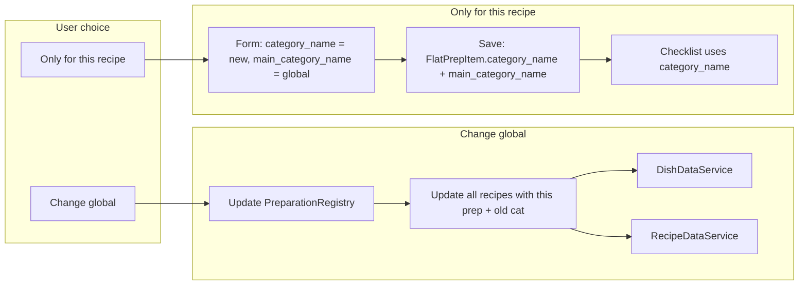

# Global-specific modal: behavior and modal size

## Overview

Implement correct behavior for "change globally" (update item category in registry and propagate to all recipes that use it), "only for this recipe" (persist recipe-specific category override so checklists show the right category), and size the modal to fit its content.

---

## Current state

- **Modal**: [global-specific-modal.component.html](src/app/shared/global-specific-modal/global-specific-modal.component.html) uses `c-modal-card--fluid`, which allows up to `90vw` width and makes the modal wider than needed for a short message and three buttons.
- **"Change globally"**: [recipe-workflow.component.ts](src/app/pages/recipe-builder/components/recipe-workflow/recipe-workflow.component.ts) (lines 229–237) already calls `prepRegistry_.updatePreparationCategory(...)`, which updates the preparation's category in [PreparationRegistryService](src/app/core/services/preparation-registry.service.ts) (KITCHEN_PREPARATIONS). It does **not** update existing recipes/dishes that already reference this preparation with the old category, so checklists built from those recipes still show the old category until each recipe is re-saved.
- **"Only for this recipe"**: The form is patched with `category_name: value` but `main_category_name` is left as the global category. When saving, [recipe-builder buildRecipeFromForm](src/app/pages/recipe-builder/recipe-builder.page.ts) (lines 1136–1148) only persists `preparation_name`, `category_name`, `quantity`, `unit` into [FlatPrepItem](src/app/core/models/recipe.model.ts) (no `main_category_name`). When loading, getPrepRowsFromRecipe sets `main_category_name: p.category_name`, so the recipe-specific override is lost on reload. Checklist grouping uses `category_name` from the recipe's prep items; the gap is persisting and restoring `main_category_name` for modal/UX consistency.

---

## 1. "Change globally": propagate category to all recipes using this preparation

**Goal:** When the user chooses "Update global", the preparation's category in the registry is updated (already done) and **every recipe/dish that has this preparation with the old category** is updated so that checklists and everywhere else show the new category.

**Approach:**

- Add a method that, given `(preparationName, oldCategory, newCategory)`:
  - Updates the preparation registry (already done in recipe-workflow).
  - Loads all dishes (and, if any exist, recipes with `prep_items_`/`prep_categories_`), and for each: if it has `prep_items_`, replace any item where `preparation_name` matches (case-insensitive) and `category_name === oldCategory` with the same item but `category_name: newCategory`; then rebuild `prep_categories_` from the updated `prep_items_` (group by `category_name`). If it has only `prep_categories_` (legacy), update matching items and regenerate as needed.
  - Saves each modified recipe/dish back (e.g. via existing `updateDish` / `updateRecipe`).
- Implement in a way that avoids circular deps: either a small "preparation category sync" helper/service that uses PreparationRegistryService, DishDataService, and RecipeDataService, or extend PreparationRegistryService to accept optional injects and run the propagation after updating the registry.
- In recipe-workflow, after the user chooses `'global'`, keep calling `prepRegistry_.updatePreparationCategory(...)` and add a call to the new "propagate to all recipes" logic (or have `updatePreparationCategory` optionally trigger propagation).

---

## 2. "Only for this recipe": persist and restore recipe-specific category

**Goal:** When the user chooses "Only for this recipe", the recipe should store both the display category (`category_name`) and the global category (`main_category_name`) so that (a) checklists use `category_name` and show the recipe-specific category, and (b) when the user reopens the recipe, the modal and category picker still know the global value and can behave correctly on further changes.

**Changes:**

- **Model:** In [recipe.model.ts](src/app/core/models/recipe.model.ts), add an optional `main_category_name?: string` to `FlatPrepItem`. When present, it is the global (registry) category; when absent, treat as equal to `category_name` for backward compatibility.
- **Save path:** In [recipe-builder.page.ts](src/app/pages/recipe-builder/recipe-builder.page.ts), in `buildRecipeFromForm` (PrepRow type and mapping around 1136–1148), include `main_category_name` from the row when building `prepItems` and persist it on each `FlatPrepItem` (optional field).
- **Load path (recipe-builder):** In `getPrepRowsFromRecipe` (844–869), when mapping `prep_items_`, set `main_category_name: (p as FlatPrepItem & { main_category_name?: string }).main_category_name ?? p.category_name`.
- **Load path (cook-view):** In [cook-view.page.ts](src/app/pages/cook-view/cook-view.page.ts), in `getPrepRowsFromRecipe` (682–707), do the same: use stored `main_category_name` if present, else `p.category_name`.
- **Apply form to recipe (cook-view):** In `applyWorkflowFormToRecipe` (766–773), when building `prepItems` from the form, include `main_category_name` from the row if the form has it, so that when the user edits a dish in cook-view we don't drop the override.

Checklist building already groups by `category_name` from the recipe's prep items; no change needed there.

---

## 3. Modal size to fit content

**Goal:** The modal should not be unnecessarily wide; size it to fit its content (heading, one line of detail, three buttons).

**Changes:**

- In [global-specific-modal.component.html](src/app/shared/global-specific-modal/global-specific-modal.component.html), remove the `c-modal-card--fluid` modifier so the card uses the default engine sizing from [styles.scss](src/styles.scss) (e.g. `width: 90%; max-width: 28rem`). If the design still feels too wide, add a small content-sized modifier in `styles.scss` (e.g. `c-modal-card--sm` with `max-width: 20rem` or `width: max-content`) and apply it to this modal only; follow [.assistant/skills/cssLayer/SKILL.md](.assistant/skills/cssLayer/SKILL.md) for any new SCSS.

---

## Data flow summary

---

## Files to touch (summary)

| Area | Files |
|------|--------|
| Global propagation | preparation-registry.service.ts and/or new helper, recipe-data.service.ts, dish-data.service.ts, recipe-workflow.component.ts |
| Specific override | recipe.model.ts, recipe-builder.page.ts, cook-view.page.ts |
| Modal size | global-specific-modal.component.html, optionally styles.scss or component SCSS |

---

## Phase 2 (Hard Pause)

**After** this plan is presented, the agent MUST:

1. Output in chat: *"The plan is ready in plans/165-global-specific-modal-behavior-and-size.plan.md. I have 3 questions for you before I proceed."*
2. Ask the following in chat **in Q&A format** (one question line ending with `?`, then options as `a.` `b.` `c.` on separate lines). Do not proceed with execution until the user answers or approves.

---

## Critical Questions (Q&A format — ask in chat)

**Question 1**

Which recipes should "change globally" update when we propagate the new category?

a. Only dishes (DISH_LIST).
b. Both dishes and preparations (RECIPE_LIST) that have prep_items_ or prep_categories_.

Recommendation: a.

---

**Question 2**

If we add propagation to all recipes that use this preparation, should undo revert those recipe updates too?

a. Yes: store updated recipe IDs and revert each to the old category when user undoes.
b. No: undo only reverts the preparation registry; recipes keep the new category.

Recommendation: b.

---

**Question 3**

How should we size the global-specific modal?

a. Remove --fluid so it uses default max-width 28rem.
b. Add c-modal-card--sm (e.g. max-width 20rem) for this modal only.

Recommendation: a.

---

## Atomic sub-tasks

- [ ] Implement propagation of category change to all dishes (and optionally recipes) that reference the preparation with the old category; wire into recipe-workflow when user chooses "change globally".
- [ ] Add optional `main_category_name` to FlatPrepItem; persist and restore in recipe-builder and cook-view so "only for this recipe" survives reload and checklist uses category_name.
- [ ] Size global-specific modal to content (remove --fluid or add --sm per answer to Question 3).
- [ ] Follow Phase 2: ask the 3 Critical Questions in chat in Q&A format and do not execute until user answers.

---

## Why the questions were not in this structure initially

The first version of this plan listed "Critical questions" at the end of the plan document in prose (e.g. "Should …?" and "Prefer …?"). The project rules (`.assistant/copilot-instructions.md` Section 1.1 and Section 2) require:

1. **Q&A format**: One question line ending with `?`, then options as `a.` `b.` `c.` on separate lines — **never** embed options in paragraphs.
2. **Ask in chat**: Questions must be **asked to the user in the conversation** in this format, not only written inside the plan. After the plan, the agent must output: *"The plan is ready in … I have [N] questions for you before I proceed."* and then pose each question in that format so the user can answer before any execution.

So the fix was: move the critical questions into the strict one-question-then-a-b-c structure, add the Phase 2 (Hard Pause) section so the agent is instructed to ask them in chat, and add this explanation so future plan authors keep the same structure.
