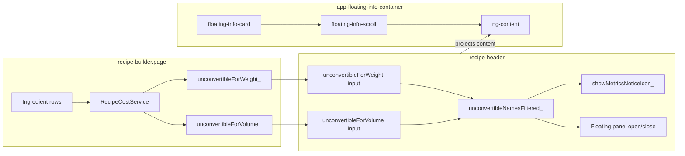

# Detailed Report: Recipe Header Metrics Notice (Unconvertible Items) Container

## 1. Intended behavior

- In the recipe header’s **metrics square** (cost / weight or volume), when some ingredients cannot be converted to the current metric (weight or volume), an **alert icon** should appear next to the value (e.g. "75g" or "86 ml").
- **Clicking the icon** (or hovering the metrics area) should open a **floating panel** above the metrics square that shows:
  - A **heading**: "Items that cannot be converted/compared" (translated).
  - A **scrollable list** of those ingredient names (max height 120px, with up/down arrow indicators).
- The icon should **only** show when there is at least one non-empty unconvertible name for the current mode (weight or volume).
- The panel should **never** open with an empty list when the icon is visible.

---

## 2. Architecture and data flow

- **Data source**: recipe-builder.page.ts calls `RecipeCostService.getUnconvertibleNamesForWeight(rows)` and `computeTotalVolumeL(rows).unconvertibleNames`, and passes them into the header as `unconvertibleForWeight_()` and `unconvertibleForVolume_()`.
- **Header**: recipe-header.component.ts exposes `unconvertibleNamesForCurrentMode_()` (weight or volume by `metricsDisplayMode_()`), then `unconvertibleNamesFiltered_()` (non-empty trimmed names). The icon is shown only when `unconvertibleNamesFiltered_().length > 0`.
- **Template**: The floating panel is a `
` that wraps app-floating-info-container with `[scrollAxis]="'vertical'"` and `[maxHeight]="120"`. The **heading** and **list items** are provided as **content projection** (slotted into `<ng-content>` inside the shared component).

---

## 3. Problems identified and causes

### 3.1 Icon or empty container when there were no real items

- **Symptom**: Icon appeared and/or the panel opened with nothing to show, or list had only blank lines.
- **Cause**: Raw unconvertible arrays could contain empty or whitespace-only strings; the UI used `unconvertibleNamesForCurrentMode_().length > 0` for both icon visibility and list, so any non-empty array (including `['']`) showed the icon and rendered empty-looking rows.
- **Fix applied**: Introduced `unconvertibleNamesFiltered_()` that filters to `(n != null && String(n).trim().length > 0)`. Icon visibility and the list both use `unconvertibleNamesFiltered_()`, so the icon only shows when there is at least one real name, and the list never shows only blank entries.

### 3.2 Floating panel had no height (blank white card)

- **Symptom**: The floating card appeared but the inner area (where the list and heading should be) was empty; only the card chrome and sometimes gradient bands were visible.
- **Cause**: In floating-info-container.component.scss, the card had no explicit height. With `scrollAxis === 'vertical'`, the inner scroll wrapper uses `flex: 1` and `min-height: 0`. In a flex column with no fixed height on the card, the flex algorithm gave the scroll area **zero height**, so the scrollable region never had space and the projected content had nowhere to render.
- **Fixes applied**:
  - Set a **fixed height** for the card in vertical mode: `height: calc(var(--scroll-max-height) + 1rem)` (template passes `--scroll-max-height` from `maxHeight()` so the scroll area is 120px and padding is accounted for).
  - Made the **scroll wrapper** a flex column and gave the **scroll div** `flex: 1` and `min-height: 0` so it fills the wrapper and gets a real height; the projected content can then lay out and scroll inside it.

### 3.3 Projected content invisible (no styles applied)

- **Symptom**: The panel had correct size and scroll behavior but the heading and list items did not appear (no text visible).
- **Cause**: The heading and list are **projected** from the recipe-header into `app-floating-info-container`’s `<ng-content>`. In the DOM they end up under:  
`div.metrics-notice-floating` → `app-floating-info-container` → … → `div.floating-info-scroll` → (projected `
` and `
`s).  
They are **no longer under** `.metrics-square`. In recipe-header.component.scss, the styles for the list and heading were only defined under `.metrics-square` (e.g. `.metrics-square .metrics-notice-heading`, `.metrics-square .metrics-notice-item`). So after projection those selectors did **not** match the projected nodes, and they received no font-size, color, or spacing. The content was in the DOM but effectively invisible.
- **Fix applied**: The same styles were added under `.metrics-notice-floating` (e.g. `.metrics-notice-floating .metrics-notice-heading`, `.metrics-notice-floating .metrics-notice-item`). The projected nodes still have `.metrics-notice-floating` as an ancestor, so these rules apply and the heading and list items are visible and correctly styled.

### 3.4 Confusion between native tooltip and the real panel

- **Symptom**: User saw a small tooltip with only the phrase "Items that cannot be converted/compared" and thought that was the “container,” which looked empty.
- **Cause**: The alert icon had `[title]="'items_not_convertible' | translatePipe"`, so the browser showed a native tooltip with that text. The actual floating panel (with heading + list) opens above the metrics square and is a separate element.
- **Fix applied**: The `[title]` on the icon was removed so the only place that text appears is inside the floating panel as the heading, reducing confusion.

---

## 4. Current implementation summary

| Layer                        | What it does                                                                                                                                                                                                                                                                                                   |
| ---------------------------- | -------------------------------------------------------------------------------------------------------------------------------------------------------------------------------------------------------------------------------------------------------------------------------------------------------------- |
| **recipe-builder.page**      | Computes `unconvertibleForWeight_` and `unconvertibleForVolume_` from cost/volume logic and passes them into the header.                                                                                                                                                                                       |
| **recipe-header (template)** | Shows the alert icon only when `showMetricsNoticeIcon_()` (i.e. `unconvertibleNamesFiltered_().length > 0`). When the panel is open, projects a `
` and multiple `
` from `unconvertibleNamesFiltered_()` into `app-floating-info-container`. |
| **recipe-header (styles)**   | Styles the heading and items both under `.metrics-square` (for any in-context use) and under `.metrics-notice-floating` so projected content is visible.                                                                                                                                                       |
| **floating-info-container**  | Renders a card with fixed height in vertical mode, a scroll wrapper that fills the card, and a scroll div with `maxHeight` 120px and arrow indicators; projects the header’s content into the scroll div via `<ng-content>`.                                                                                   |

---

## 5. Remaining risks and how to verify

- **Content still not showing**: If the list is still blank after the above fixes, possible causes:
  - **Encapsulation**: In some Angular versions or build configurations, projected nodes might not get the host’s encapsulation attribute, so `.metrics-notice-floating .metrics-notice-heading` / `.metrics-notice-item` might not match. Fallback: move the panel markup fully into the recipe-header (no projection), or use a shared panel component that receives the list as an `@Input()` and renders it internally so no projection is needed.
  - **Scroll div height**: If the scroll div still gets 0 height in a specific browser or viewport, the card will show but the content area will be empty. Check in devtools that `.floating-info-scroll` has a positive `clientHeight` when the panel is open.
  - **Overlays**: The scroll zones (`.floating-info-scroll-zone--top` / `--bottom`) are absolutely positioned with `z-index: 2` and gradient backgrounds; they are `pointer-events: none` and only overlay the top/bottom 2rem. They should not hide the middle content; if they do, reduce their height or z-index only for this use case.
- **Empty arrays**: If the parent never passes unconvertible names (e.g. cost/volume not recomputed on the right lifecycle), the filtered list will stay empty and the icon will correctly not show. Ensure the recipe-builder page runs the cost/volume update whenever ingredients or units change and passes the updated signals to the header.

---

## 6. Files involved

- recipe-header.component.html — metrics square, icon, floating wrapper, and projected content (heading + list).
- recipe-header.component.ts — `unconvertibleNamesForCurrentMode_`, `unconvertibleNamesFiltered_`, `showMetricsNoticeIcon_`, open/close and hover logic.
- recipe-header.component.scss — `.metrics-notice-floating`, and under it `.metrics-notice-heading` / `.metrics-notice-item` (for projected content), plus the same classes under `.metrics-square`.
- floating-info-container.component.html — card, scroll wrap, scroll div with `ng-content`, and arrow indicators.
- floating-info-container.component.scss — card height in vertical mode, scroll wrap/scroll div flex layout, scroll zones and indicator styling.
- recipe-builder.page.ts — sets `unconvertibleForWeight_` and `unconvertibleForVolume_` from `RecipeCostService`.
- recipe-cost.service.ts — `getUnconvertibleNamesForWeight`, `computeTotalVolumeL` (returns `unconvertibleNames`).

This report summarizes the root causes of the “blank container” and “no content” behavior and the fixes applied; if content still does not show, the verification steps and fallbacks above narrow down the next place to look.