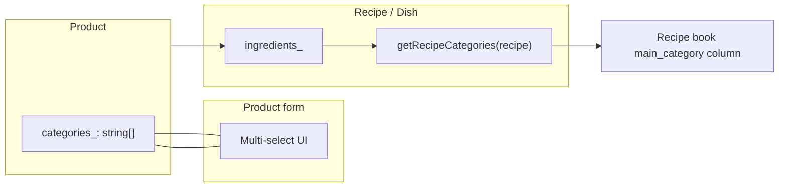

# Refactor plan: Supplier multiple-select

**Overview:** Refactor the product model and add-product form so that supplier is a multi-select (`supplierIds_: string[]`). Update list display, filtering, sorting, and tests. Demo/seed data will use `supplierIds_` from the start—no legacy normalization.

---

## 1. Model and data shape

- **[src/app/core/models/product.model.ts](src/app/core/models/product.model.ts)**  
  - Replace `supplierId_: string` with `supplierIds_: string[]` only. No backward-compat field; demo data will be built with `supplierIds_`.

## 2. Product form (multi-select UI)

- **[src/app/pages/inventory/components/product-form/product-form.component.ts](src/app/pages/inventory/components/product-form/product-form.component.ts)**  
  - Form: change control from `supplierId_: ['']` to `supplierIds_: [[]]` (array of supplier IDs).  
  - `onSupplierChange`: when value is `ADD_SUPPLIER`, open add-supplier flow; on success push the new supplier’s `_id` into `supplierIds_` and reset the select (e.g. set control value back to `''` or first option).  
  - `hydrateForm`: set `supplierIds_: data.supplierIds_ ?? []`.  
  - `onSubmit`: build `productToSave` with `supplierIds_: val.supplierIds_ ?? []`.
- **[src/app/pages/inventory/components/product-form/product-form.component.html](src/app/pages/inventory/components/product-form/product-form.component.html)**  
  - Replace the single `<select formControlName="supplierId_">` with a **multi-select**: either  
    - **Option A:** Native `<select formControlName="supplierIds_" multiple>` with checkboxes or multi-option selection, plus a separate “Add supplier” button that triggers `onSupplierChange` (no `ADD_SUPPLIER` inside the select), or  
    - **Option B:** Chips-style UI (like allergens): show selected suppliers as removable chips and a dropdown to add more, with an “Add supplier” entry that calls the add-supplier flow.
  - Use `formControlName="supplierIds_"` and ensure the control value is `string[]`.

## 3. Inventory list: display, filter, sort

- **[src/app/pages/inventory/components/inventory-product-list/inventory-product-list.component.ts](src/app/pages/inventory/components/inventory-product-list/inventory-product-list.component.ts)**  
  - **Filter options:** In `filterCategories_`, build the Supplier set from each product’s `supplierIds_` (iterate over array and add each id to the set).  
  - **Filter logic:** In `filteredProducts_`, for category `'Supplier'`, set `productValues = product.supplierIds_ ?? []` so “match if any selected supplier is in product’s suppliers.”  
  - **Sort:** In `compareProducts` for `'supplier'`, compare by comma-joined supplier names: add `getSupplierNames(ids: string[]): string` (using existing `getSupplierName`) and compare those strings.  
  - Helper `getSupplierNames(ids: string[]): string` returns comma-separated names for display and sort.
- **[src/app/pages/inventory/components/inventory-product-list/inventory-product-list.component.html](src/app/pages/inventory/components/inventory-product-list/inventory-product-list.component.html)**  
  - Replace `{{ product.supplierId_ || '—' }}` with `{{ getSupplierNames(product.supplierIds_ ?? []) || '—' }}` (or equivalent using the new helper so the list shows multiple supplier names).

## 4. Util and tests

- **[src/app/core/services/util.service.ts](src/app/core/services/util.service.ts)**  
  - In `getEmptyProduct()`, replace `supplierId_: ''` with `supplierIds_: []`.
- **Specs**  
  - **product-form.component.spec.ts:** Use `supplierIds_` in form patch/hydration and ensure the control is an array.  
  - **kitchen-state.service.spec.ts:** Mock product with `supplierIds_: ['s1']` (or similar) instead of `supplierId_`.  
  - **inventory-product-list.component.spec.ts:** Update mock products to use `supplierIds_` and adjust expectations for filter/sort/display if they assert on supplier.

## 5. No change

- **ProductDataService** – No normalization or migration. Load/save products as-is; demo data will contain `supplierIds_`.  
- **KitchenStateService** – `saveProduct(product: Product)` already passes the product through; no change once the model and form use `supplierIds_`.

---

## Summary of files to touch

| File                                    | Change                                                                            |
| --------------------------------------- | --------------------------------------------------------------------------------- |
| `product.model.ts`                      | `supplierId_` → `supplierIds_: string[]` only                                     |
| `product-form.component.ts`             | Form control `supplierIds_`, hydrate/submit with array, adjust `onSupplierChange` |
| `product-form.component.html`           | Multi-select or chips for suppliers                                               |
| `inventory-product-list.component.ts`   | Filter/sort by `supplierIds_`, add `getSupplierNames(ids)`                        |
| `inventory-product-list.component.html` | Display via `getSupplierNames(product.supplierIds_)`                              |
| `util.service.ts`                      | `getEmptyProduct()` → `supplierIds_: []`                                          |
| 3 spec files                            | Mocks and assertions for `supplierIds_`                                           |

*No changes to `product-data.service.ts`—no legacy normalization; demo data will use `supplierIds_`.*

## UI choice for multi-select

- **Recommended:** Chips + dropdown (like allergens): selected suppliers as chips with remove; dropdown to add from existing list; “Add supplier” in dropdown opens the add-supplier flow and appends the new id to `supplierIds_`. Keeps UX consistent and avoids native `multiple` select quirks.
- **Alternative:** Single `<select multiple>` with “Add supplier” as a button below; form value is `string[]`. Simpler markup but less polished than chips.

secound plan 

---
name: Product categories multi-select refactor
overview: Refactor product category from a single select to a multi-select array (`categories_`), remove the redundant `is_dairy_` flag by folding it into categories, and add recipe-level aggregation so dishes show "contains" categories (e.g. milk, meat) derived from their ingredients.
todos: []
isProject: false
---

# Product categories multi-select refactor

## Summary

- **Product:** Replace `category_: string` and `is_dairy_: boolean` with `categories_: string[]` (multi-select). Same category keys from [MetadataRegistryService](src/app/core/services/metadata-registry.service.ts) / `KITCHEN_CATEGORIES`.
- **Migration:** Existing products: `category_` → `categories_: [category_]` when present; `is_dairy_ === true` → ensure `'dairy'` is in `categories_`.
- **Recipe/dish:** Add aggregation of product categories from ingredients (same pattern as [getRecipeAllergens](src/app/pages/recipe-book/components/recipe-book-list/recipe-book-list.component.ts)) and surface in the recipe book "main category" column.

## 1. Model and defaults

- **[product.model.ts](src/app/core/models/product.model.ts):** Replace `category_: string` and `is_dairy_: boolean` with `categories_: string[]`. Keep optional `updatedAt`.
- **[util.service.ts](src/app/core/services/util.service.ts):** Default product shape: use `categories_: []` instead of `category_` and `is_dairy_`.

## 2. Product form (multi-select UI)

- **[product-form.component.ts](src/app/pages/inventory/components/product-form/product-form.component.ts):**
  - Form: `category_` → `categories_` as `FormControl<string[]>` with initial `[]`. Validator: at least one selected (e.g. `Validators.required` + custom minLength 1).
  - Remove `is_dairy_` form control and from patch/buildPayload.
  - `onCategoryChange`: adapt for multi-select (e.g. "Add new category" adds to registry and appends to `categories_` array; no single `setValue` for one category).
  - When patching from product: `categories_: data.categories_ ?? (data.category_ ? [data.category_] : [])` and if legacy `data.is_dairy_` and `'dairy'` not in array, push `'dairy'`.
  - On submit: register each selected category (no-op if already in registry), build `Product` with `categories_: val.categories_` and no `is_dairy_`.
- **[product-form.component.html](src/app/pages/inventory/components/product-form/product-form.component.html):** Replace the single `<select formControlName="category_">` with a multi-select UI: checkboxes (or a multi-select dropdown) bound to `categories_`, using `categoryOptions_()` and an "Add new category" flow. Remove the `is_dairy_` checkbox block.

## 3. Inventory list and product data service

- **[inventory-product-list.component.ts](src/app/pages/inventory/components/inventory-product-list/inventory-product.component.ts):**
  - `filterCategories_`: build Category options from all products’ `categories_` (flatMap and add to Set).
  - Filter logic: for `category === 'Category'`, use `productValues = product.categories_ ?? []`.
  - `compareProducts` for `'category'`: compare by first category (e.g. `a.categories_?.[0]`, `b.categories_?.[0]`) or joined string for stable sort.
- **[inventory-product-list.component.html](src/app/pages/inventory/components/inventory-product-list/inventory-product-list.component.html):** Display: `{{ product.categories_ | translatePipe }}` — use a pipe that accepts `string[]` and returns translated comma-separated (or use existing translatePipe in an `@for` over `product.categories_`).
- **[product-data.service.ts](src/app/core/services/product-data.service.ts):** `allTopCategories_`: use `Products.flatMap(p => p.categories_ ?? [])` then `Array.from(new Set(...))`.

## 4. Metadata manager

- **[metadata-manager.page.component.ts](src/app/pages/metadata-manager/metadata-manager.page.component.ts):** "Is category X in use?" → `allProducts.some(p => (p.categories_ ?? []).includes(item))` (and remove any `category_` reference).

## 5. Recipe aggregation and recipe book

- **[recipe-book-list.component.ts](src/app/pages/recipe-book/components/recipe-book-list/recipe-book-list.component.ts):**
  - Add `getRecipeCategories(recipe: Recipe, depth = 0): string[]` mirroring `getRecipeAllergens`: for each ingredient, if product then add `product.categories_ ?? []` to a Set; if recipe then recurse and add returned categories. Return `Array.from(set)`. Use same `MAX_ALLERGEN_RECURSION` (or a similar constant) to cap depth.
  - In `filterCategories_` / filter logic, if "main_category" is used as a filter dimension, use `getRecipeCategories(recipe)` for recipe values.
  - In `compareRecipes` for `'main_category'`: compare by first aggregated category or joined string (e.g. `getRecipeCategories(a)[0]` vs `getRecipeCategories(b)[0]`).
- **[recipe-book-list.component.html](src/app/pages/recipe-book/components/recipe-book-list/recipe-book-list.component.html):** Replace the hardcoded `{{ 'no_category' | translatePipe }}` in the main_category column with the aggregated list: e.g. show `getRecipeCategories(recipe)` as translated comma-separated labels (similar to allergens), or "—" when empty.

## 6. Tests and storage migration

- **Specs:** Update all product test data and mocks: `category_` → `categories_: ['…']`, remove `is_dairy_`. Files: [product-form.component.spec.ts](src/app/pages/inventory/components/product-form/product-form.component.spec.ts), [inventory-product-list.component.spec.ts](src/app/pages/inventory/components/inventory-product-list/inventory-product-list.component.spec.ts), [kitchen-state.service.spec.ts](src/app/core/services/kitchen-state.service.spec.ts), [product-data.service.spec.ts](src/app/core/services/product-data.service.spec.ts).
- **Recipe-book-list spec:** Add or adjust a test that verifies `getRecipeCategories` aggregates from product `categories_` (similar to existing allergen aggregation test).
- **Storage/data migration:** If products are persisted (e.g. IndexedDB via [async-storage.service](src/app/core/services/async-storage.service.ts)), add a one-time migration: when loading products, if `category_` exists and `categories_` is missing, set `categories_ = [category_]` and if `is_dairy_` add `'dairy'` to the array; then delete `category_` and `is_dairy_` from the object before use. Alternatively handle backward compatibility in the model layer (getter/setter or normalization in ProductDataService load).

## Data flow (high level)

## Order of implementation

1. Model + util default.
2. Product form (TS + HTML): multi-select, remove is_dairy_, migration in patch/submit.
3. Product data service (allTopCategories_).
4. Inventory list (filter, sort, display).
5. Metadata manager (isUsed check).
6. Recipe-book: getRecipeCategories, sort/filter, template.
7. Specs and migration (if applicable).

plan 3 

---
name: Product form collapsible inputs
overview: Refactor four product-form areas (min stock, expiry days, waste/yield logic, allergens) so each starts as a compact clickable title bar and expands to show inputs only when the user clicks the title, saving vertical space.
todos: []
isProject: false
---

# Product form: collapsible optional inputs

## Goal

Four blocks currently always show their inputs and take space. Change them so each starts as a **minimal bar** (title only). Clicking the title **expands** to show the full input(s). This keeps the form short when these optional fields are unused.

## Affected blocks

| Block | Location | Collapsed shows | Expanded shows |
|-------|----------|-----------------|----------------|
| Min stock level | [product-form.component.html](c:\foodCo\foodVibe1.0\src\app\pages\inventory\components\product-form\product-form.component.html) 71–74 | Label "min_stock_level" | Number input |
| Expiry days default | Same file 75–78 | Label "expiry_days_default" | Number input |
| Waste/yield logic | Same file 123–157 | Section title "waste_yield_logic" + icon | Grid (waste %, yield factor) + cost impact alert |
| Allergens | Same file 81–121 | Label "allergens" + icon | Search box, chips, dropdown |

## Implementation

### 1. Component state ([product-form.component.ts](c:\foodCo\foodVibe1.0\src\app\pages\inventory\components\product-form\product-form.component.ts))

- Add four boolean signals (or one object), all default `false`:
  - `expandedMinStock_`, `expandedExpiryDays_`, `expandedWasteYield_`, `expandedAllergens_`
- Add four toggle methods, e.g. `toggleMinStock()` that flips the corresponding signal.
- **Optional:** In `hydrateForm()`, set a block expanded to `true` when the loaded product has non-default values (e.g. `min_stock_level_ > 0`, `expiry_days_default_ > 0`, `yield_factor_ !== 1`, `allergens_?.length > 0`) so edit mode doesn’t hide filled data.

### 2. Template ([product-form.component.html](c:\foodCo\foodVibe1.0\src\app\pages\inventory\components\product-form\product-form.component.html))

For each of the four blocks:

- Wrap in a container (e.g. `div` with class `collapsible-field`).
- **Title bar (always visible):**
  - Single row: translated label (and icon for allergens / waste-yield), chevron icon (`chevron-down` when collapsed, `chevron-up` when expanded) — reuse existing `lucide-icon` + `name="chevron-down"` pattern from [recipe-header.component.html](c:\foodCo\foodVibe1.0\src\app\pages\recipe-builder\components\recipe-header\recipe-header.component.html).
  - `(click)="toggleX()"`, `role="button"`, `tabindex="0"`, `(keydown.enter)="toggleX()"` for accessibility.
  - Class to style as a compact bar (e.g. border, padding, cursor pointer, hover).
- **Content (conditional):**
  - `@if (expandedX_()) { ... }` wrapping the existing input(s) / section content. Form controls stay bound as today; only visibility changes.

Structure for the two single-input blocks (min stock, expiry days):

- Keep the current `grid grid-cols-2 gap-4` parent, but each of the two cells becomes a collapsible unit: title bar + optional content.

Structure for waste/yield:

- The whole `form-group.border-top` (section header + grid + cost-impact-alert) gets one title bar (the existing h3 line) and one expandable content area containing the grid and the alert.

Structure for allergens:

- One title bar (current label + shield icon), one expandable content containing `.allergen-search-box` and dropdown.

No change to form group names, `formControlName`, or submit logic.

### 3. Styles ([product-form.component.scss](c:\foodCo\foodVibe1.0\src\app\pages\inventory\components\product-form\product-form.component.scss))

- **`.collapsible-field`** (or equivalent):
  - Container for the bar + content.
- **Title bar** (e.g. `.collapsible-field__header`):
  - Single-line flex layout, align label + icon + chevron.
  - Subtle border and padding consistent with existing `.form-group label` / `.section-header` (e.g. slate border, rounded corners).
  - `cursor: pointer`, hover state (e.g. background `#f8fafc`).
  - Small chevron that rotates or swaps by state (e.g. `chevron-down` / `chevron-up`).
- **Content area** (e.g. `.collapsible-field__content`):
  - Margin/padding below the bar when expanded; reuse existing form-group spacing.

Avoid new global patterns; keep everything scoped under `.product-form-container` (or existing form container class).

### 4. Behaviour and UX

- Collapsed by default for all four so the form stays short.
- Clicking the title toggles only that block (independent toggles).
- No auto-collapse on blur; user explicitly closes by clicking the title again if desired.
- Optional: show a small hint on the bar when collapsed and value is non-default (e.g. “min_stock_level: 5”) so the user sees that the field is set without expanding.

## Files to touch

- [product-form.component.ts](c:\foodCo\foodVibe1.0\src\app\pages\inventory\components\product-form\product-form.component.ts): add 4 signals + 4 toggle methods; optional hydrate logic to open blocks with data.
- [product-form.component.html](c:\foodCo\foodVibe1.0\src\app\pages\inventory\components\product-form\product-form.component.html): wrap the four areas in title bar + `@if (expanded...)` content.
- [product-form.component.scss](c:\foodCo\foodVibe1.0\src\app\pages\inventory\components\product-form\product-form.component.scss): styles for collapsible bar and content.

## Out of scope

- Shared reusable “collapsible section” component (can be introduced later if needed).
- Changing validation or submit behaviour; form values and validity unchanged.
